# Inhalt
{:.no_toc}
* Will be replaced with the ToC, excluding the "Contents" header
{:toc}

# Einführung und theoretische Grundlagen

## Einführung zu Graphen

Dieser Abschnitt gibt eine kurze Einführung in Graphen.[^b72e] Gegenüber relationalen Datenbanken, in denen die Daten in  Tabellen abgelegt und verknüpft sind, werden in Graphen Knoten für die Speicherung der Daten verwendet und diese dann mit Kanten in Relation gesetzt. Aber auch in relationalen Datenbanken kann man natürlich Daten verknüpfen. Wo liegt also der eigentliche Vorteil?

Der folgende kleine Beispielgraph modelliert einen Zusammenhang aus dem Frühmittelalter und erklärt kurz die Grundprinzipien in der geisteswissenschaftlichen Domäne.

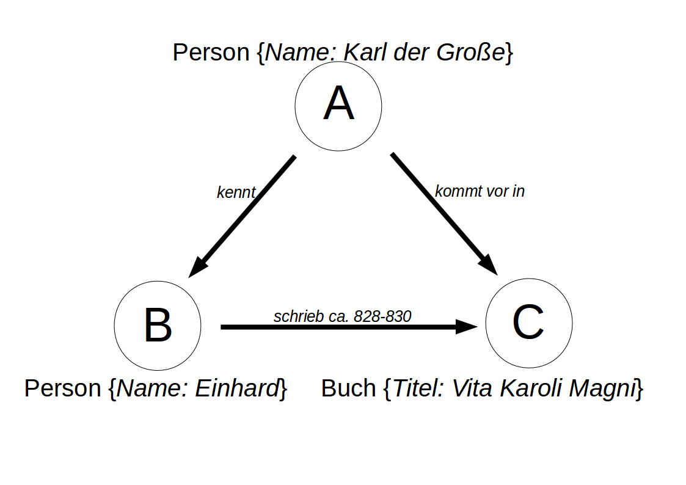

Der Beispielgraph zeigt oben einen <b>Knoten (engl. Node)</b> vom <b>Typ (engl. Label)</b> Person mit der Eigenschaft (engl. Property) Name. Diese hat den Wert "Karl der Große". Links unten ist ein weiter <b>Knoten</b> vom Typ Person mit dem Namen "Einhard". Rechts unten ist ein <b>Knoten</b> vom Typ Buch und dem Titel "Vita Karoli Magni" abgebildet. Die <b>Kanten</b> (engl. Edges) geben an, dass Karl der Große Einhard kannte, Einhard ca. 828-830 das Buch "Vita Karoli Magni" schrieb und Karl der Große in dem Buch vorkommt.

Knoten und Kanten können also noch zusätzliche Eigenschaften besitzen, in denen weitere Informationen gespeichert sind. Diese Eigenschaften sind spezifisch für die jeweiligen Knotentypen. So sieht man in der Abbildung, dass die beiden Knoten vom Typ Person jeweils noch die Eigenschaft Namen haben, deren Wert dann die Namen der Person angibt, während der Knoten vom Typ Buch die Eigenschaft Titel trägt, in dem der Titel des Buches abgespeichert wird.

Der wirkliche Mehrwert bei Graphdatenbanken ergibt sich aus gerichteten (also Verbinungen mit einer Richtung) und transitiven Beziehungen. Hat A eine direkte Kante zu B und B eine direkte Kante zu C dann ist A nicht direkt sondern transitiv mit C verbunden.
Gerade wenn ein Graph sehr viele verschiedene solcher transitiven Verbindungen hat, lassen sich Muster und Verbindungen identifizieren, die in relationalen Modellen oft unentdeckt bleiben. Darüber hinaus bietet der Graph eine optimale Ausgangslage für anschließende Netzwerkanalyse des gesamten Graphen oder ausgewählter Subgraphen.
War es in den digitalen Geisteswissenschaften bis vor einigen Jahren noch höchste Priorität überhaupt digitale Forschungsdaten bereitzustellen ist es heute die Herausforderung Daten in ihrem Kontext zu erfassen. Hierfür lassen sich Graphdatenbanken hervorragend nutzen.

## Herkunft und Idee

Graphen gehen zurück auf die erste Hälfte des 18 Jahrhunderts. 1736 löste Leonhard Euler das "Königsberger Brückenproblem", das fragte ob es möglich sei, die 4 durch den Fluss getrennten Stadtbereiche, die über 7 Brücken verbunden waren jeweils einmal zu besuchen, ohne eine der Brücken zweimal zu nutzen.[^caa8]

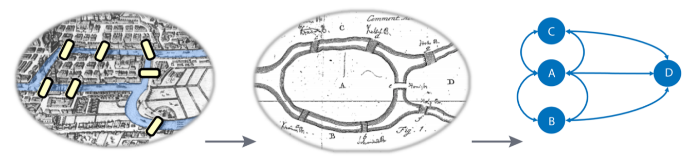

Euler kam zu der Einsicht, dass nur die Verbindungen zwischen den 4 Bereichen der Stadt relevant sind und legte damit den Grundstein für die Graphtheorie und ihre Mathematik. Er zeigte, dass das Brückenproblem nicht lösbar war, da zu jedem Stadtbereich eine ungerade Anzahl von Brücken führte, es dürfe aber nur zwei Ufer mit einer ungeraden Anzahl geben.[^bfe5]

## Graphtypen und Strukturen

### Graph und nicht Graph

Auch wenn Graphen ihren Ursprung in der Mathematik haben so sind sie doch ein pragmatisches Werkzeug um Informationen zu modellieren und zu analysieren.

")

In diesem Buch geht es nicht um Graphen im Sinne von Lösung von Gleichungen wie im Bild rechts. Es geht um Informationen, die durch Knoten und Kanten dargestellt werden, wie links im Bild.

### Labeled Property Graph

Einen Graphen, in dem die Knoten und Kanten Typen (Labels) und Eigenschaften (Properties) besitzen, nennt man "Labeled Property Graph" (LPG).

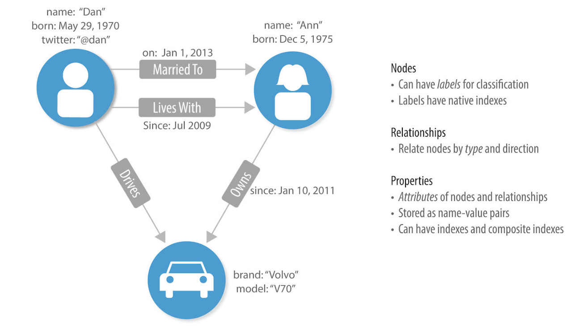

Der abgebildete Graph sagt beispielsweise aus, dass der Knoten links oben das Label "männliche Person" mit den zugehörigen Properties (name:'Dan', born etc.) trägt. Rechts daneben ist eine weibliche Person mit ihren Properties (name:'Ann', born: Dec 5, 1975) abgebildet. Die Kanten sagen aus, dass Ann am 1. Januar 2013 mit Dan zusammenlebte und seit Juli 2009 mit ihm verheiratet ist . Ann gehört gleichzeitig ein Auto (mit der Property Marke: 'Volvo'), das von Dan gefahren wird. Hier werden in einfachen Schritten Informationen aus der "realen Welt" abgebildet. In den nächsten Abschnitten geht es nun um die Konzepte dahinter.

### Einfache Graphtypen

In der folgenden Abbildung sind verschiedene Graphtypen abgebildet. Im Beispiel links ist ein einfacher Graph dargestellt, in dem jedes Knotenpaar nur eine Verbindung haben kann.

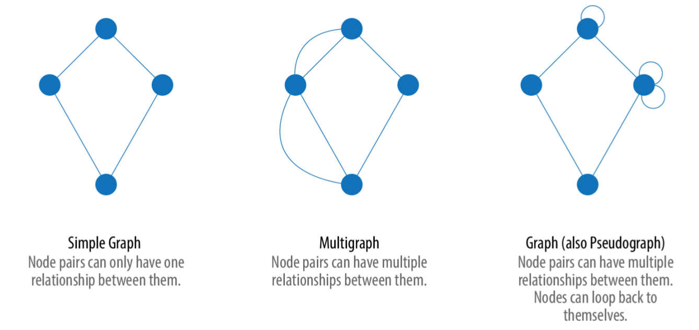

Im mittleren Beispiel sind mehrere Verbindungen zwischen Knotenpaaren möglich. Das rechte Beispiel ergänzt sich noch um die Möglichkeit, Verbindungen von Knoten wieder zu ihnen selbst zurück zu ermöglichen.

Die folgende Abbildung zeigt links ein Beispiel für einen zufälligen Graphen, aus dem sich keine hierarichischen oder strukturellen Informationen ablesen lassen.
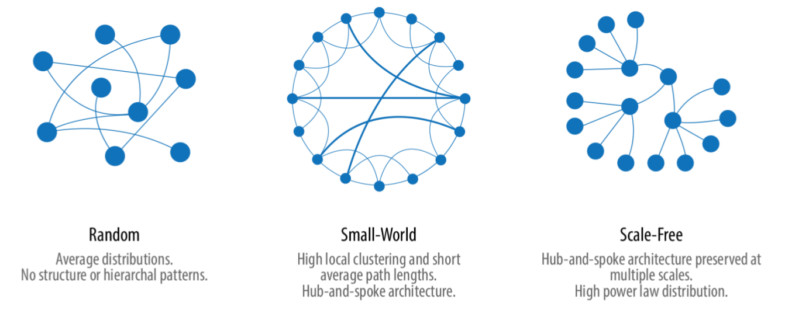

In der mittleren Abbildung ein Small-World-Graph abgebildet, der lokal stark geclustert ist und eine geringe durchschnittliche Pfadlänge hat. Die rechte Abbildung zeigt ein skalenfreies Netzwerk, wie beispielsweise das Word-Wide-Web.

In der folgenden Tabelle werden charakteristische Möglichkeiten zur Typisierung von Graphen gegenübergestellt.

|Graphattribute|Unterschiede|Überlegungen zum Algorithms|
|------------------|---------------------|------------------------------------|
|Verbundene und nichtverbundene Graphen|Gibt es einen Pfad (Länge egal) zwischen zwei beliebigen Knoten eines Graphen|Knoteninseln können zu unvorhergesehenem Verhalten, wie Abbruch oder Auslassen von Knoteninseln führen|
|Gewichtete und ungewichtete Graphen|Gibt es (domänen-spezifische) Werte für Wichtungen an Knoten und Kanten|Werte machen den Graphen reicher an Informationen; Viele Algoritmen benötigen gewichtende Werte|
|Gerichtete und ungerichtete Graphen|Ist eine Verbindung hierarchisch oder gegenseitig|Die Richtung einer Kante sind für viele Auswertungen von Relevanz|
|Zyklische und nicht zyklische Graphen|In zyklischen Graphen können Pfade können wieder zum Startknoten zurückkehren|Zyklische Graphen sind weit verbreitet. Bei der Auswertung mit Graphalgorithmen muss der Graph aber möglicherweise bearbeitet werden|
|Graphdichte|Das Verhältnis von Kanten zu Knotenzahl|Extrem dichte oder extrem dünne Graphen können die Analyse erschweren. Ggf. können Änderungen an der Modellierung helfen, sofern es die Domäne zulässt|
|Monopartite, bipartite, und k-partite Graphen|Gibt es einen, zwei oder mehrere Knotentypen|Mehr Knotentypen erleichtern in den Geisteswissenschaften die Modellierung, Graphalgorithmen arbeiten oft aber nur mit einem Knotentyp|

Quelle: [https://www.oreilly.com/library/view/graph-algorithms/9781492047674/](Needham/Hodler 2019), S. 18-19.

### Verbundene und nichtverbundene Graphen

Sind in einem Graphen mehrere Gruppen von verbundenen Knoten vorhanden und es gibt zwischen den Gruppen keine Verbindungen, handelt es sich um nichtverbundene Graphen.

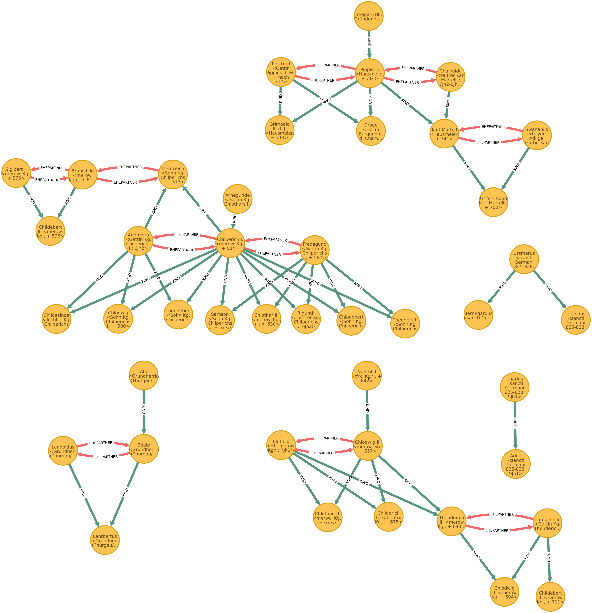

Das Beispiel zeigt einen Graphen mit Personen und ihren Verwandtschaftsbeziehungen. Es gibt mehrere Stammbäume, die nicht miteinander verbunden sind.

Das folgende Bild zeigt einen verbundenen Graphen, bei dem alle Knoten mindestens eine Kante haben und jeder Knoten jeden anderen über einen Pfad erreichen kann.

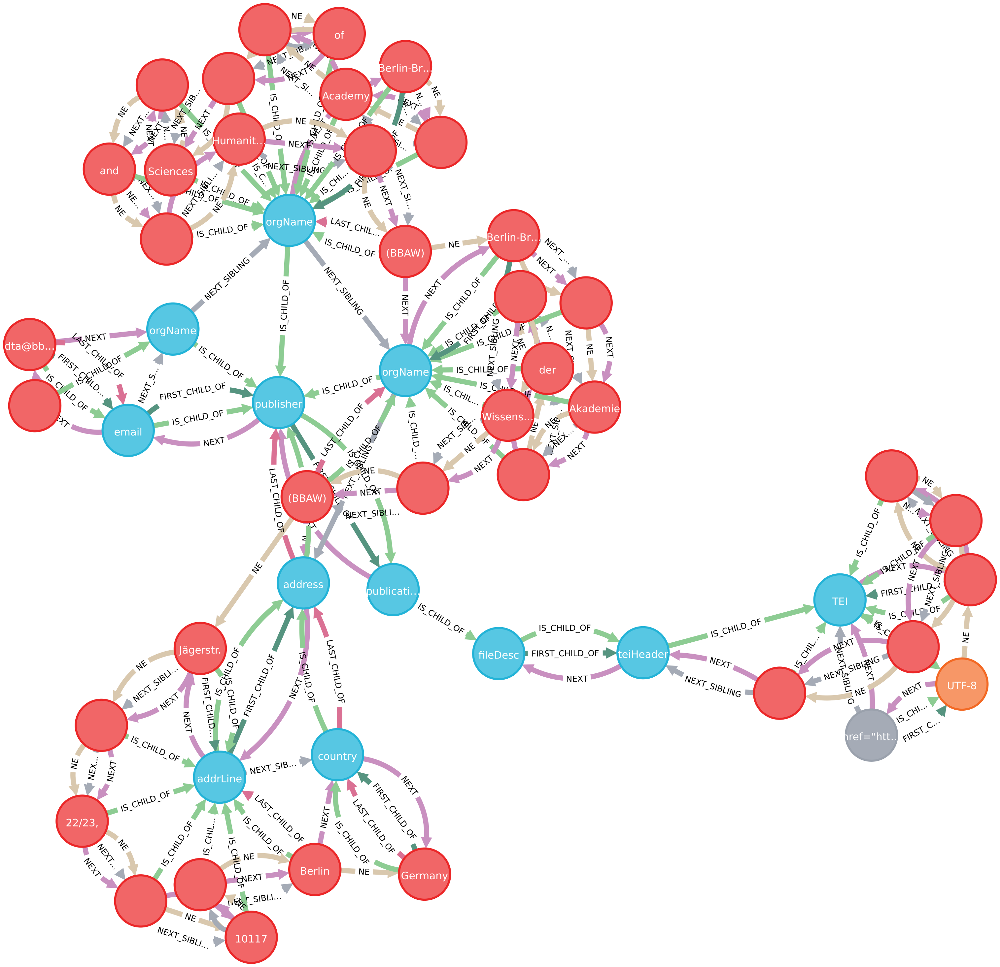

Hier wird ein Ausschnitt aus einer Graphdatenbank gezeigt, in die eine XML-Text-Datei als XML-Baum importiert wurde. Da es sich bei jeder XML-Datei um einen Baum handelt und jeder XML-Knoten Teil dieses Baumes ist, gibt es keine nichtverbundenen Teile.

### Gewichtete und ungewichtete Graphen

In ungewichteten Graphen besitzen die Kanten keinen Wert zu Gewichtung.

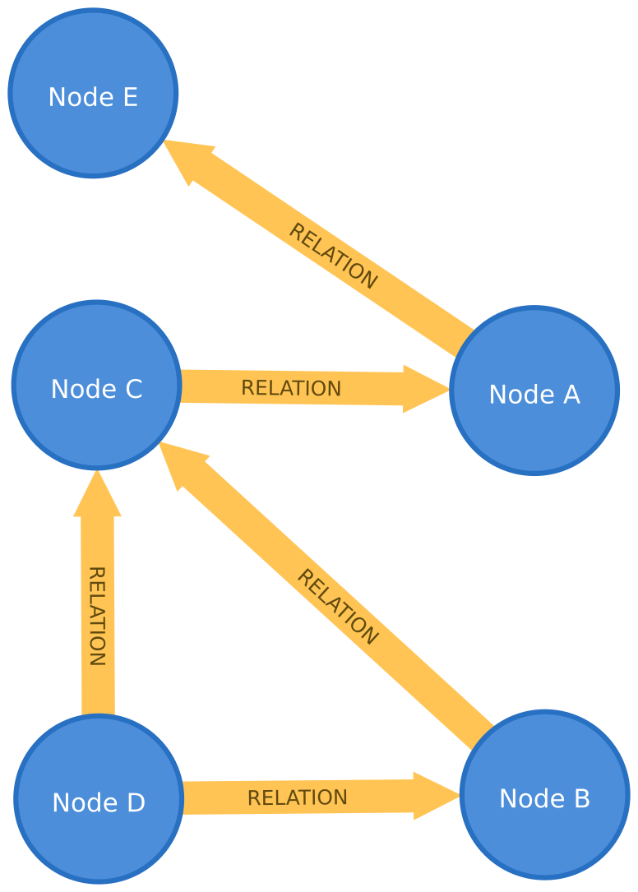

Im Graphen werden Beziehungen zwischen Personen abgebildet. Über die Intensität der Beziehungen wird nichts gesagt. In der folgenden Abbildung wurde den Beziehungen zwischen jeweils ein Wert zwischen 0 und 100 zugeordnet.

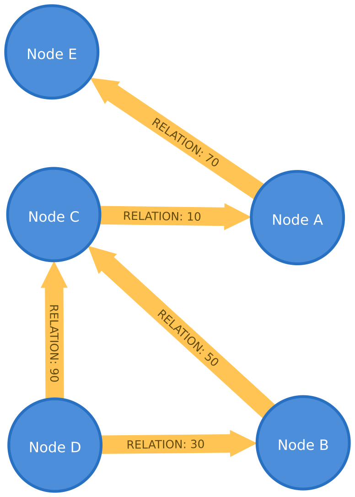

Werden solche Angaben ergänzt, werden die Informationen im Graph wertvoller. Werte für Wichtungen können beispielsweise Entfernungen, Kosten, Kapazitäten oder auch domänenspezifische Priorisierungen sein.

### Gerichtete und ungerichtete Graphen

In einem ungerichteten Graphen geht eine Beziehungen immer in beide Richtungen (beispielsweise EHEPARTNER_VON). In einem gerichteten Graphen haben Beziehungen eine Richtung. Betrachtet man einen Knoten, gibt es eingehende Kanten, die auf den Knoten zeigen und ausgehende Kanten, die von dem Knoten ausgehen. Mit der Angabe von Richtung wird eine zusätzliche Informationsdimension hinzugefügt. Angenommen im linken Beispiel der folgenden Abbildung würden die Knoten Personen und die ungerichtete Kante ihre gegenseitige Freundschaft darstellen. Daraus ergibt sich, dass Person A mit Person B befreundet ist.

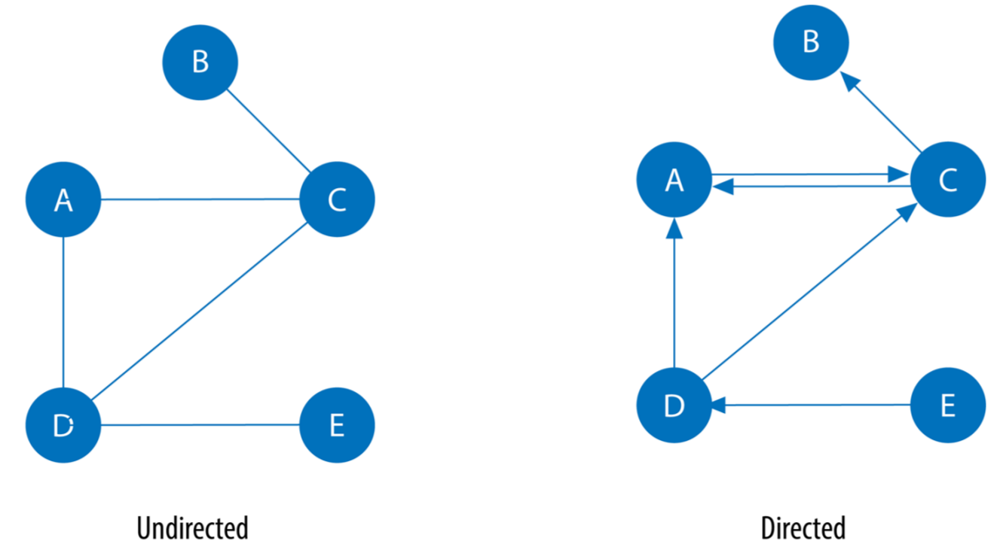

Erweitern wir das Beispiel für die rechte Abbildung, so dass die Freundschafts-Kanten gerichtet sind, so wird es möglich, zu zeigen, dass Person D für Person A freundschaftliche Gefühle hegt, die A aber nicht erwidert. Nehmen wir noch eine Wichtung der Freundschafskanten hinzu, könnte man modellieren, dass die freundschaftlichen Gefühle von Person C gegenüber A mit 0,8 gewichtet sind, umgekehrt die Zuneigung von Person A zu Person C aber nur mit 0,3.

Auch bei der Modellierung von Verwandtschaft kommen gerichtete und ungerichtete Verbindungen vor.

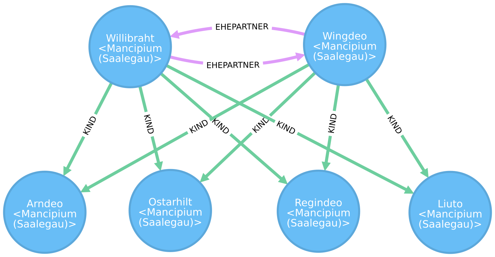

In der Graphdatenbank neo4j müssen Kanten eine Richtung haben. Ungerichtete Beziehungen kann man mit zwei Kanten vom gleichen Typ aber unterschiedlicher Richtung zwischen einem Knotenpaar modellieren. Im Verwandtschaftsbeispiel sind die zwei Personenknoten der Eltern mit zwei EHEPARTNER-Kanten unterschiedlicher Richtung verbunden. Es handelt sich um eine ungerichtete Beziehung, da es rechtlich nicht möglich ist, dass eine Person mit einer anderen Person verheiratet ist, umgekehrt aber nicht. Für die Eltern-Kind-Beziehung reicht eine Kante, da diese Beziehung hierarchisch ist.

## Installation und Start

Informationen zur Installation von neo4j finden Sie auf den Dokumentationsseiten unter [https://neo4j.com/docs/operations-manual/current/installation/](https://neo4j.com/docs/operations-manual/current/installation/). Für den normalen Nutzer empfiehlt sich die Installation von [neo4j-Desktop](https://neo4j.com/download/). Unter [https://neo4j.com/blog/this-week-in-neo4j-getting-started-with-neo4j-desktop-and-browser-graphileon-personal-edition-intuitive-detections-research-with-neo4j/?ref=twitter#features-1](https://neo4j.com/blog/this-week-in-neo4j-getting-started-with-neo4j-desktop-and-browser-graphileon-personal-edition-intuitive-detections-research-with-neo4j/?ref=twitter#features-1) finden sich Videos, in denen die Installation von [neo4j-Desktop](https://www.youtube.com/watch?v=8yWhuUnPapw) und erste Schritte im [neo4j-Browser](https://www.youtube.com/watch?v=rQTximyaETA) erklärt werden.

Eine konkrete Version kann unter Debian mit folgendem Befehl installiert werden:

apt-get install neo4j=1:3.5.14  cypher-shell=1.1.12

## Zusammenfassung

In diesem Kapitel wurde kurz auf die Ursprünge von Graphen eingegangen und verschiedene Typen von Graphen vorgestellt. Festzuhalten ist, dass es sich in den Digitalen Geisteswissenschaften in der Regel um Mischformen der vorgestellen Graphtypen handelt. Je nach Domäne werden Graphen hoher Dichte, mit vielen Knotentypen oder auch hierarchischen Strukturen benötigt. Modelle in den Digitalen Geisteswissenschaften haben meist mehrere Knotentypen und viele Kantentypen. Dies macht wiederum die direkte Anwendung von Graph-Algorithmen schwierig, so dass Graph-Transformationen notwendig werden können.

[^b72e]: Dieser Abschnitt beruht in Teilen auf den Kapiteln "Introduction" und "Graph Theory and Concepts" des Buches Graph Algorithms: Practical Examples in Apache Spark and Neo4j von Mark Needham und Amy E. Hodler, O'Reilly Media 2019 (https://www.oreilly.com/library/view/graph-algorithms/9781492047674/), S. xiii-xv und S. 1-26.

[^caa8]: Vgl. https://de.wikipedia.org/wiki/K%C3%B6nigsberger_Br%C3%BCckenproblem.

[^bfe5]: Vgl. https://de.wikipedia.org/wiki/K%C3%B6nigsberger_Br%C3%BCckenproblem.
