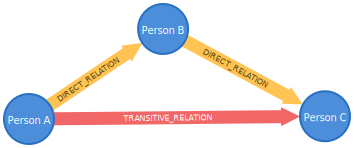
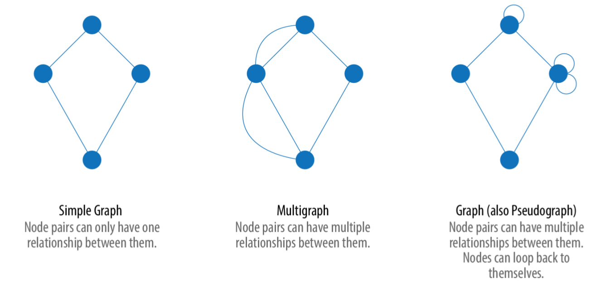
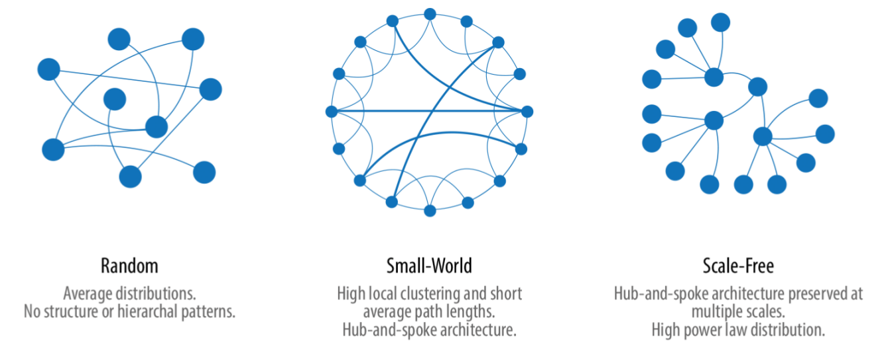

# Einführung und Theorie

# Inhalt
{:.no_toc}

* Will be replaced with the ToC, excluding the "Contents" header
{:toc}

[Dieser Abschnitt ist in Bearbeitung]

# Vorbemerkung

Dieser Abschnitt gibt eine kurze Einführung zu Graphen.[^b72e] Gegenüber relationalen Datenbanken, in denen die Daten in  Tabellen abgelegt und verknüpft sind, werden in Graphen Knoten für die Speicherung der Daten verwendet und diese dann mit Kanten in Relation gesetzt. Aber auch in relationalen Datenbanken kann man natürlich Daten verknüpfen. Wo liegt also der eigentliche Vorteil.

(Quelle: Kuczera)
Der wirkliche Mehrwert bei Graphdatenbanken ergibt sich aus gerichteten und transitiven Beziehungen. Hat A eine direkte Kante zu B und B eine direkte Kante zu C dann ist A zwar nicht direkt sonder transitiv mit C verbunden.
Gerade wenn ein Graph sehr viele verschiedene solcher transitiven Verbindungen hat lassen sich Muster und Verbindungen identifizieren die in relationalen Modellen oft unentdeckt bleiben. Darüber hinaus bietet der Graph eine optimale Ausgangslage für anschließende Netzwerkanalyse des gesamten Graphen oder von ausgewählten Subgraphen.
War es in den digitalen Geisteswissenschaften bis vor einigen Jahren noch höchste Priorität überhaupt digitale Forschungsdaten bereitzustellen ist es heute die Herausforderung Daten in ihrem Kontext zu erfassen. Hierfür lassen sich Graphdatenbanken hervorragend nutzen.

# Was sind Graphen ?

Graphen gehen zurück auf die erste Hälfte des 18 Jahrhunderts. 1736 löste Leonhard Euler das "Königsberger Brückenproblem", das fragte ob es möglich sei, die 4 durch den Fluß getrennten Stadtbereiche, die über 7 Brücken verbunden waren jeweils einmal zu besuchen, ohne eine der Brücken zweimal zu nutzen.[^caa8]

Quelle: [https://www.oreilly.com/library/view/graph-algorithms/9781492047674/](Needham/Hodler 2019), S. 2, Bild 1-1.

Euler kam zu der Einsicht, dass nur die Verbindungen relevant sind und legte damit den Grundstein für die Graphtheorie und ihre Mathematik. Er zeigte, dass das Brückenproblem nicht lösbar war, da zu jedem Stadtbereich eine ungerade Anzahl von Brücken führte, es dürfe aber nur zwei Ufer mit einer ungeraden Anzahl geben.[^bfe5]

Das folgende Beispiel modelliert einen Zusammenhang aus dem Frühmittelalter und erklärt kurz die Grundprinzipien.

(Quelle: Kuczera)

Der Beispielgraph zeigt oben einen <b>Knoten (engl. Nodes)</b>	vom Typ Person mit der Eigenschaft Name. Diese hat den Wert "Karl der Große". Links unten ist ein weiter <b>Knoten</b> vom Typ Person mit dem Namen "Einhard". Rechts unten ist ein <b>Knoten</b> vom Typ Buch und dem Titel "Vita Karoli Magni" abgebildet. Die <b>Kanten</b> (engl. Edges) geben an, dass Karl der Große Einhart kannte, Einhard ca. 828-830 das Buch "Vita Karoli Magni" schrieb und Karl der Große in dem Buch vorkommt.

Knoten und Kanten können also noch zusätzliche Eigenschaften besitzen, in denen weitere Informationen gespeichert sind. Diese Eigenschaften sind spezifisch für die jeweiligen Knotentypen. So sieht man in der Abbildung, dass die beiden Knoten vom Typ Person jeweils noch die Eigenschaft Namen haben, deren Wert dann die Namen der Person angibt, während der Knoten vom Typ Buch die Eigenschaft Titel trägt, in dem der Titel des Buches abgespeichert wird.

# Graph und nicht Graph

Auch wenn Graphen ihren Ursprung in der Mathematik haben so sind sie doch ein pragmatisches Werkzeug um Informationen zu modellieren und zu analysieren.

Quelle: [https://www.oreilly.com/library/view/graph-algorithms/9781492047674/](Needham/Hodler 2019), S. 3, Bild 1-2

In diesem Buch geht es nicht um Graphen im Sinne von Lösung von Gleichungen wie im Bild rechts. Es geht um Informationen, die durch Knoten und Kanten dargestellt werden, wie links im Bild. Der linke Graph sagt beispielsweise aus, dass Person A mit Person B zusammenlebt und verheiratet ist. Person B gehört gleichzeitig ein Auto, dass von Person A gefahren wird. Hier werden in einfachen Schritten Informationen aus der "realen Welt" abgebildet. In den nächsten Abschnitten geht es nun um die Konzepte dahintert.

# Theorien und Konzepte

Quelle: [https://www.oreilly.com/library/view/graph-algorithms/9781492047674/](Needham/Hodler 2019), S. 16, Bild 2-1

# Graphtypen und Strukturen

Quelle: [https://www.oreilly.com/library/view/graph-algorithms/9781492047674/](Needham/Hodler 2019), S. 17, Bild 2-2

Quelle: [https://www.oreilly.com/library/view/graph-algorithms/9781492047674/](Needham/Hodler 2019), S. 17, Bild 2-3

Sind in einem Graphen mehrere Gruppen von verbundenen Knoten vorhanden und es gibt zwischen den Gruppen keine Verbindungen, handelt es sich um nichtverbundene Graphen.

Das Beispiel zeigt einen Graphen mit Personen und ihren Verwandtschaftsbeziehungen. Es gibt mehrere Stammbäume, die nicht miteinander verbunden sind.

Das folgende Bild zeigt einen verbundenen Graphen, bei dem alle Knoten mindestens eine Kante haben und jeder Knoten jeden anderen über einen Pfad erreichen kann.

Hier wird ein Ausschnitt aus einer Graphdatenbank gezeigt, in die eine XML-Datei als XML-Baum importiert wurde. Da es sich bei jeder XML-Datei um einen Baum handelt und jeder XML-Knoten Teil dieses Baumes ist, gibt es keine nichtverbundenen Teile.

Quelle: [https://www.oreilly.com/library/view/graph-algorithms/9781492047674/](Needham/Hodler 2019), S. 19, Bild 2-4

Quelle: Kuczera

Quelle: Kuczera

# Graph Analyse

# Installation und Start

Informationen zur Installation von neo4j finden Sie auf den Dokumentationsseiten unter [https://neo4j.com/docs/operations-manual/current/installation/](https://neo4j.com/docs/operations-manual/current/installation/). Für den normalen Nutzer empfiehlt sich die Installation von [neo4j-Desktop](https://neo4j.com/download/). Unter [https://neo4j.com/blog/this-week-in-neo4j-getting-started-with-neo4j-desktop-and-browser-graphileon-personal-edition-intuitive-detections-research-with-neo4j/?ref=twitter#features-1](https://neo4j.com/blog/this-week-in-neo4j-getting-started-with-neo4j-desktop-and-browser-graphileon-personal-edition-intuitive-detections-research-with-neo4j/?ref=twitter#features-1) finden sich Videos, in denen die Installation von [neo4j-Desktop](https://www.youtube.com/watch?v=8yWhuUnPapw) und erste Schritte im [neo4j-Browser](https://www.youtube.com/watch?v=rQTximyaETA) erklärt werden.

[^b72e]: Dieser Abschnitt beruht auf dem Kaptiel Introduction des Buches Graph Algorithms: Practical Examples in Apache Spark and Neo4j von Mark Needham und Amy E. Hodler, O'Reilly Media 2019 (https://www.oreilly.com/library/view/graph-algorithms/9781492047674/), S. xiii-xv und S. 1-10.

[^caa8]: Vgl. https://de.wikipedia.org/wiki/K%C3%B6nigsberger_Br%C3%BCckenproblem.

[^bfe5]: Vgl. https://de.wikipedia.org/wiki/K%C3%B6nigsberger_Br%C3%BCckenproblem.
