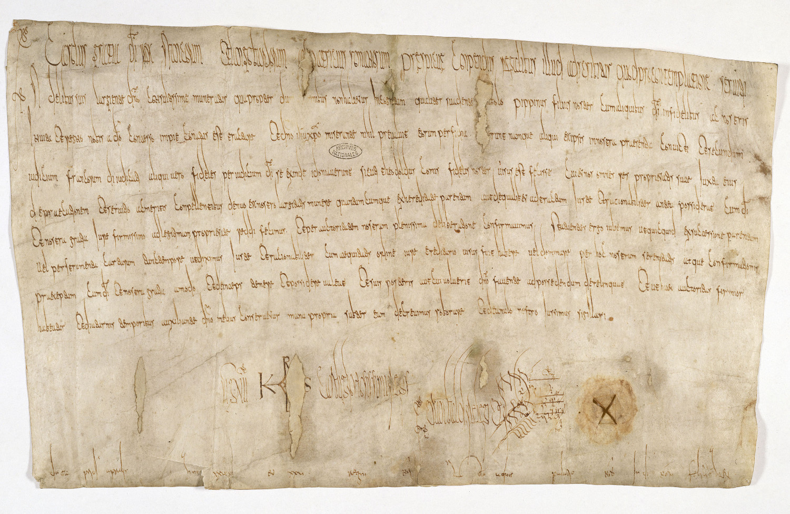
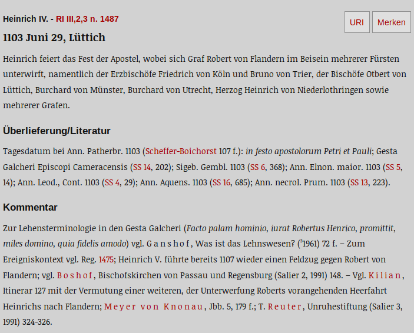
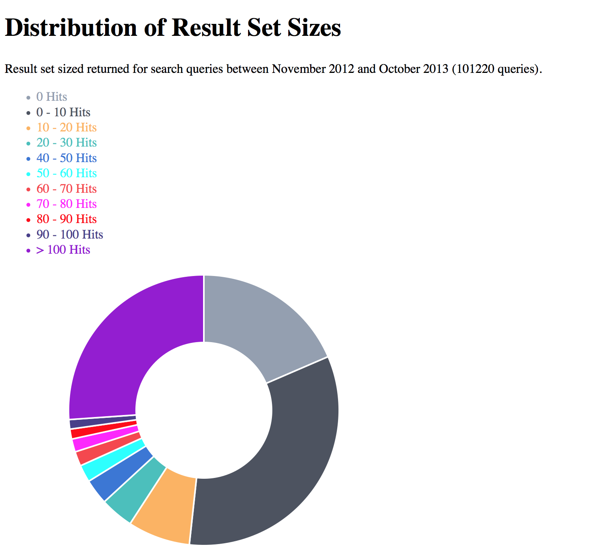
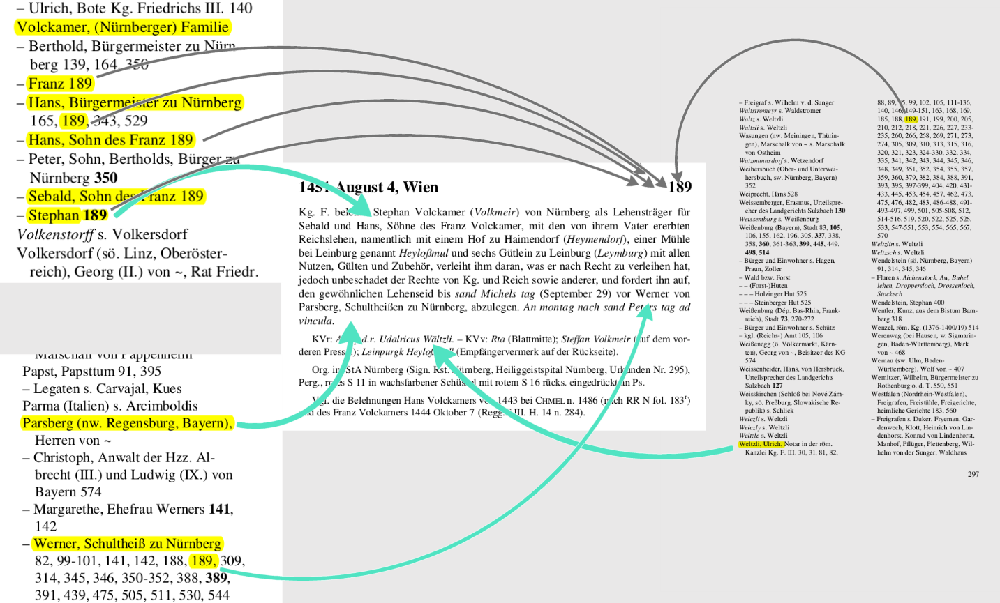
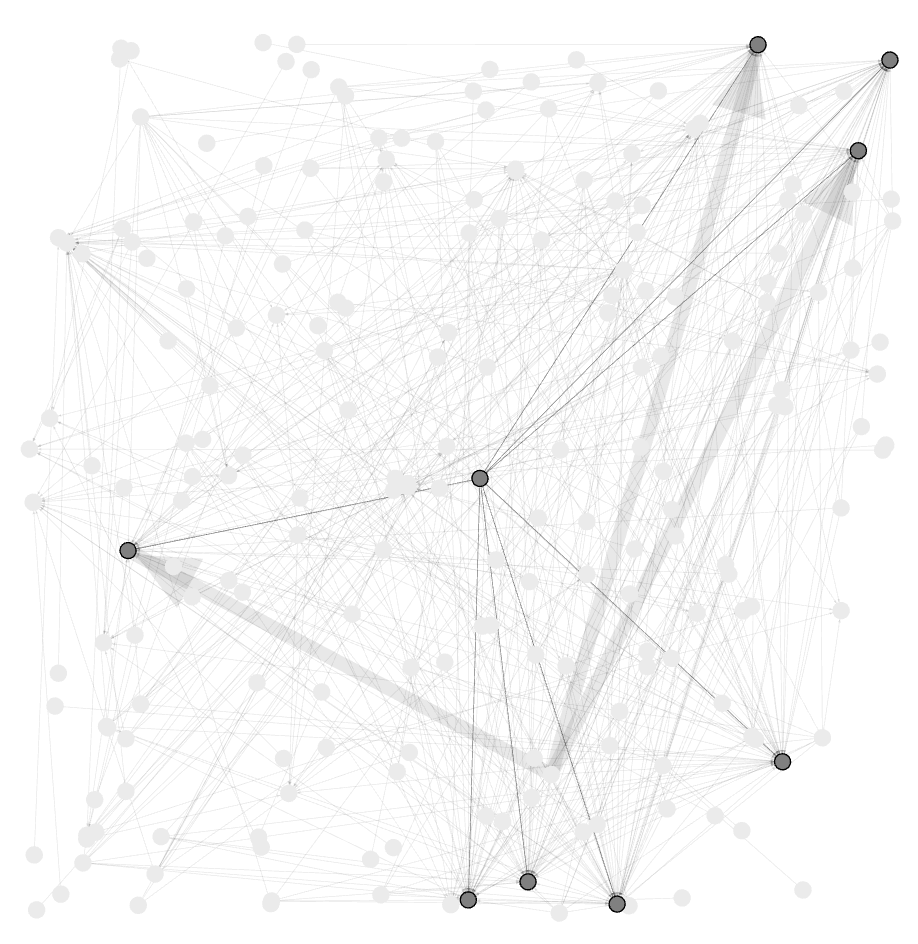
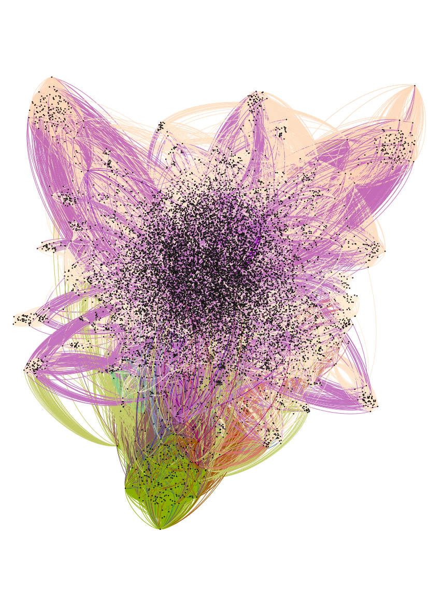

# Das Projekt Regesta Imperii oder “Wie suchen Onlinenutzer Regesten?”

# Inhalt
{:.no_toc}

* Will be replaced with the ToC, excluding the "Contents" header
{:toc}

## Das Projekt Regesta Imperii

Das Projekt Regesta Imperii wurde von Johann-Friedrich Böhmer im Jahr 1829 begonnen. Ursprünglich als Vorarbeit zu den [Monumenta Germaniae Historica](https://www.mgh.de) angelegt, wurde es mit einem erweiterten Regestenkonzept bald zu einem unverzichtbaren Grundlagenwerk. In den Regesta Imperii werden Inhaltsangaben von Urkunden erstellt, die rechtlich relevante Personen, Inhalte, Orte und Sachverhalte in deutscher Sprache zusammenfassen. Zeitlich umfassen sie den Rahmen von den [Karolingern](https://de.wikipedia.org/wiki/Karolinger) (7. Jahrhundert) bis Kaiser [Maximilian](https://de.wikipedia.org/wiki/Maximilian_I._(HRR)) (gestorben 1519).

Ursprünglich von der DFG gefördert, sind die Regesta Imperii heute Teil des Bund-Ländergeförderten Akademienprogramms und werden von der Akademie der Wissenschaften und der Literatur, Mainz, der Berlin-Brandenburgischen Akademie der Wissenschaften und der Akademie der Wissenschaften, Wien betreut.

Die Regesta Imperii arbeiten vor allem herrscherzentriert, d.h. in den Regesten muss der Herrscher eine zentrale Rolle spielen. Bei Urkundenregesten hat er selbst die Urkunde ausgestellt, bei historiographischen Regesten werden den Herrscher betreffende historische Hintergründe zusammengefasst.

In der Kopfzeile des Regests werden der Herrscher sowie Abteilung, Band und Regestennummer genannt. Die darunterliegende Datierungszeile nennt das Ausstellungsdatum der Urkunden und den Handlungs- bzw. Ausstellungsort. Es folgt der Regestentext mit der Zusammenfassung der Urkunde, Hinweise zur Originaldatierung, die Kanzleivermerke und schließlich Angaben zur Überlieferungssituation (Gibt es eine Originalurkunde, wo liegt sie, gibt es ggf. Abschriften etc.).

## Die Digitalisierung der Regesta Imperii

Im Rahmen eines von der DFG geförderten Projekts wurden die Regesta Imperii gemeinsame von der Akademie der Wissenschaften, Mainz und der Bayrischen Staatsbibliothek München von 2001 bis 2006 komplett digitalisiert. Alle seit 2006 erschienenen Regesten wurden sofort im Volltext online gestellt. Glücklicherweise hatte die Mainzer Akademie die Rechte selbst inne, so dass der Veröffentlichung als Volltext im Internet keine rechtlichen Hürden im Wege standen. Rückblickend lässt sich feststellen, dass der Absatz der gedruckten Bände nicht gelitten sondern teilweise sogar etwas zugelegt hat.

## Wie suchen Online-Nutzer Regesten ?

Ende 2013 wurde das Suchverhalten der Nutzer der Online-Regestensuche im Rahmen eines Vortrages auf der Digital-Diplomatics-Konferenz in Paris in den Blick genommen.[^595c] Ein interessantes Ergebnis war die Häufigkeitsverteilung der Treffermengen pro Suchanfrage.

Im Tortendiagramm ist die Treffermenge in Zehnerschritten angegeben. Die hellgraue Gruppe oben rechts hat keine Treffer, die dunkelgraue Gruppe einen bis zehn Treffer, die gelbe Gruppe 11 bis 20 usw. Die lila Gruppe hat mehr als hundert Treffer. Überraschend war die große Gruppe mit über 100 Treffern. Hinzu kam, dass über 68% der Nutzer nur ein Suchwort in die Suchmaske eingegeben haben, wobei das beliebteste Suchwort *Heinrich* Ende 2013 zu über 18.000 Treffern führte. Auf der Ergebnisseite hieß es dann: "Sie suchten nach *Heinrich*. Ihre Suche erzielte 18884 Treffer [...] Sie sehen die Treffer 1 bis 20."

Zusammenfassend könnte man feststellen, dass die Gruppe mit 1 bis 10 Treffern mit ihrem Ergebnis zufrieden war. 10 Regesten lassen sich gut ausdrucken und können anschließend gelesen, ausgewertet und in die eigene Forschungsarbeit einfließen. Die Gruppe mit keinem Treffer hatte möglicherweise die Suche zu sehr eingeschränkt oder einen Tippfehler beim Suchbegriff und wäre lieber in der Gruppe mit einem bis 10 Treffern. Selbstverständlich lassen sich auch 20 und mehr Treffer gut verarbeiten aber bei größeren Treffermengen steigt natürlich auch der Aufwand stark an, so dass davon auszugehen ist, dass die Nutzer kleinere, präzisere Ergebnisse bevorzugen.

Sehr gut lässt sich am Tortendiagramm auch ablesen, dass über die Hälfte unserer Nutzer vor der Suche eine genaue Vorstellung vom Ergebnis haben. Sie sind CIN-Nutzer (concrete information need). Die Gruppe mit über 100 Treffern können der Gruppe der POIN-Nutzer (problem-oriented information need) zugeordnet werden, die problemorientierte Anfragen haben. Für diese Nutzergruppe ist die aktuelle Trefferanzeige der Regestensuche unzureichend, da sie für ihre großen Treffermengen weitere Einschränkungsmöglichkeiten brauchen.[^0b8f]

## Historische Netzwerkanalyse in den Registern

Im Bereich der historischen Netzwerkanalyse gab es in den letzten Jahren sehr interessante Arbeiten.[^3273] Von Seiten der Regesta Imperii bieten sich hier vor allem die Register der Regesta Imperi als sehr interessante Quelle an. Geht man davon aus, dass alle Personen, die gemeinsam in einem Regest genannt sind, etwas miteinander zu tun haben, könnte man auf Grundlage der Registerdaten ein Personennetzwerk erstellen. Über die Qualität der Beziehungen lässt sich nichts sagen und dies schränkt die Aussage der Daten ein. Andererseits stehen sehr viele Verknüpfungen zur Verfügung.

Allein die Einträge in den Registern der Regesten Kaiser Friedrichs III. sind über 143.000 mal in Regesten genannt. Daraus ergeben sich dann über 460.000 1zu1-Beziehungen.[^6155]

In der folgenden Abbildung sind die in den Registern des Regestenbandes von Joseph Chmel gewonnenen 1zu1-Beziehungen mit Gephi visualisiert.[^ce4b]

Bei der Analyse ergaben sich aber verschiedene Probleme. Zum einen werden in den Registern auch Kanzleibeamte genannt, die mit der eigentlichen Urkundenhandlung gar nichts zu tun hatten sondern später lediglich ihr Kürzel auf der Urkunde hinterließen. Dies mag archivgeschichtlich interessant sein, für die Urkundenhandlung ist es aber irrelevant. Ein zweites Problem ist der Aufbau des Registers, in dem Orte und Personen in einem Register zusammengefasst werden. Zum einen handelt es sich hierdurch nicht mehr um ein reines Personennetzwerk sondern um ein gemischtes Personen- und Ortsnetzwerk. Zum anderen überragen die über sehr lange Zeit bestehenden Orte, die in ihrer Lebensdauer begrenzten natürlichen Personen in den Netzwerkstrukturen. Schließlich zeigte sich, dass die Algorithmen zur Netzwerkanalyse mit zeitbehaftenen Daten (wie Regesten mit ihrem Ausstellungsdatum) nur schlecht umgehen konnten.

Aus Historikersicht war der Ansatz also weniger zielführend. Jedoch ergaben sich aus Modellierungssicht interessante Einblicke. Um die Netzwerke näher analysieren zu können, wurden kurze Zeitschnitte der Regesten untersucht. Hierfür musste das in Java geschriebene Programm zur Erstellung der Netzwerkdaten jedesmal umgeschrieben werden. Mein Kollege Ulli Meybohm, der das Programm damals betreute, wies mich nach dem wiederholten Umschreiben des Programms darauf hin, dass ich für meine Daten besser eine Graphdatenbank verwenden solle, beispielsweise neo4j. Erste Versuche des Imports der Registerdaten in neo4j erwiesen sich aber als sehr komplex, obwohl das Datenmodell *Person kennt Person* eigentlich relativ einfach ist.

Schließlich ergaben Nachfragen bei neo4j, dass bei Problemen mit dem Datenmodell oft einfach ein Typ von Knoten vergessen worden sein könnte. Und tatsächlich wurden in den ersten Modellen die Regestenknoten nicht berücksichtigt. Mit den Regestenknoten im Modell war der Import schließlich mit weniger rechnerischem Aufwand möglich.

## Zusammenfassung

In diesem Kapitel wurde zunächst das Akademieprojekt Regesta Imperii vorgestellt. Seit der Anfang der 2000er Jahre erfolgten Digitalisierung stehen die Regesten unter [www.regesta-imperii.de](www.regesta-imperii.de) unter Creative-Commons-Lizenz frei im Internet zur Nutzung zur Verfügung. Für die Auswertung gibt es eine einfache Suchmaske und eine erweiterte Suche. Für die Jahre 2012 und 2013 wurden die Suchstrategien der Nutzer in der Online-Regestensuche untersucht und es zeigte sich, dass sich zwei Nutzungsszenarien unterscheiden lassen, von denen aber nur eines von den aktuellen Suchmasken der Regesta Imperii Online optimal bedient wird. Im zweiten Teil des Kapitels wurden die Visualisierung von Registernetzwerken und die anschließende Modellierung in Graphdatenbanken dargestellt und Nutzungs- und Auswertungsszenarien diskutiert. Im folgenden Kapitel wird die Modellierung von Regesten im Graphen detailliert erklärt.

[^5147]: Verwendet wird die Graphdatenbank neo4j. Die Open-Source-Version ist kostenlos erhältlich unter [https://www.neo4j.com](https://www.neo4j.com).
[^892b]: Dies ist das Tabellenkalkulationsformat von Libreoffice und Openoffice. Vgl. [https://de.libreoffice.org](https://de.libreoffice.org).

[^336e]: Die Angaben in der Graphdatenbank sind Englisch, daher *Regestae*.

[^d219]: Gemeint ist hier der lowerCamelCase bei dem der erste Buchstabe kleingeschrieben und dann jedes angesetzte Wort mit einem Großbuchstaben direkt angehängt (wie bei archivalHistory). Vgl. auch https://de.wikipedia.org/wiki/Binnenmajuskel#Programmiersprachen.

[^5979]: Vgl. die Vorbemerkung zum Register in Böhmer, J. F., Regesta Imperii III. Salisches Haus 1024-1125. Tl. 2: 1056-1125. 3. Abt.: Die Regesten des Kaiserreichs unter Heinrich IV. 1056 (1050) - 1106. 5. Lief.: Die Regesten Rudolfs von Rheinfelden, Hermanns von Salm und Konrads (III.). Verzeichnisse, Register, Addenda und Corrigenda, bearbeitet von Lubich, Gerhard unter Mitwirkung von Junker, Cathrin; Klocke, Lisa und Keller, Markus - Köln (u.a.) (2018), S. 291.

[^595c]: Vgl. Kuczera, Andreas; Schrade, Torsten: From Charter Data to Charter Presentation: Thinking about Web Usability in the Regesta Imperii Online. Vortrag auf der Tagung ›Digital Diplomatikcs 2013 – What is Diplomatics in the Digital Environment?‹ Folien: https://prezi.com/vvacmdndthqg/from-charta-data-to-charta-presentation/.
[^0b8f]: Näheres dazu in Kuczera, Andreas: Digitale Perspektiven mediävistischer Quellenrecherche, in: Mittelalter. Interdisziplinäre Forschung und Rezeptionsgeschichte, 18.04.2014. URL: mittelalter.hypotheses.org/3492.

[^3273]: Vgl. beispielsweise Gramsch, Robert: Das Reich als Netzwerk der Fürsten - Politische Strukturen unter dem Doppelkönigtum Friedrichs II. und Heinrichs (VII.) 1225-1235. Ostfildern, 2013. Einen guten Überblick bietet das Handbuch Historische Netzwerkforschung - Grundlagen und Anwendungen. Herausgegeben von Marten Düring, Ulrich Eumann, Martin Stark und Linda von Keyserlingk. Berlin 2016. Direkt zu Register vgl. Kuczera, Andreas: Register als Quelle für die historische Netzwerkforschung. In: Das Konverseninstitut und sein Umfeld im Hoch- und Spätmittelalter, herausgegeben von Christian Stadelmaier, Andreas Kuczera und Holger Sturm, Darmstadt 2017, S. 173-192.

[^ce4b]: Regesta chronologico-diplomatica Friderici III. Romanorum imperatoris (regis IV.) : Auszug aus den im K.K. Geheimen Haus-, Hof- und Staats-Archive zu Wien sich befindenden Registraturbüchern vom Jahre 1440 - 1493 ; nebst Auszügen aus Original-Urkunden, Manuscripten und Büchern / von Joseph Chmel, Wien 1838 und 1840.

[^6155]: Der Cypher-Befehl zur Erstellung der 1zu1-Beziehungen lautet: *MATCH (n1:Registereintrag)-[:GENANNT_IN]->(r:Regest)<-[:GENANNT_IN]-(n2:Registereintrag)
MERGE (n1)-[:KNOWS]->(n2);* Dabei werden die gerichteten `KNOWS`-Kanten jeweils in beide Richtungen erstellt.
Mit folgendem Befehl lassen sich die `KNOWS`-Kanten zählen: *MATCH p=()-[r:KNOWS]->() RETURN count(p);* Für die Bestimmung der 1zu1-Beziehungen muss der Wert noch durch 2 geteilt werden.
