# Inhalt
{:.no_toc}

* Will be replaced with the ToC, excluding the "Contents" header
{:toc}

# Regestenmodellierung im Graphen

## Wie kommen die Regesten in den Graphen

In diesem Abschnitt wird beispielhaft anhand der Regesten Kaiser Heinrichs IV. der Import der Online-Regesten in die Graphdatenbank neo4j durchgespielt.[^0153] Die Webseite der Regesta Imperii Online basiert auf dem Content-Managment-System typo3, welches auf eine mysql-Datenbank aufbaut. In der Datenbank werden die Regesteninformationen in verschiedenen Tabellen vorgehalten. Die Webseite bietet momentan nur die Möglichkeit, die Regesten über eine REST-Schnittstelle im CEI-XML-Format herunterzuladen. Die CSV-Version, die sich für den Import in die Graphdatenbank anbietet findet sich auf [Github](https://github.com/kuczera/Graphentechnologien/raw/master/data/RegH4.csv).  Dort finden Sie auch eine [Textdatei]{https://github.com/kuczera/Graphentechnologien/raw/master/data/GraphCypher.txt} mit den Listings aller cypher-Befehle.

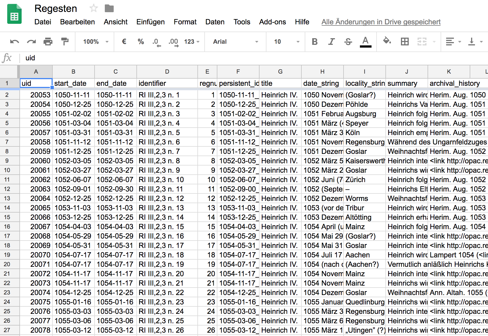

In der CSV-Datei finden sich die oben erläuterten einzelnen Elemente der Regesten in jeweils eigenen Spalten. Die Spaltenüberschrift gibt Auskunft zum Inhalt der jeweiligen Spalte.

### Import mit dem `LOAD CSV`-Befehl

Mit dem Befehl `LOAD CSV` können im Neo4j-Browser die CSV-Dateien mit den Regesten in die Graphdatenbank neo4j importiert werden.[^5147] Hierfür muss die Datenbank aber Zugriff auf die CSV-Daten haben. Dies ist einerseits über den im Datenbankverzeichnis vorhandene Ordner `import` oder über eine URL, unter der die CSV-Datei abrufbar ist, möglich. Da sich die einzelnen Zugriffswege auf den `import`-Ordner von Betriebssystem zu Betriebssystem unterscheiden, wird hier beispielhaft der Import über eine URL vorgestellt. Hierfür wird ein Webserver benötigt, auf den man die CSV-Datei hochlädt und sich anschließend die Webadresse für den Download der Datei notiert.

### Google-Docs für den CSV-Download

Es ist aber auch möglich, CSV-Daten in Google-spreadsheets zu speichern und dort eine URL für den Download der Daten zu erstellen. Zunächst benötigt man hierfür einen Google-Account. Anschließend öffnet man Google-Drive und erstellt dort eine leere Google-Tabellen-Datei (Google-Spreadsheet) in die man dann die CSV-Datei kopieren kann.

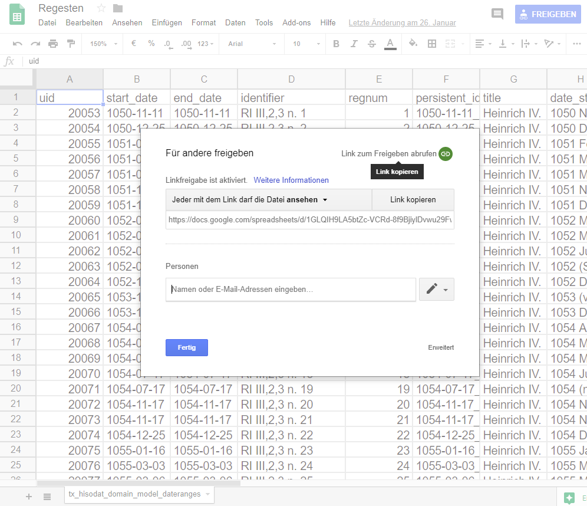

Wichtig ist nun, die Datei zur Ansicht freizugeben (Klick auf `Freigeben` oben rechts im Fenster, dann `Link zum Freigeben` abrufen und anschließend `Fertig` bestätigen). Jetzt ist die CSV-Datei in Google-Docs gespeichert und kann auch von anderen Personen über den Freigabelink angesehen werden. Für den Import in die Graphdatenbank benötigen wir aber einen Download im CSV-Format. Diesen findet man unter `Datei/Herunterladen als/Kommagetrennte Werte.csv aktuelles Tabellenblatt`.

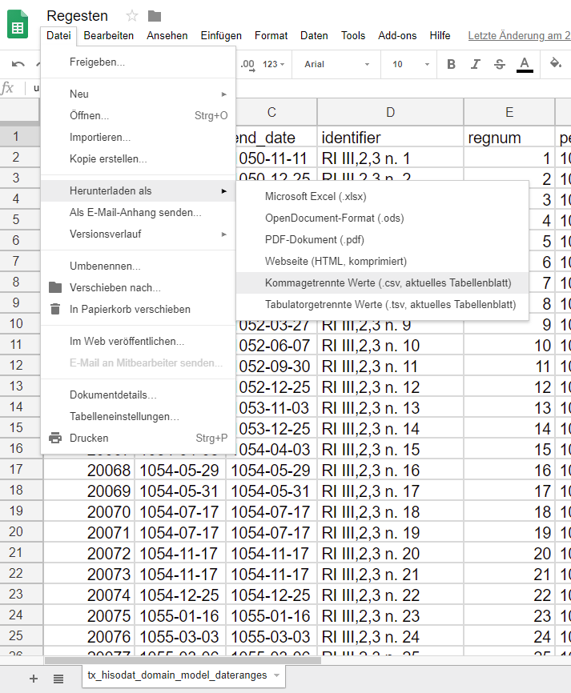

Damit erhält man das aktuelle Tabellenblatt als CSV-Download. Anschließend muss nun im Browser unter Downloads der Download-Link der Datei gesucht und kopiert werden.

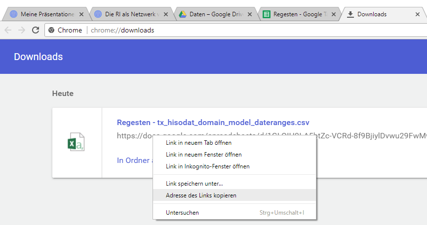

### Regestenmodellierung im Graphen

Mit dem `LOAD CSV`-Befehl stehen die Informationen der Regestentabelle nun für die weitere Verarbeitung zur Verfügung. Nun muss festgelegt werden, wie diese Informationen im Graphen modelliert werden sollen. Daher wird im nächsten Schritt das Modell der Regesten im Graphen vorgestellt (siehe Abbildung).

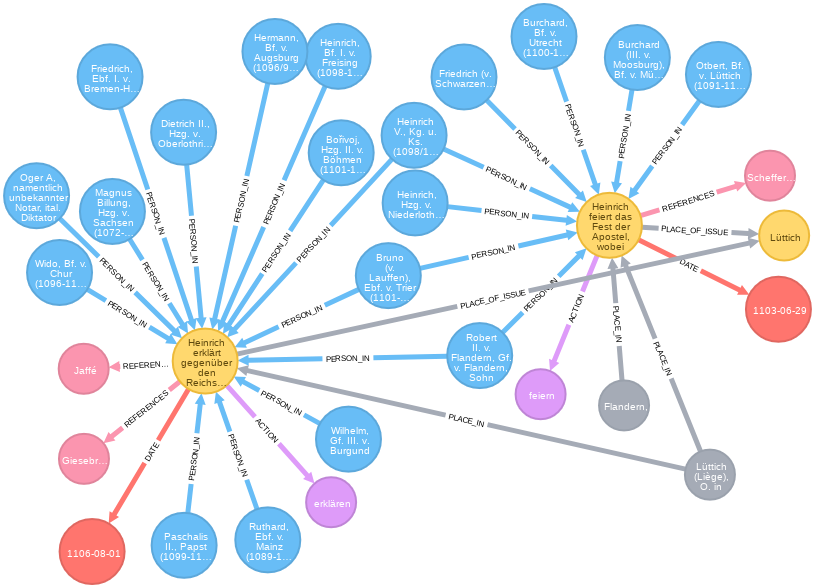

In den Abbildungen finden sich beispielhaft das Regest RI III,2,3 Nr. 1487, einmal in der Ansicht der Onlineregesten und in der zweiten Abbildung als Modell im Graphen (neben anderen Regesten).

Die gelben Knoten sind die Regesten. Aus den Angaben des Regests werden mit dem o.a. Befehl noch ein Datumsknoten und ein Ortsknoten erstellt. Mit dem ersten `CREATE`-Befehl werden die Regesten erstellt. Die `MERGE`-Befehle erzeugen ergänzende Knoten für die Datumsangaben und die Ausstellungsorte. Nun ist es aber so, dass Ausstellungsort und Ausstellungsdatum mehrfach vorkommen können. Daher wird hier nicht der `CREATE`-Befehl sondern der `MERGE`-Befehl verwendet. Dieser funktioniert wie der `CREATE`-Befehl, prüft aber vorher, ob in der Datenbank ein solcher Knoten schon existiert. Falls es ihn noch nicht gibt, wird er erzeugt, wenn es ihn schon gibt, wird er der entsprechenden Variable zugeordnet. Anschließend werden die Kanten zwischen Regestenknoten und Ausstellungsortsknoten sowie Regestenknoten und Datumsknoten erstellt. In der folgenden Tabelle werden die einzelnen Befehle dargestellt und kommentiert.

### Indexe Erstellen

Bevor nun mit dem Import begonnen wird, ist es für die Beschleunigung des Importprozesses von Vorteil vorher Indexe für häufig genutzte Properties zu erstellen.

~~~cypher
// vorab Index erzeugen -> Import wird schneller
CREATE INDEX ON :Regesta(ident);
CREATE INDEX ON :Regesta(regnum);
CREATE INDEX ON :Regesta(persistentIdentifier);
CREATE INDEX ON :Regesta(registerId);
CREATE INDEX ON :Regesta(heftId);
CREATE INDEX ON :Regesta(placeOfIssue);
CREATE INDEX ON :Regesta(origPlaceOfIssue);
CREATE INDEX ON :Date(startDate);
CREATE INDEX ON :Place(original);
CREATE INDEX ON :Place(normalizedGerman);
CREATE INDEX ON :Action(action);
CREATE INDEX ON :Literature(literatur);
CREATE INDEX ON :Reference(reference);
CREATE INDEX ON :IndexEntry(registerId);
CREATE INDEX ON :IndexEntry(nodeId);
CREATE INDEX ON :Regesta(latLong);
CREATE INDEX ON :IndexPlace(registerId);
CREATE INDEX ON :IndexEvent(registerId);
CREATE INDEX ON :IndexPerson(registerId);
~~~

### Erstellen der Regestenknoten

Mit dem folgenden Cypher-Query werden die Regestenknoten in der Graphdatenbank erstellt:

~~~cypher
// Regestenknoten erstellen
LOAD CSV WITH HEADERS FROM "https://github.com/kuczera/Graphentechnologien/raw/master/data/RegH4.csv" AS line
CREATE (r:Regesta {regid:line.persistentIdentifier, text:line.summary,
  archivalHistory:line.archival_history, date:line.date_string,  
  ident:line.identifier,  regnum:line.regnum,
  origPlaceOfIssue:line.locality_string, startDate:line.start_date,
  endDate:line.end_date})
MERGE (d:Date {startDate:line.start_date, endate:line.end_date})
MERGE (r)-[:DATE]->(d)
RETURN count(r);
~~~

Im Folgenden werden die einzelnen Teile des Import-Befehls erläutert:

|Befehl|Variablen|Bemerkungen|
|:--------------------------|--------------------|:-------------------------------|
|`LOAD CSV WITH HEADERS FROM` "https://github.com/kuczera/Graphentechnologien/raw/master/data/RegH4.csv" AS line|line|Import der CSV-Dateien. Es wird jeweils eine Zeile an die Variable line weitergegeben|
|`CREATE`(r:Regesta {regid:line.persistentIdentifier, text:line.summary, archivalHistory:line.archival_history, date:line.date_string ... |line.persistent_ identifier, line.summary etc. |Erstellung des Regestenknotens. Für die weiteren Befehle steht der neu erstellt Regestenknoten unter der Variable `r` zur Verfügung.|
|`MERGE` (d:Date {startDate:line.start_date, endate:line.end_date})|line.start_date und line.end_date|Es wird geprüft, ob ein Datumsknoten mit der Datumsangabe schon existiert, falls nicht, wird er erstellt. In jedem Fall steht anschließend der Datumsknoten unter der Variable d zur Verfügung.|
|`MERGE` (r)-[:DATE]->(d)|`(r)` ist der Regestenknoten, `(d)` ist der Datumsknoten|Zwischen Regestenknoten und Datumsknoten wird eine `DATE`-Kante erstellt.|

### Erstellen der Ausstellungsorte

In den Kopfzeilen der Regesten ist, soweit bekannt, der Ausstellungsort der Urkunde vermerkt. Im Rahmen der Arbeiten an den Regesta Imperii Online wurden diese Angaben zusammengestellt und soweit möglich die Orte identifiziert, so dass diese Angabe nun beim Import der Regesten in den Graphen berücksichtigt werden kann. Insgesamt befinden sich in den Regesta Imperii über 12.000 verschiedene Angaben für Ausstellungsorte, wobei sie sich aber auch teilweise auf den gleichen Ort beziehen können (Wie z.B. Aachen, Aquisgrani, Aquisgradi, Aquisgranum, coram Aquisgrano etc.). Allein mit der Identifizierung der 1.000 häufigsten Ortsangaben konnte schon die überwiegende Mehrzahl der Ausstellungsorte georeferenziert werden. Die Daten zur Ortsidentifizierung liegen auch als CSV-Datei vor.

Mit dem folgenden Cypher-Query werden die Ausstellungsorte in die Graphdatenbank importiert:

~~~cypher
// RI-Ausstellungsorte-geo erstellen
LOAD CSV WITH HEADERS FROM "https://github.com/kuczera/Graphentechnologien/raw/master/data/RI_Ortsdaten.csv"
AS line
WITH line
WHERE line.Lat IS NOT NULL
AND line.normalisiertDeutsch IS NOT NULL
MATCH (r:Regesta {origPlaceOfIssue:line.Original})
MERGE (p:Place {normalizedGerman:line.normalisiertDeutsch,
  longitude:line.Long, latitude:line.Lat})
WITH r, p, line
MERGE (r)-[rel:PLACE_OF_ISSUE]->(p)
SET p.wikidataId = line.wikidataId
SET p.name = line.name
SET p.gettyId = line.GettyId
SET p.geonamesId = line.GeonamesId
SET rel.original = line.Original
SET rel.alternativeName = line.Alternativname
SET rel.commentary = line.Kommentar
SET rel.allocation = line.Zuordnung
SET rel.state = line.Lage
SET rel.certainty = line.Sicherheit
SET rel.institutionInCity = line.InstInDerStadt
RETURN count(p);
~~~

Da der Import-Query etwas komplexer ist, wird er im folgenden näher erläutert. Nach dem `LOAD CSV WITH HEADERS FROM`-Befehl wird zunächst überprüft, ob der jeweils eingelesene Eintrag in der Spalte `line.lat` und in der Spalte `line.normalisiertDeutsch` Einträge hat. Ist dies der Fall, wird überprüft, ob es einen Regestenknoten gibt, der einen Ausstellungsorteintrag hat, der der Angabe in der Spalte `Original` entspricht. Diese Auswahl ist notwendig, da in der Tabelle die Ausstellungsorte der gesamten Regesta Imperii enthalten sind. Für diesen Import sollen aber nur jene angelegt werden, die für die Regesten Kaiser Heinrichs IV. relevant sind. Mit dem `MERGE`-Befehl wird der `Place`-Knoten erstellt (falls es ihn nicht schon gibt) und anschließend mit dem Regestenknoten verknüpft. Schließlich werden noch weitere Details der Ortsangabe im `Place`-Knoten und in den `PLACE_OF_ISSUE`-Kanten ergänzt.

### Koordinaten der Ausstellungsorte

Mit dem folgenden Query werden die Koordinatenangaben zu Höhen- und Breitengraden der Ausstellungsorte (`Place`-Knoten), die in den Propertys latitude und longitude abgespeichert sind, in der neuen Property LatLong zusammengefasst und in `point`-Werte umgewandelt. Seit Version 3 kann neo4j mit diesen Werten Abstandsberechnungen durchführen (Mehr dazu siehe unten bei den Auswertungen).

~~~cypher
// Regesten und Ausstellungsorte mit Koordinaten der Ausstellungsorte versehen
MATCH (r:Regesta)-[:PLACE_OF_ISSUE]->(o:Place)
SET r.latLong = point({latitude: tofloat(o.latitude),
  longitude: tofloat(o.longitude)})
SET o.latLong = point({latitude: tofloat(o.latitude),
  longitude: tofloat(o.longitude)})
SET r.placeOfIssue = o.normalizedGerman
SET r.latitude = o.latitude
SET r.longitude = o.longitude;
~~~

### Ausstellungsdatum

In den Regesta Imperii Online sind die Datumsangaben der Regesten iso-konform im Format JJJJ-MM-TT (also Jahr-Monat-Tag) abgespeichert. Neo4j behandelt diese Angaben aber als String. Um Datumsberechnungen durchführen zu können, müssen die Strings in neo4j-interne Datumswerte umgerechnet werden. Der Cypher-Query hierzu sieht wie folgt aus:

~~~cypher
// Date in neo4j-Datumsformat umwandeln
MATCH (n:Regesta)
SET n.isoStartDate = date(n.startDate);
MATCH (n:Regesta)
SET n.isoEndDate = date(n.endDate);
MATCH (d:Date)
SET d.isoStartDate = date(d.startDate);
MATCH (d:Date)
SET d.isoEndDate = date(d.endDate);
~~~

Zunächst werden mit dem `MATCH`-Befehl alle Regestenknoten aufgerufen. Anschließend wird für jeden Regestenknoten aus der String-Property `startDate` die Datumsproperty `isoStartDate` berechnet und im Regestenknoten abgespeichert. Mit Hilfe der Property können dann Datumsangaben und Zeiträume abgefragt werden (Beispiel hierzu unten in der Auswertung).

## Exkurs 1: Herrscherhandeln in den Regesta Imperii

Bisher wurden beim Import der Regesten in den Graphen nur die in den Online-Regesten bereits angelegten Angaben importiert. Im folgenden Schritt werden nun in einem kleinen Exkurs die Regestentexte selbst analysiert und anschließend die Graphdatenbank um eine weitere Informationsebene ergänzt.
Regesten sind in ihrer Struktur stark formalisiert. Meist wird mit dem ersten Verb im Regest das Herrscherhandeln beschrieben. Um dies auch digital auswerten zu können, haben wir in einem kleinen Testprojekt mit Hilfe des [Stuttgart-München Treetaggers](http://www.cis.uni-muenchen.de/~schmid/tools/TreeTagger/)[^29b0] aus jedem Regest das erste Verb extrahiert und normalisiert. Die Ergebnisse sind in folgender [Tabelle](https://docs.google.com/spreadsheets/d/1nlbZmQYcT1E3Z58yPmcnulcNQc1e3111Di-4huhV-FY/edit?usp=sharing) einsehbar. Diese Tabelle wird mit dem folgenden Cypher-Query in die Graphdatenbank eingelesen.

~~~cypher
// ReggH4-Herrscherhandeln
LOAD CSV WITH HEADERS FROM "https://github.com/kuczera/Graphentechnologien/raw/master/data/ReggH4-Verben.csv"
AS line FIELDTERMINATOR ','
MATCH (r:Regesta{ident:line.regid})
MERGE (l:Action{action:line.Lemma})
MERGE (r)-[:ACTION]->(l);
~~~

Dabei wird zunächst mit dem `MATCH`-Befehl das jeweilige Regest gesucht, anschließend mit dem `MERGE`-Befehl der `Action`-Knoten für das Herrscherhandeln angelegt (falls noch nicht vorhanden) und schließlich der `Regesta`-Knoten mit dem `Action`-Knoten über eine `ACTION`-Kante verbunden. In der folgenden Abbildung ist ein Ausschnitt mit Regesten und den verknüpften Actionknoten dargestellt.

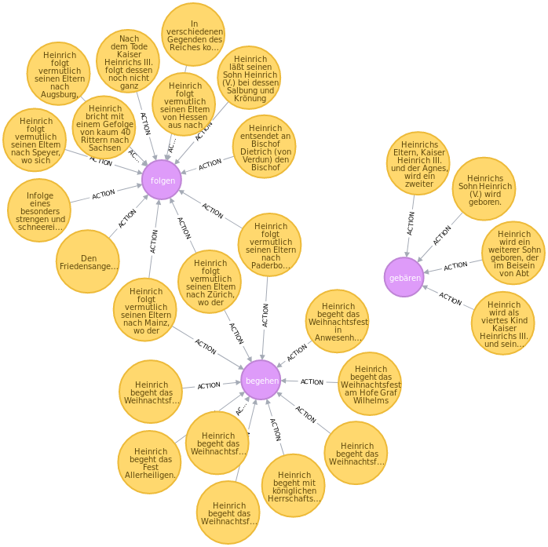

## Zitationsnetzwerke in den Regesta Imperii

In vielen Online-Regesten ist die zitierte Literatur mit dem [Regesta-Imperii-Opac](http://opac.regesta-imperii.de/lang_de/) verlinkt. Da es sich um URLs handelt, sind diese Verweise eindeutig.
Andererseits lassen sie sich mit regulären Ausdrücken aus den Regesten extrahieren. Mit folgendem Query werden aus den Überlieferungsteilen der Regesten die mit dem Opac verlinkten Literaturangaben extrahiert und jede Literaturangabe als `Refernce`-Knoten angelegt. Für den folgenden Befehl muss die APOC-Bibliothek in neo4j installiert sein: https://neo4j-contrib.github.io/neo4j-apoc-procedures/#_installation_with_neo4j_desktop.

~~~cypher
// ReggH4-Literaturnetzwerk erstellen
MATCH (reg:Regesta)
WHERE reg.archivalHistory CONTAINS "link"
UNWIND apoc.text.regexGroups(reg.archivalHistory,
"<link (\\S+)>(\\S+)</link>") as link
MERGE (ref:Reference {url:link[1]})
ON CREATE SET ref.title=link[2]
MERGE (reg)-[:REFERENCES]->(ref);
~~~

Da dies mit dem `MERGE`-Befehl geschieht, wird in der Graphdatenbank jeder Literaturtitel nur einmal angelegt. Anschließend werden die `Reference`-Knoten mit den Regesten über `REFERENCES`-Kanten verbunden. Zu den Auswertungsmöglichkeiten vgl. unten den Abschnitt zu den [Auswertungsperspektiven](##Auswertungsperspektiven).

## Import der Registerdaten in die Graphdatenbank

### Vorbereitung der Registerdaten

Register spielen für die Erschließung von gedrucktem Wissen eine zentrale Rolle, da dort in alphabetischer Ordnung die im Werk vorkommenden Entitäten (z.B. Personen und Orte) hierarchisch gegliedert aufgeschlüsselt werden. Für die digitale Erschließung der Regesta Imperii sind Register von zentraler Bedeutung, da mit ihnen die in den Regesten vorkommenden Personen und Orte bereits identifiziert vorliegen. Für den Import in die Graphdatenbank wird allerdings eine digitalisierterte Fassung des Registers benötigt. Im Digitalisierungsprojekt Regesta Imperii Online wurden Anfang der 2000er Jahre auch die gedruckt vorliegenden Register digitalisiert. Sie dienen nun als Grundlage für die digitale Registererschließung der Regesta Imperii. Im hier gezeigten Beispiel werden die Regesten Kaiser Heinrichs IV. und das dazugehörige Register importiert. Da der letzte Regestenband der Regesten Kaiser Heinrichs IV. mit dem Gesamtregister erst vor kurzem gedruckt wurde, liegen hier aktuelle digitale Fassung von Registern und Regesten vor. Die für den Druck in Word erstellte Registerfassung wird hierfür zunächst in eine hierarchisch gegliederte XML-Fassung konvertiert, damit die Registerhierarchie auch maschinenlesbar abgelegt ist.

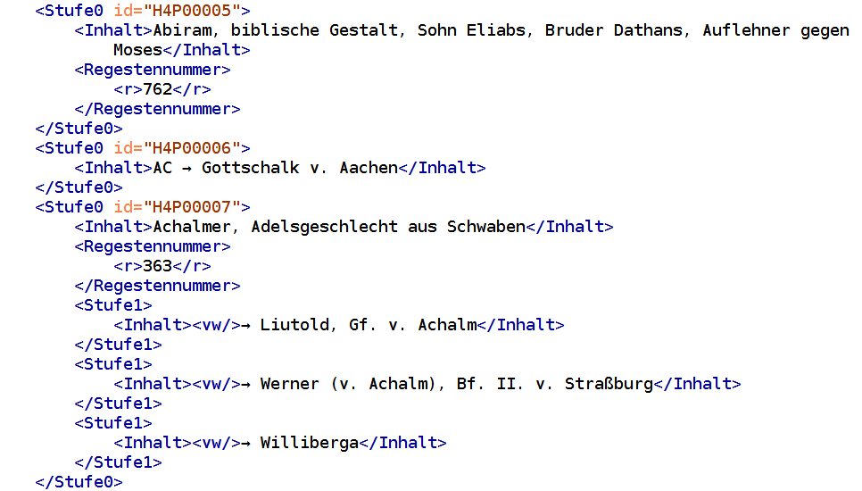

In der XML-Fassung sind die inhaltlichen Bereiche und die Abschnitte für die Regestennummern jeweils extra in die Tags `<Inhalt>` und `<Regestennummer>` eingefasst. Innerhalb des Elements `<Regestennummer>` ist dann nochmal jede einzelne Regestennummer in `<r>`-Tags eingefasst. Die aus dem gedruckten Register übernommenen Verweise sind durch ein leeres `<vw/>`-Element gekennzeichnet.

Die in XML vorliegenden Registerdaten werden anschließend mit Hilfe von TuStep in einzelne CSV-Tabellen zerlegt.

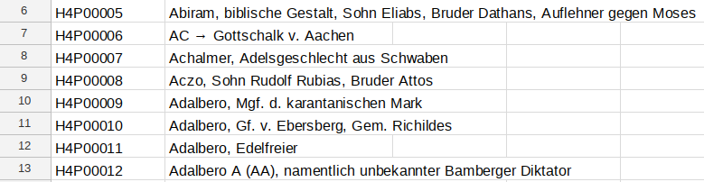

In einer Tabelle werden alle Entitäten aufgelistet und jeweils mit einer ID versehen.

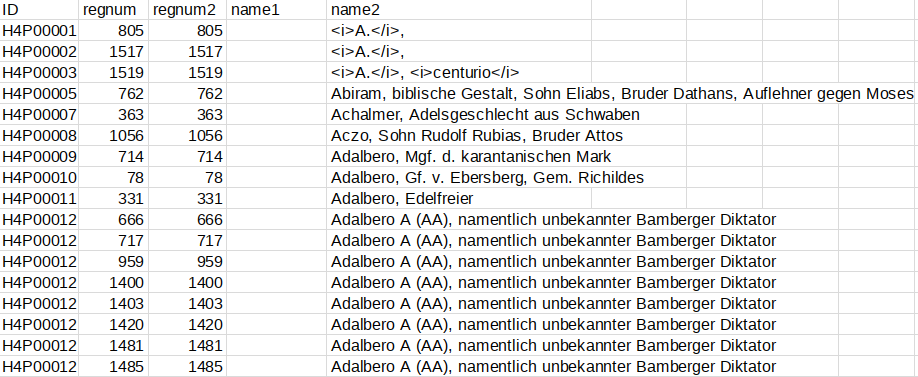

In der anderen Tabelle werden die Verknüpfungen zwischen Registereinträgen und den Regesten aufgelistet. Der Registereintrag Adalbero kommt in mehreren Regesten vor. Da das Register der Regesten Heinrichs IV. nur zwei Hierarchiestufen enthält, in denen beispielsweise verschiedene Amtsphasen ein und derselben Person unterschieden werden, wurden diese beim Import zusammengefasst.[^5979] Damit gibt es pro Person jeweils nur einen Knoten.

### Import der Registerdaten in die Graphdatenbank

Im Gegensatz zu den Regesten Kaiser Friedrichs III., bei denen Orte und Personen in einem Register zusammengefasst sind, haben die Regesten Kaiser Heinrich IV. getrennte Orts- und Personenregister. Die digitalisierten Registerdaten können als [Excel](https://github.com/kuczera/Graphentechnologien/raw/master/data/RegisterH4.xlsx)- oder als  [ODS](https://github.com/kuczera/Graphentechnologien/raw/master/data/RegisterH4.ods)-Datei heruntergeladen werden. In dem Tabellendokument befinden sich insgesamt drei Tabellen. In der Tabelle `Personen` sind die Einträge des Personenregisters aufgelistet und in der Tabelle `Orte` befindet sich die Liste aller Einträge des Ortsregisters. Schließlich enthält die Tabelle `APPEARS_IN` Information dazu, welche Personen oder Orte in welchen Regesten genannt sind. Der folgende Cypher-Query importiert die Einträge der Personentabelle in die Graphdatenbank und erstellt für jeden Eintrag einen Knoten vom Typ `:IndexPerson`:

~~~cypher
// Registereinträge Personen erstellen
LOAD CSV WITH HEADERS FROM "https://github.com/kuczera/Graphentechnologien/raw/master/data/RegisterH4-IndexPerson.csv"
AS line
CREATE (:IndexPerson {registerId:line.ID, name1:line.name1});
~~~

Mit dem folgenden Cypher-Query werden nach dem gleichen Muster aus der Tabelle `Orte` die Ortseinträge in die Graphdatenbank importiert.

~~~cypher
// Registereinträge Orte erstellen
LOAD CSV WITH HEADERS FROM "https://github.com/kuczera/Graphentechnologien/raw/master/data/RegisterH4-IndexPlace.csv"
AS line
CREATE (:IndexPlace {registerId:line.ID, name1:line.name1});
~~~

Die beiden Befehle greifen also auf verschiedene Tabellenblätter des gleichen Google-Tabellendokuments zu, laden es als CSV-Daten und übergeben die Daten zeilenweise an die weiteren Befehle (Hier an den `MATCH`- und den `CREATE`-Befehl).
Im nächsten Schritt werden nun mit den Daten der `APPEARS_IN`-Tabelle die Verknüpfungen zwischen den Registereinträgen und den Regesten erstellt.

~~~cypher
// PLACE_IN-Kanten für Orte erstellen
LOAD CSV WITH HEADERS FROM "https://github.com/kuczera/Graphentechnologien/raw/master/data/RegisterH4-Place-APPEARS_IN.csv"
AS line
MATCH (from:IndexPlace {registerId:line.ID})
MATCH (to:Regesta {regnum:line.regnum2})
CREATE (from)-[:PLACE_IN {regnum:line.regnum,
  name1:line.name1, name2:line.name2}]->(to);
~~~

Mit zwei `MATCH`-Befehlen werden jeweils das Regest und der Registereintrag aufgerufen und mit dem `CREATE`-Befehl eine `PLACE_IN`-Kante zwischen den beiden Knoten angelegt, die als Attribute den Inhalt der Spalten `name1` und `name2` erhält.
Analog werden die Verknüpfungen zwischen Regestenknoten und Personenknoten angelegt:

~~~cypher
// PERSON_IN-Kanten für Person erstellen
LOAD CSV WITH HEADERS FROM "https://github.com/kuczera/Graphentechnologien/raw/master/data/RegisterH4-Person-APPEARS_IN.csv"
AS line
MATCH (from:IndexPerson {registerId:line.ID}),
(to:Regesta {regnum:line.regnum2})
CREATE (from)-[:PERSON_IN {regnum:line.regnum, name1:line.name1,
  name2:line.name2}]->(to);
~~~

## Exkurs 2: Die Hierarchie des Registers der Regesten Kaiser Friedrichs III.

In anderen Registern der Regesta Imperii, wie beispielsweise den Regesten Kaiser Friedrichs III., sind teilweise fünf oder mehr Hierarchiestufen vorhanden, die jeweils auch Entitäten repräsentieren.

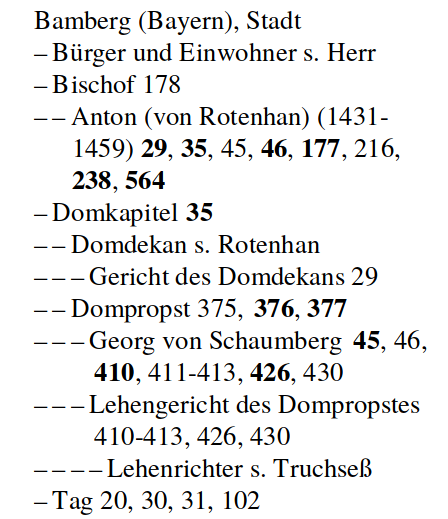

In diesen Fällen müssen die Hierarchien auch in der Graphdatenbank abgebildet werden, was durch zusätzliche Verweise auf die ggf. vorhandenen übergeordneten Registereinträge möglich wird.

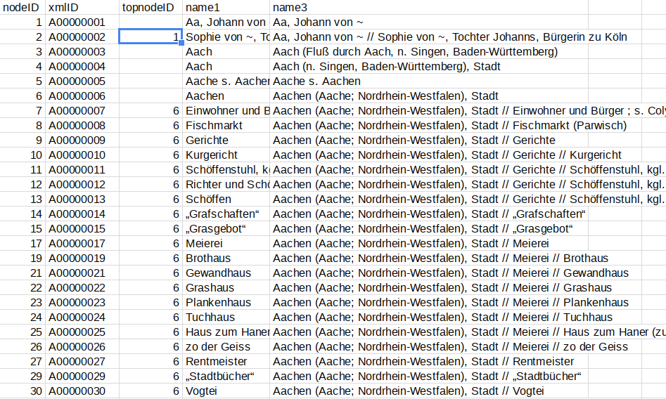

Im Tabellenausschnitt wird jedem Registereintrag in der ersten Spalte eine `nodeID` als eindeutige Kennung zugewiesen. Bei Registereinträgen, die kein Hauptlemma sind, enthält die dritte Spalte `topnodeID` den Verweis auf die eindeutige Kennung `nodeID` des übergeordneten Eintrages. Beim Import in die Graphdatenbank wird diese Hierarchie über `CHILD_OF`-Kanten abgebildet, die vom untergeordneten Eintrag auf das übergeordnete Lemma verweisen. Damit ist die komplette Registerhierarchie im Graphen abgebildet. In der Spalte `name1` ist das Lemma angegeben. In der Spalte `name3` ist zusätzlich zum Lemma noch der gesamte Pfad vom Hauptlemma bis zum Registereintrag, jeweils mit Doppelslashes (`//`) getrennt. Bei tiefer gestaffelten Registern ist teilweise ohne Kenntnis der übergeordneten Einträge eine eindeutige Identifizierung eines Eintrages nicht möglich. So wird in Zeile 17 der o.a. Abbildung allein mit der Angabe aus der Spalte `name1` nicht klar, um welche `Meierei` es sich handelt. Mit dem kompletten Pfad des Registereintrages in der Spalte `name3` wird dagegen deutlich, dass die Aachener `Meierei` gemeint ist.

## Auswertungsperspektiven

### Personennetzwerke in den Registern

#### Graf Robert II. von Flandern in seinem Netzwerk

Nach dem Import können nun die Online-Regesten und die Informationen aus den Registern der Regesten Kaiser Heinrichs IV. in einer Graphdatenbank aus einer Vernetzungsperspektive abgefragt werden.[^f663]

Ausgangspunkt ist der Registereintrag von [Graf Robert II. von Flandern](https://de.wikipedia.org/wiki/Robert_II._(Flandern)). Diesen Knoten finden wir mit folgendem Query.

~~~cypher
// Robert II. von Flandern
MATCH (n:IndexPerson) WHERE n.registerId = 'H4P01822'
RETURN *;
~~~

Mit einem Doppelklick auf den `IndexPerson`-Knoten öffnen sich alle `Regesta`-Knoten, in denen Robert genannt ist. Klickt man nun wiederum alle Regestenknoten doppelt an, sieht man alle Personen und Orte, mit denen Robert gemeinsam in den Regesten genannt ist.

Dies kann auch in einem Cypher-Query zusammengefasst werden.

~~~cypher
// Robert II. von Flandern mit Netzwerk
MATCH (n:IndexPerson)-[:PERSON_IN]->
(r:Regesta)<-[:PERSON_IN]-
(m:IndexPerson)
WHERE n.registerId = 'H4P01822'
RETURN *;
~~~

In der folgenden Abb. wird das Ergebnis dargestellt.

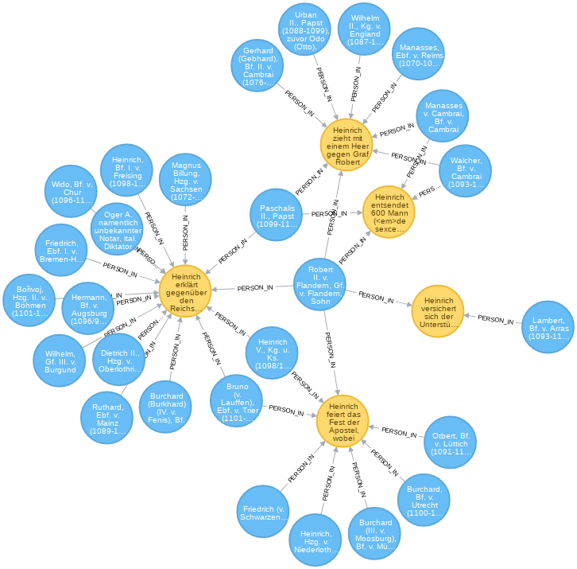

Hier wird der `MATCH`-Befehl um einen Pfad über `PERSON_IN`-Kanten zu `Regesta`-Knoten ergänzt, von denen jeweils eine `PERSON_IN`-Kante zu den anderen, in den Regesten genannten `IndexPerson`-Knoten führt.

Nimmt man noch eine weitere Ebene hinzu, wächst die Ergebnismenge stark an. Der folgende Query kann daher je nach Rechnerleistung etwas länger dauern.

~~~cypher
// Robert II. von Flandern mit Netzwerk und Herrscherhandeln (viel)
MATCH
(n1:IndexPerson)-[:PERSON_IN]->(r1:Regesta)<-[:PERSON_IN]-
(n2:IndexPerson)-[:PERSON_IN]->(r2:Regesta)<-[:PERSON_IN]-
(n3:IndexPerson)
WHERE n1.registerId = 'H4P01822'
RETURN *;
~~~

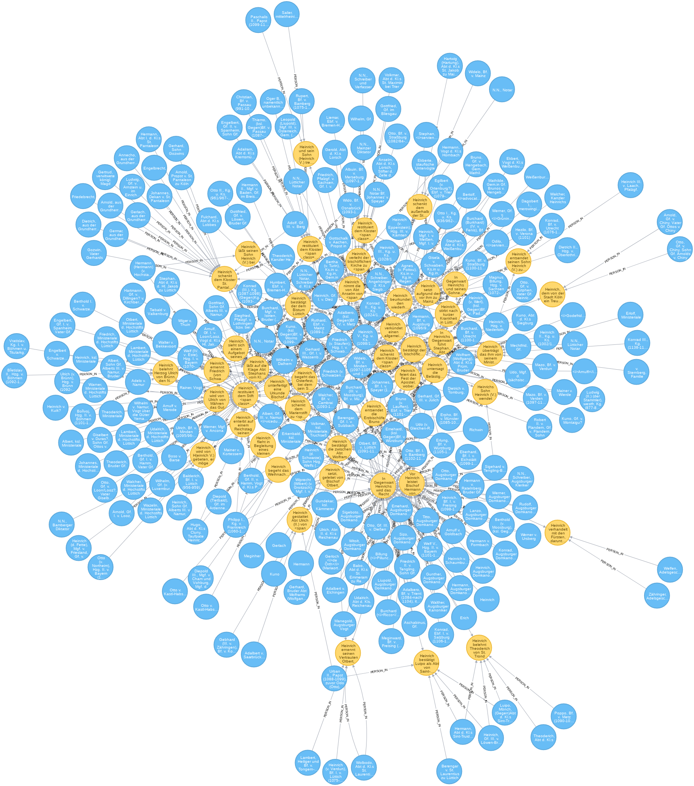

#### Graf Robert II. von Flandern und Herzog Heinrich von Niederlothringen

In der Graphdatenbank ist es über die Exploration der Beziehungen einer Person hinaus möglich, explizit die Verbindungen von zwei Personen abzufragen. In unserem nächsten Beispiel suchen wir jene Regesten, in denen [Graf Robert II. von Flandern](https://de.wikipedia.org/wiki/Robert_II._(Flandern)) und [Herzog Heinrich von Niederlothringen](https://de.wikipedia.org/wiki/Heinrich_I._(Limburg)) gemeinsam genannt sind.

~~~cypher
// Robert II. von Flandern und Herzog Heinrich von Niederlothringen mit Netzwerk
MATCH
(n:IndexPerson)-[:PERSON_IN]->
(r:Regesta)<-[:PERSON_IN]-(m:IndexPerson)
WHERE n.registerId = 'H4P01822'
AND m.registerId = 'H4P00926'
RETURN *;
~~~

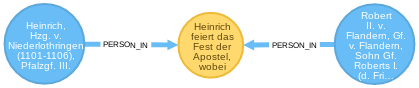

Es zeigt sich, dass Robert und Heinrich in einem Regest gemeinsam genannt sind.

Und dieses [Regest](http://www.regesta-imperii.de/id/cf75356b-bd0d-4a67-8aeb-3ae27d1dcefa) berichtet von der Unterwerfung Roberts unter Heinrich IV.[^cbec]

> Heinrich feiert das Fest der Apostel, wobei sich Graf Robert von Flandern im Beisein mehrerer Fürsten unterwirft, namentlich der Erzbischöfe Friedrich von Köln und Bruno von Trier, der Bischöfe Otbert von Lüttich, Burchard von Münster, Burchard von Utrecht, Herzog Heinrich von Niederlothringen sowie mehrerer Grafen.

Möglicherweise haben beide aber gemeinsame Bekannte, also Personen mit denen sowohl Heinrich als auch Robert in unterschiedlichen Regesten gemeinsam genannt sind. Hierfür wird der Cypher-Query um eine Ebende erweitert.

~~~cypher
// Robert und Heinrich mit allen gemeinsamen Personen und Regesten
MATCH (n1:IndexPerson)
-[:PERSON_IN]->(r1:Regesta)<-[:PERSON_IN]-
(n2:IndexPerson)-[:PERSON_IN]->(r2:Regesta)
<-[:PERSON_IN]-(n3:IndexPerson)
WHERE n1.registerId = 'H4P00926'
AND n3.registerId = 'H4P01822'
RETURN *;
~~~

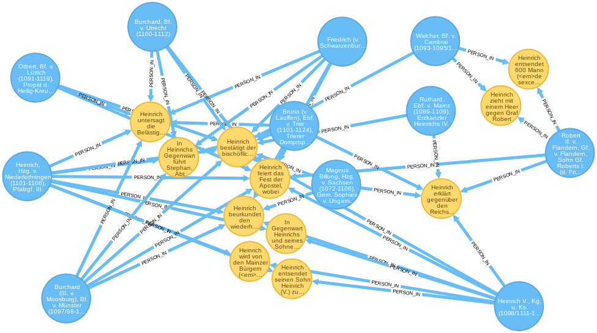

Ein erster Blick auf das Ergebnis zeigt, dass Heinrich allgemein besser vernetzt ist. Für die weitere Analyse ihres Verhältnisses ist nun die Lektüre der angegebenen Regesten notwendig.
Hierfür lässt sich das Ergebnis noch etwas weiter aufbereiten, indem die zwischen den Personen liegenden Regesten in `KNOWS`-Kanten umgewandelt werden, die als zusätzliche Information die Angaben zu den Regesten enthalten.

~~~cypher
// Rausrechnen der dazwischenliegenden Knoten
MATCH
(startPerson:IndexPerson)-[:PERSON_IN]->
(regest:Regesta)<-[:PERSON_IN]-(endPerson:IndexPerson)
WHERE startPerson.registerId in ['H4P01822', 'H4P00926']
WITH startPerson, endPerson, count(regest) as anzahl,
collect(regest.ident) as idents
CALL apoc.create.vRelationship(startPerson, "KNOWS",
{anzahl:anzahl, regesten:idents}, endPerson) YIELD rel
RETURN startPerson, endPerson, rel;
~~~

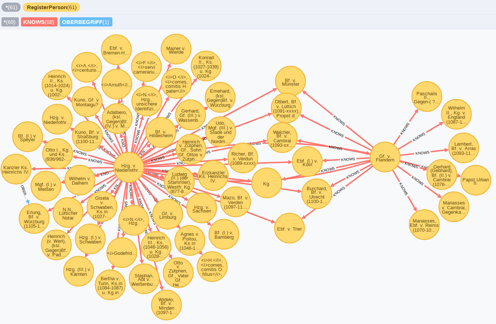

In der Abbildung sind die zwei Ego-Netzwerke von Heinrich (links) und Robert (rechts) mit den dazwischen liegenden gemeinsamen Bekanntschaften dargestellt. Es zeigt sich, dass Heinrich stärker sowohl mit Geistlichen als auch Weltlichen vernetzt war, während Robert insgesamt weniger Kontakte aber mit einem Schwerpunkt in der Geistlichkeit hatte.

Für den Historiker ist aber vor allem interessant, was in den Regesten steht, die Robert und Heinrich über die Mittelsmänner verbinden. Hierfür wird der Cypher-Query angepasst und sowohl Personen als auch die Regestentexte ausgegeben.

~~~cypher
// Liste der Regesten als Ergebnis
MATCH
(startPerson:IndexPerson)-[:PERSON_IN]->
(regest1:Regesta)<-[:PERSON_IN]-(middlePerson:IndexPerson)
-[:PERSON_IN]->(regest2:Regesta)
<-[:PERSON_IN]-(endPerson:IndexPerson)
WHERE startPerson.registerId in ['H4P00926']
AND endPerson.registerId in ['H4P01822']
RETURN DISTINCT startPerson.name1,
regest1.ident, regest1.text,
middlePerson.name1, regest2.ident,
regest2.text, endPerson.name1;
~~~

In der folgenden Abbildung wird ein Ausschnitt der Ergebnistabelle gezeigt. In der ersten Spalte der Tabelle finden sich Robert, anschließend die Angaben zum Regest, mit dem er mit der mitteleren Person (middlePerson.name1) verknüpft ist. Dem folgen schließlich die Angaben zum Regest, mit den die mittlere Person mit Robert in der letzten Spalte verbunden ist. Die Tabelle bietet einen Überblick zur Überlieferungssituation aus der Perspektive der Regesta Imperii.

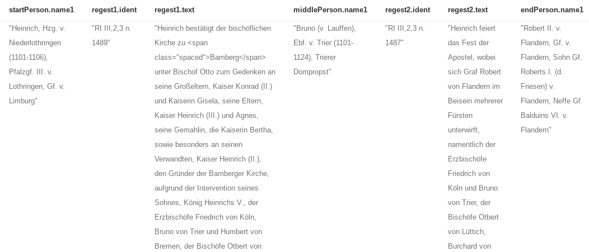

### Herrscherhandeln ausgezählt

Wie bereits oben erwähnt, wurde in einem ersten Test jeweils das erste Verb des Regestentextes extrahiert, lemmatisiert und in die Graphdatenbank eingespielt. Im folgenden werden nun einige Cypher-Querys vorgestellt, die dies beispielhaft auswerten.

~~~cypher
// Herrscherhandeln ausgezählt
MATCH (n:Action)<-[h:ACTION]-(m:Regesta)
RETURN n.action, count(h) as ANZAHL ORDER BY ANZAHL desc LIMIT 10;
~~~

|n.action|ANZAHL|
|----------------------|------------|
|werden|145|
|schenken|133|
|bestätigen|109|
|begehen|95|
|verleihen|48|
|ernennen|36|
|nehmen|35|
|treffen|34|
|empfangen|29|
|erhalten|26|

Die Ergebnisliste zeigt gleich die Einschränkungen, da das Hilfsverb *werden* aus dem textuellen Zusammenhang gerissen ist. Andererseits ergeben sich aber auch interessante Erkenntnisse zur Häufigkeitsverteilung von Herrscherhandeln in Regestentexten. Die Anwendung des Verfahrens auf Regestentexte ist dabei auf der einen Seite positiv, da bei der Erstellung der Regesten sehr stark auf formale Kriterien geachtet wird und so die Zusammenhänge gut zu erfassen sind. Auf der anderen Seite ist die Auswertung aber wiederum einen weiteren Schritt von der ursprünglichen Quelle entfernt.

### Herrscherhandeln pro Ausstellungsort ausgezählt

Im folgenden Query kommt eine räumliche Komponente zur Abfrage hinzu, da das Verb (Action) hier jeweils abhängig vom Ausstellungsort der Urkunde abgefragt wird.

~~~cypher
// Herrscherhandeln pro Ausstellungsort
MATCH (n:Action)<-[h:ACTION]-(:Regesta)-[:PLACE_OF_ISSUE]->(p:Place)
WHERE p.normalizedGerman IS NOT NULL
RETURN p.normalizedGerman, n.action, count(h) as ANZAHL ORDER BY ANZAHL desc LIMIT 10;
~~~

|p.normalizedGerman|n.action|ANZAHL|
|----|----:|----:|
|Mainz|begehen|15|
|Mainz|schenken|14|
|Goslar|schenken|13|
|Rom|werden|12|
|Regensburg|schenken|12|
|Goslar|begehen|11|
|Speyer|schenken|10|
|Worms|begehen|8|
|Regensburg|bestätigen|7|
|Regensburg|werden|7|

In der ersten Spalte befindet sich der Ortsname, der aus der Property `normalizedGerman` des `Place`-Knotens stammt. In der zweiten Spalte wird das Verb angegeben und in der dritten Spalte schließlich die Anzahl der jeweiligen Regesten. Interessant wäre hier auch noch die Ergänzung der zeitlichen Dimension, mit der dann der zeitliche Verlauf in die Auswertung miteinbezogen werden könnte.

### Herrscherhandeln und Anwesenheit

Im nächsten Beispiel werden in einem Regest genannten Personen in die Auswertung des Herrscherhandelns mit einbezogen.

~~~cypher
MATCH (p:IndexPerson)-[:PERSON_IN]-(r:Regesta)-[:ACTION]-(l:Action)
RETURN p.name1, l.action, count(l) AS Anzahl ORDER BY p.name1, Anzahl DESC;
~~~

|p.name1|l.action|Anzahl|
|:-----------------------------------------------------|------------:|------:|
| ... | ... | ... |
|Adalbero, Metzer Domkanoniker, Kanzler Heinrichs IV., Kanzler (Gegen)Kg. Rudolfs v. Rheinfelden|schenken|21|
|Adalbero, Metzer Domkanoniker, Kanzler Heinrichs IV., Kanzler (Gegen)Kg. Rudolfs v. Rheinfelden|bestätigen|9|
|Adalbero, Metzer Domkanoniker, Kanzler Heinrichs IV., Kanzler (Gegen)Kg. Rudolfs v. Rheinfelden|verleihen|4|
|Adalbero, Metzer Domkanoniker, Kanzler Heinrichs IV., Kanzler (Gegen)Kg. Rudolfs v. Rheinfelden|erlassen|2|
|Adalbero, Metzer Domkanoniker, Kanzler Heinrichs IV., Kanzler (Gegen)Kg. Rudolfs v. Rheinfelden|übertragen|2|
|Adalbero, Metzer Domkanoniker, Kanzler Heinrichs IV., Kanzler (Gegen)Kg. Rudolfs v. Rheinfelden|ermäßigen|2|
|Adalbero, Metzer Domkanoniker, Kanzler Heinrichs IV., Kanzler (Gegen)Kg. Rudolfs v. Rheinfelden|gestatten|2|
|Adalbero, Metzer Domkanoniker, Kanzler Heinrichs IV., Kanzler (Gegen)Kg. Rudolfs v. Rheinfelden|vollziehen|1|
|Adalbero, Metzer Domkanoniker, Kanzler Heinrichs IV., Kanzler (Gegen)Kg. Rudolfs v. Rheinfelden|nehmen|1|
|Adalbero, Metzer Domkanoniker, Kanzler Heinrichs IV., Kanzler (Gegen)Kg. Rudolfs v. Rheinfelden|mindern|1|
|Adalbero, Metzer Domkanoniker, Kanzler Heinrichs IV., Kanzler (Gegen)Kg. Rudolfs v. Rheinfelden|setzen|1|
| ... | ... | ... |

Die Ergebnistabelle zeigt den Abschnitt zu Adalbero, einem Metzer Domkanoniker, mit der Häufigkeit der jeweiligen Verben zum "Herrscherhandeln".

### Regesten 200 km rund um Augsburg

Mit dem folgenden Query werden für den Umkreis von 200 km rund um Augsburg alle Regesten aufgerufen.

~~~cypher
// Entfernungen von Orten berechnen lassen
MATCH (n:Place)
WHERE n.normalizedGerman = 'Augsburg'
WITH n.latLong as point
MATCH (r:Regesta)
WHERE distance(r.latLong, point) < 200000
AND r.placeOfIssue IS NOT NULL
AND r.placeOfIssue <> 'Augsburg'
RETURN r.ident, r.placeOfIssue,
distance(r.latLong, point) AS Entfernung
ORDER BY Entfernung;
~~~

Solche Queries lassen sich auch mit zeitlichen Abfragen kombinieren und bieten sehr flexible Abfragemöglichkeiten.

### Welche Literatur wird am häufigsten zitiert

Beim Import der Regesten in die Graphdatenbank werden die mit dem RI-Opac verlinkten Literaturtitel als eigenständige `Reference`-Knoten angelegt und jeweils mit dem `Regesta`-Knoten verknüpft. Diese Verknüpfung wird mit dem folgenden Query abgefragt, ausgezählt und aufgelistet.

~~~cypher
// Welche Literatur wird am häufigsten zitiert
MATCH (n:Reference)<-[r:REFERENCES]-(m:Regesta)
RETURN n.title, count(r) AS Anzahl
ORDER BY Anzahl DESC LIMIT 10;
~~~

|n.title|ANZAHL
|:---|---:
|Stumpf|215
|Böhmer|201
|Ldl|101
|Jaffé|60
|Schmale|56
|Buchholz|51
|Scheffer-Boichorst|50
|Wauters|39
|Dobenecker|33
|Remling|28

Mit diesen Daten lassen sich Zitationsnetzwerke in den Regesten darstellen mit denen Regesten gefunden werden können, die auf Grund der gemeinsam zitierten Literatur die gleichen inhaltlichen Schwerpunkte aufweisen können.

### Der Import zusammengefasst

Den komplette [Cypher-Code](cypher/20_cypher-Datenbankerstellung.txt) für die Erstellung der Graphdatenbank ist zusammengefasst über eine [Textdatei](cypher/20_cypher-Datenbankerstellung.txt) abrufbar. Es ist zu empfehlen, die aktuelle Version von neo4j-Desktop zu installieren, eine Graphdatenbank anzulegen und in der Graphdatenbank die Apoc-Bibliothek zu installieren. Inzwischen ist es möglich, in der Befehlszeile des neo4j-Browsers auch mehrere Befehle nacheinander ausführen zu lassen. Alternativ kann nach dem Start der Graphdatenbank im Reiter `Terminal` mit dem Befehl `bin/cypher-shell` die cypher-shell aufgerufen werden. In diese Shell werden dann alle Befehl gemeinsam hineinkopiert und ausgeführt.
Alternativ zur Installation von neo4j kann auch auf den Internetseiten von neo4j eine [Sandbox](https://neo4j.com/lp/try-neo4j-sandbox) erstellt werden.

## Zusammenfassung

In diesem Kapitel wurden die Schritte zum Import der Regesten Kaiser Heinrichs IV. in die Graphdatenbank neo4j erläutert sowie verschiedene Auswertungsbeispiele vorgestellt.

[^5147]: Zu Installation und ersten Schritten von neo4j vgl. in der Einleitung den Abschnitt zu Installation und Start.
[^892b]: Dies ist das Tabellenkalkulationsformat von Libreoffice und Openoffice. Vgl. [https://de.libreoffice.org](https://de.libreoffice.org).

[^336e]: Die Angaben in der Graphdatenbank sind Englisch, daher *Regesta*.

[^d219]: Gemeint ist hier der lowerCamelCase bei dem der erste Buchstabe kleingeschrieben und dann jedes angesetzte Wort mit einem Großbuchstaben direkt angehängt (wie bei archivalHistory). Vgl. auch https://de.wikipedia.org/wiki/Binnenmajuskel#Programmiersprachen.

[^5979]: Vgl. die Vorbemerkung zum Register in Böhmer, J. F., Regesta Imperii III. Salisches Haus 1024-1125. Tl. 2: 1056-1125. 3. Abt.: Die Regesten des Kaiserreichs unter Heinrich IV. 1056 (1050) - 1106. 5. Lief.: Die Regesten Rudolfs von Rheinfelden, Hermanns von Salm und Konrads (III.). Verzeichnisse, Register, Addenda und Corrigenda, bearbeitet von Lubich, Gerhard unter Mitwirkung von Junker, Cathrin; Klocke, Lisa und Keller, Markus - Köln (u.a.) (2018), S. 291.

[^595c]: Vgl. Kuczera, Andreas; Schrade, Torsten: From Charter Data to Charter Presentation: Thinking about Web Usability in the Regesta Imperii Online. Vortrag auf der Tagung ›Digital Diplomatics 2013 – What ist Diplomatics in the Digital Environment?‹ Folien: https://prezi.com/vvacmdndthqg/from-charta-data-to-charta-presentation/.
[^0b8f]: Näheres dazu in Kuczera, Andreas: Digitale Perspektiven mediävistischer Quellenrecherche, in: Mittelalter. Interdisziplinäre Forschung und Rezeptionsgeschichte, 18.04.2014. URL: mittelalter.hypotheses.org/3492.

[^3273]: Vgl. beispielsweise Gramsch, Robert: Das Reich als Netzwerk der Fürsten - Politische Strukturen unter dem Doppelkönigtum Friedrichs II. und Heinrichs (VII.) 1225-1235. Ostfildern, 2013. Einen guten Überblick bietet das
Handbuch Historische Netzwerkforschung - Grundlagen und Anwendungen. Herausgegeben von
Marten Düring, Ulrich Eumann, Martin Stark und Linda von Keyserlingk. Berlin 2016.

[^ce4b]: Regesta chronologico-diplomatica Friderici III. Romanorum imperatoris (regis IV.) : Auszug aus den im K.K. Geheimen Haus-, Hof- und Staats-Archive zu Wien sich befindenden Registraturbüchern vom Jahre 1440 - 1493 ; nebst Auszügen aus Original-Urkunden, Manuscripten und Büchern / von Joseph Chmel, Wien 1838 und 1840.

[^6155]: Der Cypher-Befehl zur Erstellung der 1zu1-Beziehungen lautet: *MATCH (n1:Registereintrag)-[:APPEARS_IN]->(r:Regest)<-[:APPEARS_IN]-(n2:Registereintrag)
MERGE (n1)-[:KNOWS]->(n2);* Dabei werden die gerichteten `KNOWS`-Kanten jeweils in beide Richtungen erstellt.
Mit folgendem Befehl lassen sich die `KNOWS`-Kanten zählen: *MATCH p=()-[r:KNOWS]->() RETURN count(p);* Für die Bestimmung der 1zu1-Beziehungen muss der Wert noch durch 2 geteilt werden.

[^7a43]: Letztgenannte Tabelle existiert nur aus historischen Gründen und wird beim Import nicht mehr berücksichtigt.

[^f663]: Die nun folgenden Abfragen sind zum Teil einer Präsentation entnommen, die für die Summerschool der [Digitalen Akademie](https://www.digitale-akademie.de) im Rahmen des [Mainzed](https://www.mainzed.org/de) entwickelt wurden. Die Präsentation findet sich unter der URL [https://digitale-methodik.adwmainz.net/mod5/5c/slides/graphentechnologien/RI.html](https://digitale-methodik.adwmainz.net/mod5/5c/slides/graphentechnologien/RI.html).

[^cbec]: Vgl. RI III,2,3 n. 1487.

[^0153]: Die Einrichtung der Graphdatenbank Neo4j wird erläutert unter https://neo4j.com/docs/operations-manual/current/installation/.  Die den Regesten Kaiser Heinrichs IV. umfassen folgende Bände: Böhmer, J. F., Regesta Imperii III. Salisches Haus 1024-1125. Tl. 2: 1056-1125. 3. Abt.: Die Regesten des Kaiserreichs unter Heinrich IV. 1056 (1050) - 1106. 1. Lief.: 1056 (1050) – 1065, bearb. von Struve, Tilman - Köln (u.a.) (1984). Böhmer, J. F., Regesta Imperii III. Salisches Haus 1024-1125. Tl. 2: 1056-1125. 3. Abt.: Die Regesten des Kaiserreichs unter Heinrich IV. 1056 (1050) - 1106. 2. Lief.: 1065–1075, bearb. von Struve, Tilman unter Mitwirkung von Lubich, Gerhard und Jäckel, Dirk - Köln (u.a.) (2010). Böhmer, J. F., Regesta Imperii III. Salisches Haus 1024-1125. Tl. 2: 1056-1125. 3. Abt.: Die Regesten des Kaiserreichs unter Heinrich IV. 1056 (1050) - 1106. 3. Lief.: 1076–1085, bearb. von Lubich, Gerhard nach Vorarbeiten von Struve, Tilman unter Mitwirkung von Jäckel, Dirk - Köln (u.a.) (2016). Böhmer, J. F., Regesta Imperii III. Salisches Haus 1024-1125. Tl. 2: 1056-1125. 3. Abt.: Die Regesten des Kaiserreichs unter Heinrich IV. 1056 (1050) - 1106. 4. Lief.: 1086–1105/06, bearb. von Lubich, Gerhard nach Vorarbeiten von Brauch, Daniel unter Mitwirkung von Weber, Matthias - Köln (u.a.) (2016). Böhmer, J. F., Regesta Imperii III. Salisches Haus 1024-1125. Tl. 2: 1056-1125. 3. Abt.: Die Regesten des Kaiserreichs unter Heinrich IV. 1056 (1050) - 1106. 5. Lief.: Die Regesten Rudolfs von Rheinfelden, Hermanns von Salm und Konrads (III.). Verzeichnisse, Register, Addenda und Corrigenda, bearbeitet von Lubich, Gerhard unter Mitwirkung von Junker, Cathrin; Klocke, Lisa und Keller, Markus - Köln (u.a.) (2018).

[^29b0]: Zum Treetagger vgl. http://www.cis.uni-muenchen.de/~schmid/tools/TreeTagger/.
