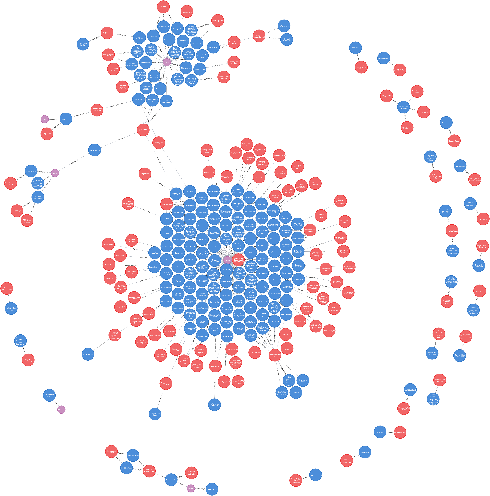

# Inhalt
{:.no_toc}

* Will be replaced with the ToC, excluding the "Contents" header
{:toc}

# Import von strukturierten XML-Daten in neo4j

In diesem Kapitel wird der Import von strukturierten XML-Daten in die Graphdatenbank neo4j beschrieben. Strukturiert meint hierbei, dass es sich nicht um mixed-content handelt, beim dem Text und Auszeichnung gemischt vorliegen können, sondern um Daten in einer datenbank-ähnlichen Struktur. Die Daten stammen aus einem Projekt meines Kollegen Thomas Kollatz, der sie mir freundlicherweise zur Verfügung gestellt hat. Ziel des Kapitels ist es, zunächst die Struktur der XML-Daten im Graphen zu analysieren, dann ein Graphmodell zu entwickeln und anschließend den Import durchzuführen.

## Das XML-Beispiel

Das XML-Beispiel enthält eine Liste von Buchwerken (`<work>`) die in einer Sammlung (`<collection>`) zusammengefasst sind. Innerhalb der einzelnen Bücher-Einträge sind neben dem Titel noch Angaben zu Autoren, Kommentatoren und dem Druckort zu finden.
In der folgenden Abbildung wird ein Auszug aus den Daten gezeigt.

Das root-Element in dem XML-Beispiel ist `<collection>`. Innerhalb von `<collection>` finden sich Angaben zu verschiedenen Büchern, die jeweils wieder mit einem `<work>`-Element zusammengefasst sind. Zu jedem Buch werden folgende Angaben gemacht:

* Titel des Buches im `<title>`-Element
* Autor(en) des Buches um `<autor>`-Element, ggf. durchnummeriert mit Zahlen in eckigen Klammern (z.B. [1])
* Kommentator des Buches im `<kommentator>`-Element
* Druckort des Buches im `<druckort>`-Element

## Knotentypen

Für die Modellierung dieser Datenstruktur in der Graphdatenbank müssen zunächst die verschiedenen Entitäten identifiziert werden um festzulegen, welche Knotentypen notwendig sind. Als erstes scheint es sinnvoll einen Knoten vom Typ `Werk` anzulegen, wie es auch im XML über das `<work>`-Element modelliert ist. Die dem `<work>`-Element untergeordneten Elemente `<title>`, `<autor>`, `<kommentator>` und `<druckort>` sind für das Werk jeweils spezifisch. Den Titel eines Werkes können wir in einem `Titel`-Knoten ablegen, den Druckort in einem `Ortsknoten` und Autoren sowie Kommentatoren werden in `Personen`-Knoten gespeichert. Hier ist zu beachten das die identifizierten Entitäten, wie z.b. Personen, nicht in Knotentypen gespeichert werden die ihre Rolle wiedergeben (wie z.B. Autor oder Kommentator) sondern unabhängig von ihrer Rolle in der allgemein gehaltenen Kategorie Person. Im Graphen werden die verschiedenen Rollen, wie Autor oder Kommentator, dann über die Kanten modelliert, was im nächsten Abschnitt näher erläutert wird.

## Kantentypen

Nach den Knotentypen sind nun die Kantentypen festzulegen. Sie geben an, in welcher Beziehung die verschiedenen Knoten zueinander stehen. Sieht man sich die XML-Vorlage an, ergeben sich folgene Typen von Kanten:

* `GEDRUCKT_IN`
* `AUTOR_VON`
* `KOMMENTIERT_VON`

Mit der `GEDRUCKT_IN`-Kante werden ein Werk und ein Ort verbunden und damit angegeben, dass dieses Buch in jenem Ort gedruckt worden ist.

Die `AUTOR_VON`-Kante verbindet einen Personenknoten mit einem Werkknoten und ordnet damit den Autor dem von ihm geschriebenen Buch zu.

Mit der `KOMMENTIERT_VON`-Kante wird auch ein Personenknoten einem Werkknoten zugeordnet, diesmal nimmt die Person aber die Rolle des Kommentierenden ein.

Im der folgenden Abbildung werden alle Knoten und Kanten des Beispiels gemeinsam dargestellt.

Damit steht das Graphmodell fest und im nächsten Abschnitt geht es an den Import.

## Der Import mit apoc.load.xmlSimple

Für den Import von XML-Daten steht in der Apoc-Bibliothek der Befehl apoc.load.xml zur Verfügung. Im folgenden wird zunächst der gesamte Befehl für den Import des XML-Beispiels gelistet.

~~~cypher
CALL apoc.load.xmlSimple("https://raw.githubusercontent.com/kuczera/Graphentechnologien/master/docs/data/kollatz.xml") yield value as xmlFile
UNWIND xmlFile._work as wdata
	MERGE (w1:Werk{eid:wdata.id})
	set w1.name=wdata._title._text
    FOREACH (name in wdata._autor |
		MERGE (p1:Person {Name:name._text})
		MERGE (p1)-[:AUTOR_VON]->(w1) )
	FOREACH (name in wdata._kommentator |
		MERGE (p1:Person {Name:name._text})
		MERGE (p1)-[:KOMMENTIERT_VON]->(w1))
	FOREACH (druckort in [x in
		wdata._druckort._text where x is not null] |
		 MERGE (o1:Ort{name:druckort})
		 MERGE (w1)-[:GEDRUCKT_IN]->(o1));
~~~

Für den Import wird die Apoc-Funktion apoc.load.xmlSimple verwendet[^6846]. Diese Funktion nimmt XML-Dateien oder eine URL und stellt die Daten geparst für die weitere Verarbeitung in einer Map-Struktur zur Verfügung (vgl. die Zeilen 1-4 des Codebeispiels). In der Variable __xmlFile__ befindet sich nun diese Map-Struktur. In Zeile 5 folgt der `UNWIND`-Befehl, der jeweils ein Werk (das ist der Inhalt des *work*-Elements in der XML-Datei) an die Variable value weitergibt, mit der es dann weiter verarbeitet werden kann. Dies wiederholt sich so lange, bis alle *work*-Elemente der XML-Datei abgearbeitet sind.

Nach dem `UNWIND`-Befehl folgt eine Gruppe von Befehlen, die immer wieder für jedes *work*-Element ausgeführt werden. Als erstes wird mit dem `MERGE`-Befehl ein Knoten vom Typ `Werk` für das Buch mit der Titelangabe in der Eigenschaft `name` erstellt. Dies ist nicht weiter schwierig, da in der XML-Datei für jedes Werk nur ein Titel existiert. Anders ist dies bei den Autoren, von denen es einen oder mehrere geben kann, die dann auch in mehreren *autor*-Elementen verzeichnet sind. In der gleichen Weise wird anschließend mit den Angaben zu Autor, Kommentator (die beide Personenknoten ergeben) und mit dem Druckort verfahren. Mit der Erstellung bzw. Prüfung auf Existenz durch den `MERGE`-Befehl werden gleichzeitig die `AUTOR_VON`-, `KOMMENTIERT_VON`-, und `GEDRUCKT_IN`-Kanten erstellt und der Graph vervollständigt.

Die Funktion apoc.loadxmlSimple ist inzwischen veraltet und wird von der Funktion apoc.loadxml abgelöst. Diese ist allgemeiner, aber dadurch in der Anwendung etwas komplizierter.

~~~cypher
CALL
apoc.load.xml("https://raw.githubusercontent.com/kuczera/Graphentechnologien/master/docs/data/kollatz.xml", "/collection/*")  YIELD value AS work // this uses an xpath expression to get all child nodes of "<collection>""
WITH
[x in work._children where x._type="title" | x._text][0] as titel,
[x in work._children where x._type="autor" | x._text] as autoren,
[x in work._children where x._type="kommentator" | x._text] as kommentatoren,
[x in work._children where x._type="druckort" | x._text] as druckorte,
work.id as eid
MERGE (w:Werk{eid:eid})
SET w.name = titel
FOREACH (x in autoren |
   MERGE (p:Person {name:x})
   MERGE (p)-[:AUTOR_VON]->(w) )
FOREACH (x in kommentatoren |
   MERGE (p:Person {name:x})
   MERGE (w)-[:KOMMENTIERT_VON]->(p) )
FOREACH (x in druckorte |
   MERGE (o:Ort {name:x})
   MERGE (w)-[:GEDRUCKT_IN]->(o) );
~~~

## Zusammenfassung

In diesem Abschnitt wurden die Analyse einer XML-Datei, die daraus resultierende Graphmodellierung und der Import des XMLs in die Graphdatenbank neo4j beschrieben. Für den Import wurden die Funktionen `apoc.load.xmlSimple` und `apoc.load.xml` aus der apoc-Bibliothek verwendet. Der Cypher-Code kann als Grundlage für weitere Importe von XML in die Graphdatenbank neo4j dienen.

[^6846]: Die Apoc-Bibliothek muss nach der Installation von neo4j zusätzlich installiert werden. Nähere Informationen finden sich im Anhang im Abschnitt zur Die Apoc-Bibliothek.
