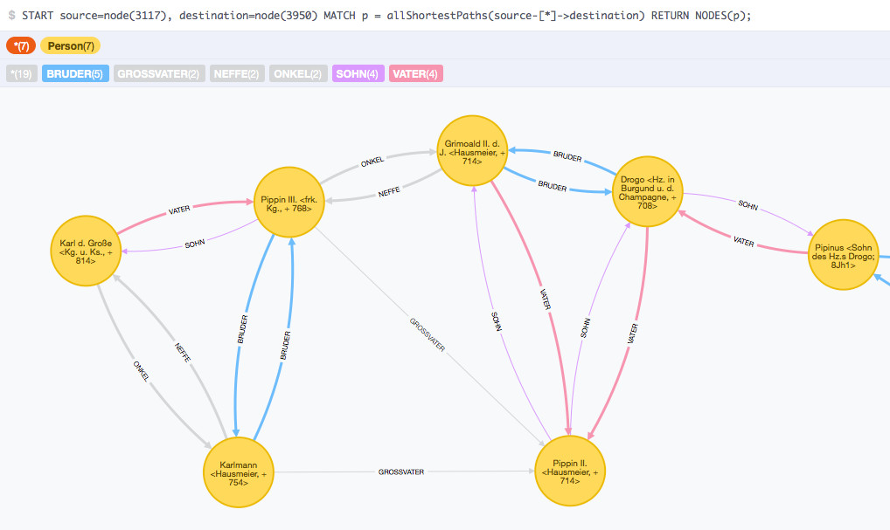
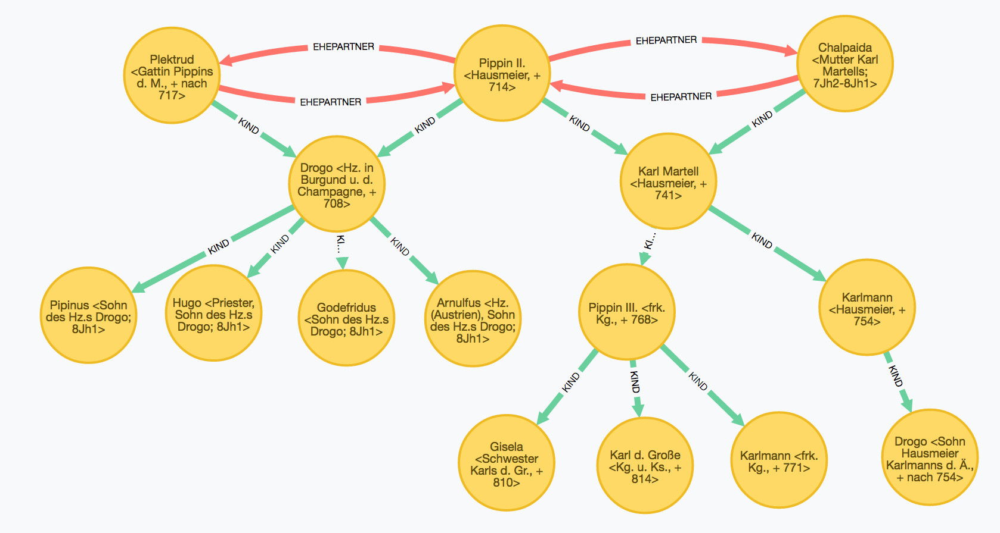
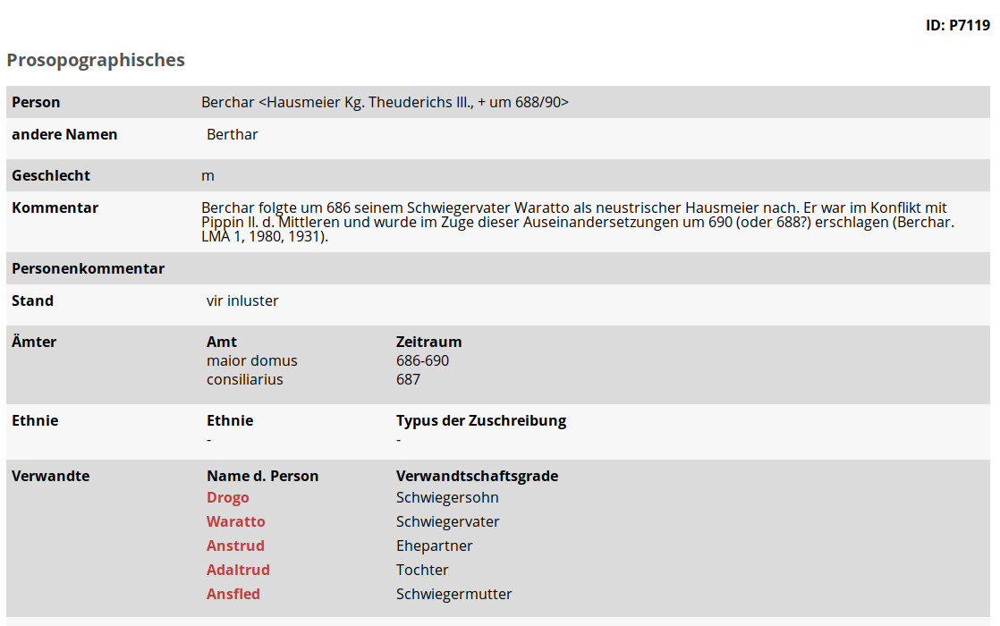

# Inhalt
{:.no_toc}

* Will be replaced with the ToC, excluding the "Contents" header
{:toc}

# Verwandtschaft im Graphen

In diesem Kapitel wird am Beispiel eines Ausschnitts der Daten des Projekts __Nomen et Gens__[^cca7] die Modellierung von Verwandtschaft in der Graphdatenbank neo4j dargestellt.[^a768]

## Das Projekt Nomen et Gens

Das Projekt __Nomen et Gens__ (NeG) zielt darauf ab, alle schriftlich belegten Namen und Personen Kontinentaleuropas in den vier Jahrhunderten vor Karl dem Großen (also von 400 bis 800 nach Christus) zu erfassen. Die Datenbank des Projekts geht auf ein erfolgreich abgeschlossenes DFG-Projekt zurück und wird aktuell von den Projektbeteiligten weiter betreut und sukzessive ausgebaut.  Neben den Quellen der Personennennung, den unterschiedlichen Namensformen usw. werden auch die Verwandtschaftsbeziehungen zwischen identifizierten Personen in der Datenbank abgelegt. Dabei werden bis zu 16 verschiedene Verwandtschaftsbeziehungen in der Datenbank gespeichert, wie z. B. Bruder, Schwester, Sohn, Tochter, Vater, Mutter, Onkel oder Nichte. Bei einem Personendatensatz werden dann jeweils die Verwandtschaftsbeziehungen aufgelistet, so dass man sich ggf. jeweils von Person zu Person durchklicken muss, bis man am Ziel angelangt ist.

## Nomen et Gens im Graphen

Vor diesem Hintergrund bot es sich an, die Personen und die zugehörigen Verwandtschaftsbeziehungen in die Graphdatenbank neo4j zu transferieren und anschließend graphbasierte Abfrageperspektiven zu testen.

Die Abbildung zeigt die ersten Ergebnisse des Datenbankimports. Aus der Visualisierung werden die zahlreichen redundanten Beziehungen deutlich, die in der Folge zu neuen Modellierungsansätzen für die Verwandtschaftsbeziehungen führten. Ergebnis der Überlegungen war die Reduzierung der möglichen Verwandtschaftsbeziehungen auf die zwei Kantentypen `KIND` und `VERHEIRATET_MIT`. Dabei wird eine Kante vom Typ `KIND` für eine Elternteil-Kind-Beziehung nur einmal vergeben, während eine Kante vom Typ `VERHEIRATET_MIT` immer zweifach in jeweils umgekehrter Richtung angelegt wird. Dies ergibt sich aus der Überlegung, dass eine Elternteil-Kind-Beziehung gerichtet ist und zwar in unserem Fall vom Elternteil zum Kind hin, während eine `VERHEIRATET_MIT`-Beziehung ungerichtet ist: Wenn eine Person mit einer anderen Person verheiratet ist, ist die andere Personen automatisch auch mit der ersten verheiratet. Da im Property-Graph-Modell von neo4j jede Kante genau eine Richtung haben muss, wird die `VERHEIRATET_MIT`-Kante zweimal in jeweils unterschiedliche Richtung angelegt, während bei der hierarchischen Elternteil-Kind-Beziehung eine Kante ausreicht.

## Sind Berchar und Karl der Große verwandt ?

Im folgenden Beispiel soll das Potential der Graphmodellierung von Verwandtschaftsbeziehungen demonstriert werden. In der Datenbank gibt es die Person Berchar. Berchar war ein Hausmeier König Theuderichs III. Die Frage ist nun, ob dieser Berchar mit Karl dem Großen verwandt ist. In der NeG-Datenbank ist ein Verwandtschaftsverhältnis von Berchar zu Karl dem Großen nicht direkt ableitbar.

In der Graphdatenbank neo4j wird für eine solche Fragestellung eine Shortest_Path-Abfrage verwendet, die den kürzesten möglichen Weg zwischen zwei Knoten zurück liefert, sofern es einen gibt. Der folgende Cypher-Befehl liefert den Pfad zwischen dem Personenknoten Karls des Großen mit der NeG-ID `7404` und dem Personenknoten von Berchar mit der NeG-ID `7119`. Dabei wird die Länge des abzufragenden Pfades auf 15 Kanten begrenzt.

~~~cypher
// shortest_path-Abfrage von Karl dem Großen zu Berchar
MATCH (KdG:Person { nid:'7404' })
MATCH (Berchar:Person { nid:'7119' })
p = shortestPath((KdG)-[*..15]-(Berchar))
RETURN p;
~~~

Das Ergebnis zeigt, dass Berchar tatsächlich mit Karl dem Großen verwandt ist. Er ist nämlich der Schwiegervater von Drogo (Herzog in Burgund und der Champagne, gest. 708), der wiederum der Bruder des Großvaters Karls des Großen ist.

## Zusammenfassung

Mit diesem Beispiel sind die interessanten Erschließungs- und Modellierungsperspektiven für die digitale Genealogie nur angedeutet. Mit Graphentechnologien lässt sich intuitive Datenmodellierung mit sehr flexiblen Erschließungs- und Abfragemöglichkeiten kombinieren.

[^a768]: Dieses Kapitel geht in großen Teilen zurück auf meinem Aufsatz Graphentechnologien in den Digitalen Geisteswissenschaften, in: ABI Technik 2017; 37(3): 179–196, [https://doi.org/10.1515/abitech-2017-0042](https://doi.org/10.1515/abitech-2017-0042). URL: [https://www.degruyter.com/downloadpdf/j/abitech.2017.37.issue-3/abitech-2017-0042/abitech-2017-0042.pdf](https://www.degruyter.com/downloadpdf/j/abitech.2017.37.issue-3/abitech-2017-0042/abitech-2017-0042.pdf), insbesondere die Seiten 179 bis 182 und wurde nur geringfügig ergänzt. Herrn Prof. Dr. Steffen Patzold danke ich herzlich für die Erlaubnis, die Nomen et Gens Daten im Rahmen dieser Publikation zu verwenden (mit Mail vom 22.01.2019).

[^cca7]: Informationen zum Projekt „Nomen et Gens“ finden Sie unter [http://www.neg.uni-tuebingen.de/](http://www.neg.uni-tuebingen.de/) (abgerufen am 10.08.2018).
