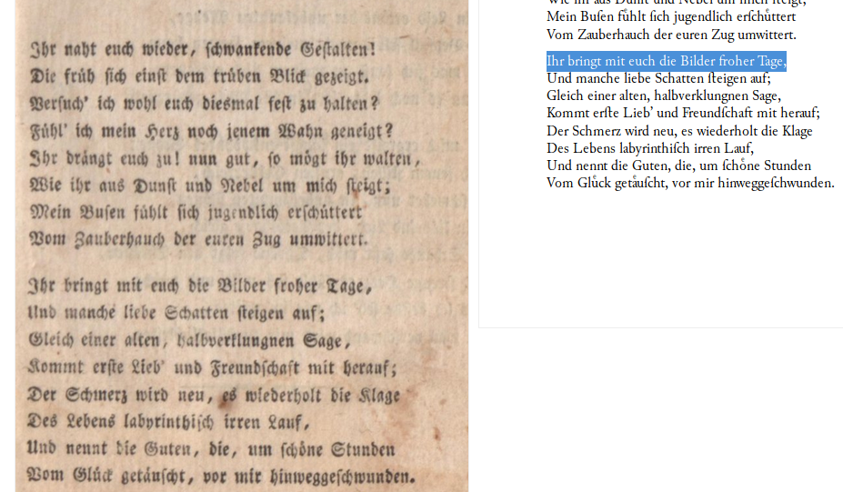
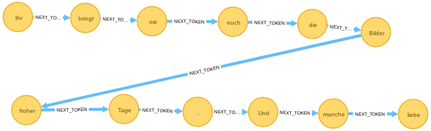
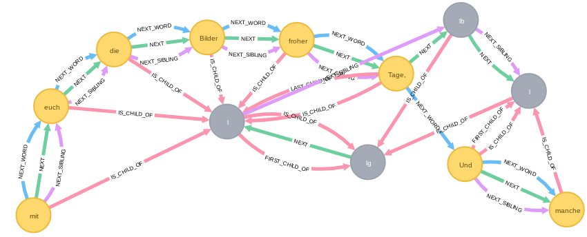

# Inhalt
{:.no_toc}

* Will be replaced with the ToC, excluding the "Contents" header
{:toc}

# Das Deutsche Textarchiv im Graphen

In diesem Abschnitt werden zwei Verfahren zum Import von XML-Texten des Deutschen Textarchivs (DTA) in die Graphdatenbank neo4j vorgestellt. Dabei unterscheiden sich sowohl das gewählte Ausgangsformat der DTA als auch die gewählten Importtechniken.

## Das deutsche Textarchiv

Das Deutsche Textarchiv (DTA) stellt einen Disziplinen übergreifenden Grundbestand deutscher Werke aus dem Zeitraum von ca. 1600 bis 1900 im Volltext und als digitale Faksimiles frei zur Verfügung und bereitet ihn so auf, dass er über das Internet in vielfältiger Weise nutzbar ist. Das DTA-Korpus soll in größtmöglicher Breite widerspiegeln, was an bedeutenden Werken in deutscher Sprache veröffentlicht wurde. Die ausgewählten Texte stehen repräsentativ für die Entwicklung der deutschen Sprache seit der Frühen Neuzeit. Alle DTA-Texte werden unter einer offenen Lizenz veröffentlicht (CC BY-NC). Das DTA fördert die Wiederverwendung seiner Texte in allen Bereichen der Digitalen Geisteswissenschaften.

## Die Downloadformate des DTA

Das DTA bietet zu den bereitgestellten Texten verschiedene Formate zum Download an. Als Beispiel wird hier [Goethes Faust](http://deutschestextarchiv.de/book/show/goethe_faust01_1808) in der ersten Auflage von 1808 importiert.

+ [TEI-P5](http://deutschestextarchiv.de/book/download_xml/goethe_faust01_1808) bietet die textkritische Fassung des Faust
+ [TCF](http://deutschestextarchiv.de/book/download_fulltcf/16181) bietet die tokenisierte, serialisierte, lemmatisierte und normalisierte Fassung, textkritische Informationen fehlen jedoch.
+ [Plain-Text](http://deutschestextarchiv.de/book/download_txt/goethe_faust01_1808) bietet einen einfachen Text mit Seiten- und Zeilenfall ohne weitere Zusatzinformationen

Für den Import in eine Graphdatenbanken bietet sich das TCF-Format an, da es den Text in tokenisierter, serialisierter, lemmatisierter und normalisierter Form bietet. In diesem Format lässt er sich mit Cypher-Befehlen in die Graphdatenbank importieren. Im Beispiel wird Goethes Faust in der TCF-Fassung in die Graphdatenbank importiert.

Hier wird ein Ausschnitt aus der TCF-Datei[^f332] gezeigt

~~~xml
<token ID="w5b">Ihr</token>
<token ID="w5c">bringt</token>
<token ID="w5d">mit</token>
<token ID="w5e">euch</token>
<token ID="w5f">die</token>
<token ID="w60">Bilder</token>
<token ID="w61">froher</token>
<token ID="w62">Tage</token>
<token ID="w63">,</token>
<token ID="w64">Und</token>
<token ID="w65">manche</token>
<token ID="w66">liebe</token>
<token ID="w67">Schatten</token>
~~~

und im Anschluss im Vergleich das Original (links) und der Lesetext (rechts).

Vergleicht man das TCF-XML mit der gleiche Stelle im TEI-P5 ist zu erkennen, dass in letzterem der Zeilenfall annotiert ist.

~~~xml
<lb/>
  <lg n="2">
      <l>Ihr bringt mit euch die Bilder froher Tage,</l><lb/>
      <l>Und manche liebe Schatten &#x017F;teigen auf;</l><lb/>
~~~

Die Downloadformate sind also für verschiedene Nutzungsszenarien optimiert. Für den Import in eine Graphdatenbank bietet sich das TCF-Format an.

## Vorbereitungen

Als Vorbereitung müssen einige Constraints eingerichtet werden.[^0235]

~~~cypher
create constraint on (t:Token) assert t.id is unique;
create constraint on (s:Sentence) assert s.id is unique;
create constraint on (l:Lemma) assert l.text is unique;
~~~

Mit den Befehlen wird sichergestellt, dass die im nächsten Schritt importierten Knoten eindeutige IDs haben.

## Import des TCF-Formats

### Tokenimport

Nun folgt der Import-Befehl mit der apoc-procedure *apoc.load.xmlSimple*.

~~~cypher
call apoc.load.xml('http://deutschestextarchiv.de/book/download_fulltcf/16181') yield value as doc
unwind doc._TextCorpus._tokens._token as token
create (t:Token{id:token.ID, text:token._text})
with collect(t) as tokens
unwind apoc.coll.pairs(tokens)[0..-1] as value
with value[0] as a, value[1] as b
create (a)-[:NEXT_TOKEN]->(b);
~~~

In der ersten Zeile wird der apoc-Befehl *apoc.load.xmlSimple* aufgerufen, der als Argument die URL der TCF-Version von Goethes Faust im Deutschen Textarchiv erhält. Die weiteren cypher-Befehle parsen die XML-Datei und spielen die Token (also die einzelnen Wörter) als Wortknoten in die Graphdatenbank ein. Schließlich werden die NEXT_TOKEN-Kanten zwischen den eingespielten Wörtern erstellt.

### Satzstrukturen

Der nächste Befehl lädt wieder die gleiche XML-Datei und importiert die Satzstrukturen.

~~~cypher
call apoc.load.xmlSimple("http://deutschestextarchiv.de/book/download_fulltcf/16181") yield value as doc
unwind doc._TextCorpus._sentences._sentence as sentence
match (t1:Token{id:head(split(sentence.tokenIDs, " "))})
match (t2:Token{id:last(split(sentence.tokenIDs, " "))})
create (s:Sentence{id:sentence.ID})
create (s)-[:SENTENCE_STARTS]->(t1)
create (s)-[:SENTENCE_ENDS]->(t2)
with collect(s) as sentences
unwind apoc.coll.pairs(sentences)[0..-1] as value
with value[0] as a, value[1] as b
create (a)-[:NEXT_SENTENCE]->(b);
~~~

### Lemmaimport

Im folgenden Befehl werden die Lemmata importiert und jedes Token mit dem zugehörigen Lemma verknüpft.

~~~cypher
call apoc.load.xmlSimple('http://deutschestextarchiv.de/book/download_fulltcf/16181') yield value as doc
unwind doc._TextCorpus._lemmas._lemma as lemma
match (t:Token{id:lemma.tokenIDs})
merge (l:Lemma{text:lemma._text})
create (t)-[:LEMMATISIERT]->(l);
~~~

Der letzte Befehl ergänzt bei jedem Token-Knoten noch die Lemma-Information als Proptery.

~~~cypher
call apoc.load.xmlSimple('http://deutschestextarchiv.de/book/download_fulltcf/16181') yield value as doc
unwind doc._TextCorpus._lemmas._lemma as lemma
match (t:Token{id:lemma.tokenIDs}) set t.Lemma = lemma._text;
~~~

Damit ist nun die Fassung von Goethes Faust aus dem Deutschen Textarchiv in die Graphdatenbank importiert worden und kann weiter untersucht werden.

### Beispielabfrage

Bei Cypher-Abfragen können alle Eigenschaften von Knoten und Kanten miteinbezogen werden. Der Query fragt nach einem `Token`-Knoten mit dem Lemma **Bild**, gefolgt von einem `Token`-Knoten mit dem Lemma **froh** und dazu die drei vorhergehenden und die drei nachfolgenen `Token`-Knoten.

~~~cypher
MATCH
w=()-[:NEXT_TOKEN*5]->(a:Token{Lemma:'Bild'})
-[:NEXT_TOKEN]->(b:Token{Lemma:'froh'})
-[:NEXT_TOKEN*5]->()
RETURN *;
~~~

Damit finden wir die am Anfang des Kapitels vorgestellte Stelle im Graphen.

## Import der TEI-P5-Fassung

Im nächsten Schritt wird die TEI-P5-Fassung von Goethes Faust importiert

~~~cypher
call
apoc.xml.import("http://deutschestextarchiv.de/book/download_xml/goethe_faust01_1808",{relType:'NEXT_WORD', label:'XmlWord',filterLeadingWhitespace:true})
yield node
return node;
~~~

und mit dem folgenden Query auch jene **Bilder froher Tage**-Stelle im Text aufgerufen.

~~~cypher
MATCH
w=(:XmlWord)-[:NEXT_WORD*3]->
(a:XmlWord {text:'Bilder'})-[:NEXT_WORD]->
(:XmlWord {text:'froher'})-[:NEXT_WORD*3]->(:XmlWord)
RETURN *;
~~~

Das Ergebnis zeigt die komplexere Struktur der gleichen Stelle im TEI-P5-Graphen, da hier u.a. auch der Zeilenfall annotiert ist.

## Zusammenfassung
Im vorliegenden Kapitel wurden die Schritte für den Import der DTA-TCF-Fassung von Goethes Faust in die Graphdatenbank neo4j vorgestellt. Die qualitativ hochwertigen Text-Quellen des Deutschen Textarchivs bieten in Verbindung mit Graphdatenbanken sehr interessante neue Möglichkeiten zur Auswertung der Texte. Durch Austausch des Links zur TCF-Fassung können auch andere Texte des DTA eingespielt werden. Am Ende wurde beispielhaft die TEI-P5-Fassung eingespielt um die gleiche Stelle in beiden Fassungen vergleichen zu können. Weitere Informationen zu XML im Graphen finden Sie im Kapitel zu [XML-Text im Graphen](https://kuczera.github.io/Graphentechnologien/60_XML-Text-im-Graphen.html).

[^0235]: Zu __constraints__ vgl. [https://neo4j.com/docs/developer-manual/current/cypher/schema/constraints/](https://neo4j.com/docs/developer-manual/current/cypher/schema/constraints/)

[^f332]: Vgl. zu diesem Beispiel [http://deutschestextarchiv.de/book/view/goethe_faust01_1808?p=11](http://deutschestextarchiv.de/book/view/goethe_faust01_1808?p=11).
