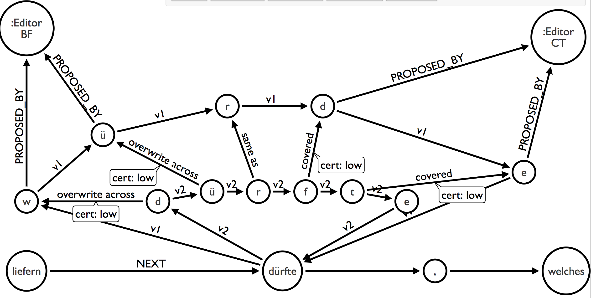
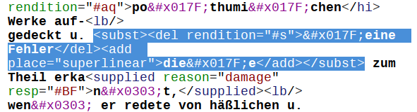
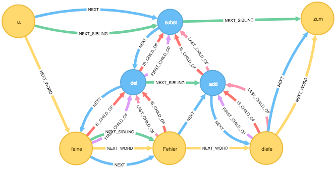
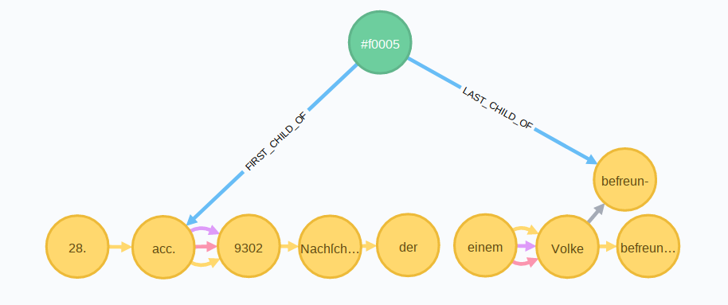
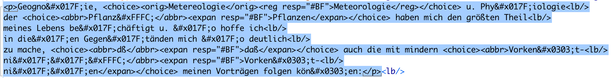
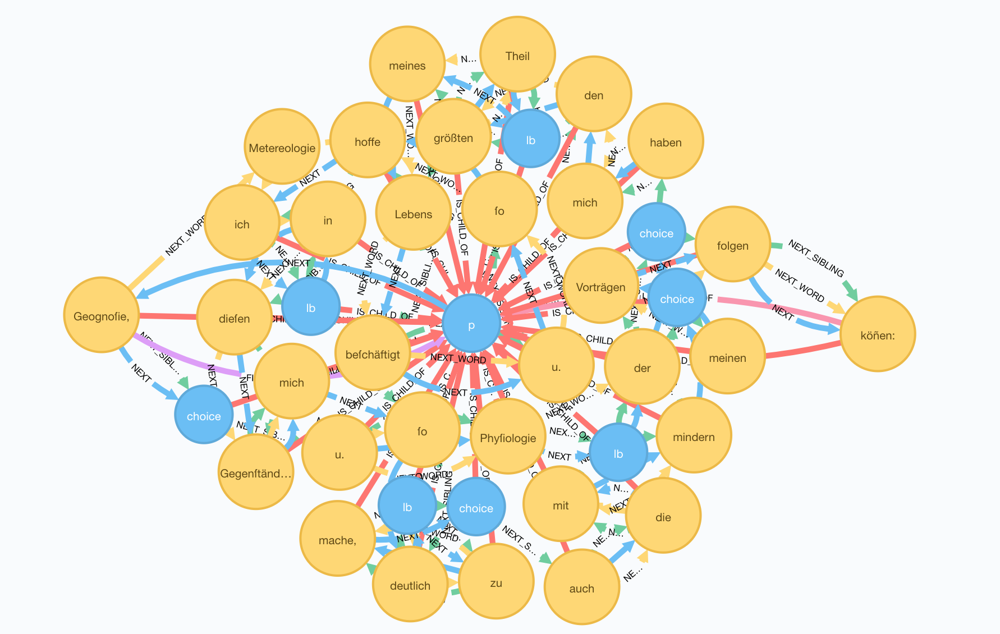
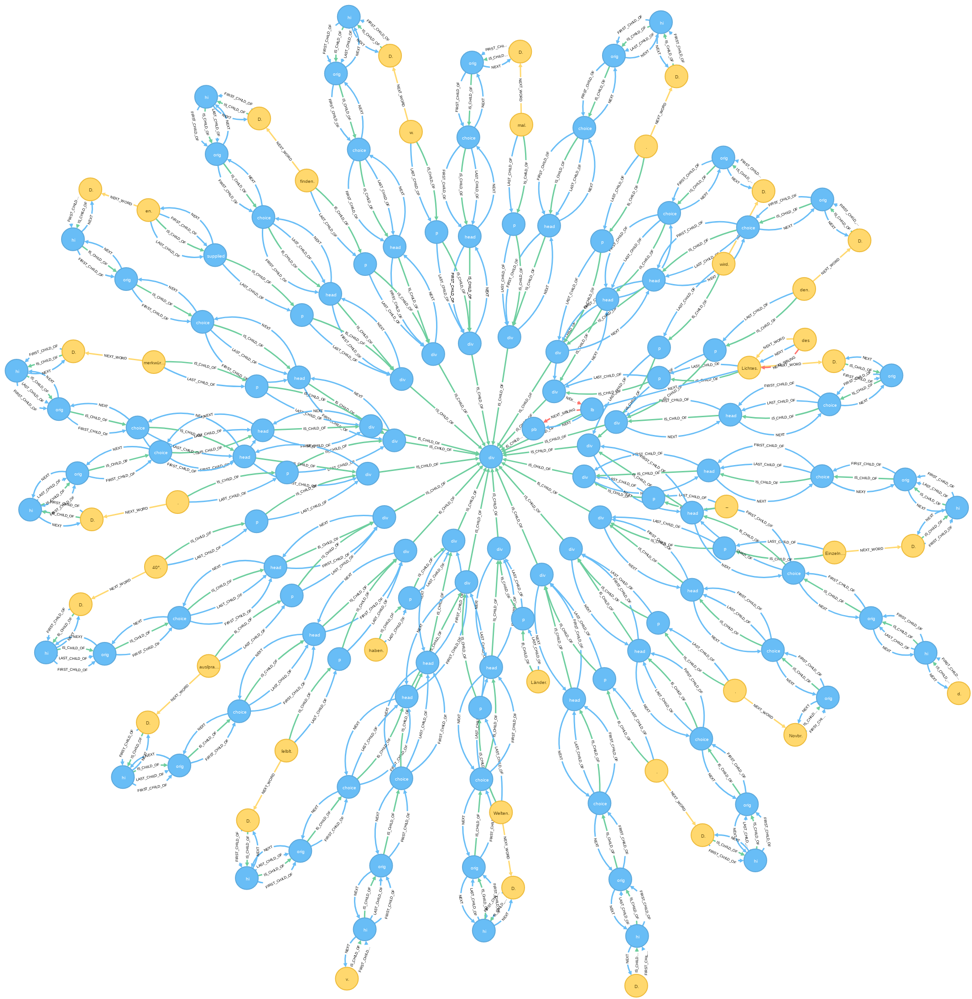
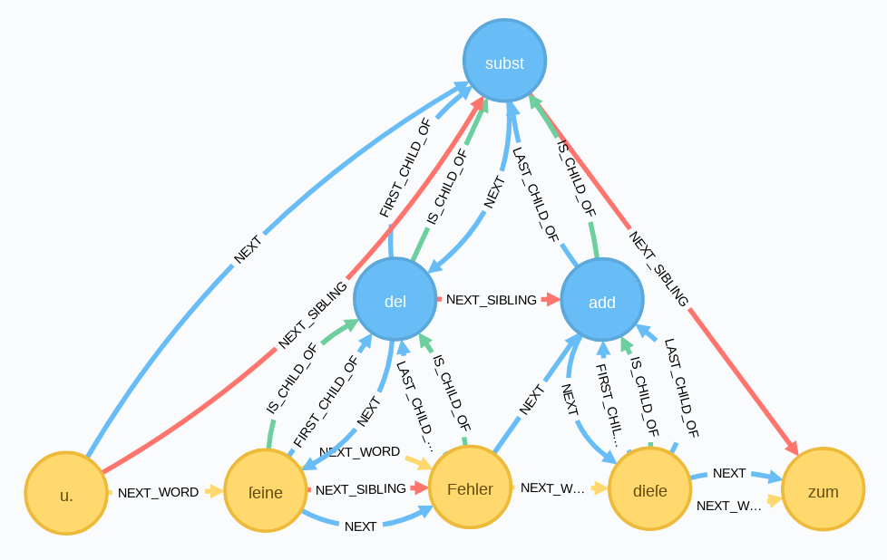
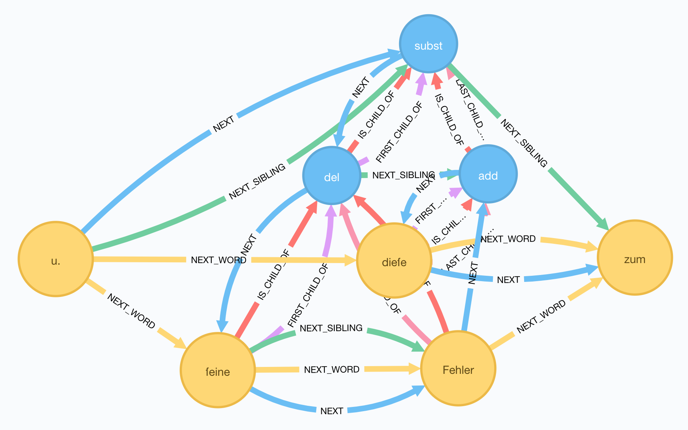

# Inhalt
{:.no_toc}

* Will be replaced with the ToC, excluding the "Contents" header
{:toc}

# Graph-Refactoring mit DTA-XML

## Modellierungsüberlegungen

Die Diskussion über Modellierungsansätze von Text als Graph hält aktuell an.[^28e2] Momentan ist XML als Technik für die Codierung von Text in digitalen Editionen sehr verbreitet und bildet einen Quasi-Standard.
Da die technische Grundlage von XML normale Plain-Textdateien sind, handelt es sich bei XML um eine eindimensionale Kette von Tokens[^bb95].
Prinzipiell können XML-Dateien ohne größere Probleme in einen Graphen importiert werden, da sie einen geerdeten, gerichteten azyklischen Graphen (der vielfache Elternbeziehungen verhindert) und damit ein Ordered Hierarchy of Content Objects (OHCO) darstellen. Es gibt vor allem im Bereich des Mixed-Content verschiedene Ansätze, XML-Strukturen im Graphen abzubilden[^32a2]. Überlegungen zur Auslagerung von Annotationen aus XML in eine Graphdatenbank brachte schon Desmond Schmidt in die Diskussion ein:

*Embedded annotations can also be removed from TEI texts. The elements `<note>`, `<interp>`, and `<interpGrp>` describe content that, like metadata, is about the text, not the text itself. These are really annotations, and should ideally be represented via the established standards and practices of external annotation (Hunter and Gerber 2012). Annotations are stored in triple stores or graph databases like Neo4J,20 which record the identifiers of each component of the annotation and its data*[^b141].

Diesen Gedanken folgend werden in diesem Abschnitt Ansätze für eine Modellierung der Semantik des DTA-Basisformat im Property-Graphen nach dem Prinzip des `Texts als Kette von Wortknoten` (Text as a chain of wordnodes) mit angelagerter Annotation vorgestellt.

## Granularität des Modells -- Was ist ein Token ?

Dabei ist die Entscheidung, für ein Wort jeweils einen Knoten zu nehmen, schon eine wichtige Vorentscheidung. Es wäre durchaus denkbar auch für jedes Zeichen einen Knoten anzulegen. Für den Bereich der historisch-kritischen und philologischen Editionen ist es in der Regel ausreichend, beim Import von XML-kodierten Texten in den Graphen jeweils ein Wort in einen Knoten zu importieren, da meist die historische Aussage der Quelle im Vordergrund steht. In anderen Bereichen der digitalen Geisteswissenschaften kann die Entscheidung, welche Einheit für den Import in einen Knoten gewählt wird, durchaus anders ausfallen. So ist für Philologien die Betrachtung auf Buchstabenebene interessant[^736a].

{#fig:Granularitaet-im-Graphen.png}

Im Graphmodell ist man im Hinblick auf die Granularität des Datenmodells wesentlich flexibler als z.B. bei XML oder Standoff-Markup. So ist es beispielsweise denkbar, an einen Wortknoten eine weitere Kette von Knoten anzulagern, welche pro Knoten jeweils einen Buchstaben des Wortes und die zugehörigen Annotationen enthalten (vgl. Abb. [@fig:Granularitaet-im-Graphen.png]). Es handelt sich um einen buchstabenbasierten Sub-Graphen, dessen Anfang und Ende mit dem Wortknoten verbunden ist. Damit können verschiedene Granularitätsstufen in einem Modell und in einer Datenbank abgebildet werden.

## Import der DTA-XML-Daten

Für den Import der Texte wird die Procedure apoc.xml.import aus der apoc-Bibliothek von neo4j verwendet[^ed8a]. Die Procedure nimmt XML-Dateien entgegen und importiert sie in die Graphdatenbank.

Importiert wird die Transkription von [Gotthilf Patzigs Mitschriften](http://www.deutschestextarchiv.de/patzig_msgermfol841842_1828/13) von Humboldts Vorträgen über physische Geographie.[^70f5]

Mit dem folgenden Befehl wird die Patzig-Mitschrift in die Graphdatenbank importiert[^8a2a]:

~~~cypher
CALL apoc.xml.import('http://www.deutschestextarchiv.de/book/download_xml/patzig_msgermfol841842_1828',
	{relType:'NEXT_WORD', label:'XmlWord', filterLeadingWhitespace:true}) 	
	yield node return node;
~~~

Dabei werden die XML-Knoten in Graphknoten umgewandelt und verschiedene Arten von Kanten erstellt, die die Baum-Hierarchie des XMLs im Graphen abbilden. Mit der Option `createNextWordRelationships:true` wird darüber hinaus festgelegt, dass die im XML vorhandenen Textknoten über `NEXT_WORD`-Kanten miteinerander verknüpft werden. Zu beachten ist hierbei, dass es in TEI-XML zwei verschiedene Klassen von Elementen gibt. Die eine dient der Klassifizierung von Text, die zweite bringt Varianten und zusätzlichen Text mit, der beim Import in seiner Serialität eingelesen und mit `NEXT_WORD`-Kanten verbunden wird. Dies kann dann zu Problemen bei der Lesbarkeit der Wortkette führen.

Das Wurzelelement der importierten XML-Datei wird in einen Knoten vom Typ `XmlDocument` importiert. Dieser erhält die Properties `_xmlEncoding` zur Darstellung des Encodings, `_xmlVersion` für die XML-Version und `url` für die URL des importierten XML-Dokuments.

Mit einem weiteren cypher-Query erhalten alle der importierten Knoten die Eigenschaft `url` mit der URL des importierten XML-Dokuments. Damit lassen sich Knoten in einer Graphdatenbank mit mehreren importierten XML-Dokumenten auseinanderhalten.

~~~cypher
MATCH (d:XmlDocument)-[:NEXT_WORD*]->(w:XmlWord)
SET w.url = d.url;
~~~

Mit dem nächsten cypher-Query werden die Knoten des importierten XML-Dokuments durchnummertiert und der jeweilige Wert in der Property `DtaID` abgelegt.

~~~cypher
MATCH p = (start:XmlDocument)-[:NEXT*]->(end:XmlTag)
WHERE NOT (end)-[:NEXT]->() AND start.url = 'http://www.deutschestextarchiv.de/book/download_xml/patzig_msgermfol841842_1828'
WITH nodes(p) as nodes, range(0, size(nodes(p))) AS indexes
UNWIND indexes AS index
SET (nodes[index]).DtaID = index;
~~~

## Erläuterung der entstandenen Graphstrukturen

Nach Abschluss des Imports werden jetzt die importierten Datenstrukturen erläutert. In der folgenden Tabelle werden die verschiedenen Typen von Knoten erläutert, die während des Imports erstellt wurden.

Tabelle zum Importvorgang der XML-Elemente und den entsprechenden Knoten

|XML-Knoten|Graphknoten|Bemerkungen|
|-------------------|------------------|------------------------------------|
|XML-Wurzelelement|XmlDocument|Gibt es nur einmal. Es enthält Angaben zur Encodierung, zur XML-Version und die URL der importierten XML-Datei|
|XML-Element-Knoten|XmlTag-Knoten|Die Attribute des XML-Elements werden in entsprechende Properties des XMLTag-Knotens in der Datenbank umgewandelt|
|XML-Text-Knoten|XmlWord|Jedes Wort des XML-Textknotens wird ein XmlWord-Knoten im Graphen|

In der nächsten Tabelle werden die verschiedenen Kantentypen erläutert. Sie geben die Serialität des XMLs (`NEXT`-Kanten), die Hierarchie (`NEXT_SIBLING` und `IS_CHILD_OF`-Kanten) und auch die Abfolge der Inhalte der XML-Textelemente (`NEXT_WORD`) wieder.

Tabelle zu den erstellen Kantentypen

|Kante|Bemerkungen|
|-----------------|----------------------------------------------------------|
|:NEXT|Zeigt die Serialität der XML-Datei im Graphen|
|:NEXT_SIBLING|Zeigt auf den nächten Graphknoten auf der gleichen XML-Hierarchie-Stufe|
|:NEXT_WORD|Zeigt auf das nächste Wort in einem XML-Textknoten|
|:IS_CHILD_OF|Zeigt auf den in der XML-Hierarchie übergeordneten Knoten|
|:FIRT_CHILD_OF|Zeigt vom ersten untergeordneten auf den übergeordneten Knoten.|
|:LAST_CHILD_OF|Zeigt vom letzten untergeordneten auf den übergeordneten Knoten.|

Die folgende Abbildung zeigt einen kleinen Ausschnitt aus der TEI-XML-Datei der Patzig-Vorlesungsmitschrift.

Dieser Abschnitt wird in der folgenden Abbildung im Graph gezeigt. In der Abbildung des XML-Ausschnittes sind jene Teile blau markiert, die sich auch in der Graphabbildung befinden.

So lassen sich beispielsweise die von einem `<add>`-Element umfassten Wörter abfragen, in dem man ausgehend vom `add`-Knoten der `FIRST_CHILD_OF`-Kante rückwärts folgt, anschließend vom gefundenen Knoten den `NEXT_SIBLING`-Kanten so lange folgt, bis man über eine `LAST_CHILD_OF`-Kante wieder zum `add`-Knoten zurückgeführt. Der entsprechende cypher-Query sieht wie folgt aus:

~~~cypher
MATCH
(n:XmlTag {_name:'add'})
<-[:FIRST_CHILD_OF]-(w1:XmlWord)
-[:NEXT_WORD*..5]->(w2:XmlWord)
-[:LAST_CHILD_OF]->(n)
RETURN * LIMIT 25
~~~

In einem zweiten Schritt kann der so entstandene Graph mit Hilfe von cypher-Querys weiter bearbeitet werden. Die Grahdatenbank neo4j ist schemafrei und somit können nun über die importierten XML-Strukturen weitere Erschließungsstrukturen gelegt werden, ohne dass ein XML-Parser sich über das nicht mehr wohlgeformte XML beschwert. Zu beachten ist bei jedem Schritt, ob wieder der Schritt zurück nach XML getätigt werden soll. Sicherlich ist es kein größeres Problem, eine in eine Graphdatenbank importierte XML-Datei wieder als solche zu exportieren. Ist der Graph aber mit weiteren Informationen angereichert, so muss geklärt werden, ob, und wenn ja wie, diese zusätzlichen Informationen in wohlgeformtes XML transformiert werden können.

## Das DTA-Basisformat im Graphen

Das DTA-Basisformat ist ein Subset der TEI und bietet für Textphänomene jeweils nur eine Annotationsmöglichkeit. Damit wird die in der TEI vorhandene Flexibilität bei der Auszeichnung eingeschränkt, um damit einen höheren Grad an Interoperabilität zu erreichen. Das DTA-Basisformat folgt den P5-Richtlinien der TEI, trifft aber eine Tag-Auswahl der für die Auszeichung historischer Texte notwendigen Elemente.

Im folgenden Abschnitt werden für ausgewählte Elemente des DTA-Basisformats mögliche Modellierungsformen im Graphen beschrieben. Zum äußeren Erscheinungsbild werden der Seitenfall sowie Spalten- und Zeilenumbrüche berücksichtigt. Bei den Textphänomenen werden Absätze, Schwer- und Unleserliches behandelt. Inhaltlich beschränkt es sich auf die Kapiteleinteilung und Inline-Auszeichnungen. Abschließend werden noch editorische Eingriffe im Graph modelliert. Für die Metadaten werden keine Modellierungsvorschläge formuliert, da diese sich sauber im XML-Baum darstellen lassen und keine Überlappungsprobleme etc. entstehen.

## Layoutstrukturen des Dokuments

### Graphenmodellierung von Zeilen

Nehmen wir als Beispiel Zeilenwechsel auf einer Seite des Patzig-Manuskripts (http://www.deutschestextarchiv.de/book/view/patzig_msgermfol841842_1828/?hl=Himalaja&p=39).[^3af6]

~~~ xml
... Die<lb/>
Jnder hegen die große Verehrung vor<lb/>
dem Himalaja Gebirge. ...
~~~

Im Graphen sieht die Stelle wie folgt aus:

Das leere `<lb/>`-Element steht für die Markierung eines Zeilenanfangs (*line begins*). Der Graph soll nun so umgebaut werden, dass die Zeile durch einen `line`-Knoten gekennzeichnet wird, von dem aus eine `FIRST_CHILD_OF`-Kante mit dem ersten Wort der Zeile und eine `LAST_CHILD_OF`-Kante mit dem letzten Wort der Zeile verbunden ist.

Mit dem folgenden cypher-Query kommt man den auf der Abbildung sichtbaren Subgraphen:

~~~cypher
MATCH (n0:XmlWord)-[:NEXT_WORD]->
(n1:XmlWord {DtaID:10272})-[:NEXT_WORD*..8]->(n2:XmlWord),
(n1)<-[:NEXT]-(t1:XmlTag {_name:'lb'}),
(n3:XmlWord {DtaID:10277})-[:NEXT]->(t2:XmlTag {_name:'lb'})
RETURN * LIMIT 20;
~~~

Im folgenden Schritt wird ein `line`-Knoten erzeugt, der die Zeile darstellen soll. Mit diesem werden dann das erste und das letzte Wort der Zeile verbunden.

~~~cypher
MATCH (n0:XmlWord)-[:NEXT_WORD]->
(n1:XmlWord {DtaID:10272})-[:NEXT_WORD*..8]->(n2:XmlWord),
(n1)<-[:NEXT]-(t1:XmlTag {_name:'lb'}),
(n3:XmlWord {DtaID:10277})-[:NEXT]->(t2:XmlTag {_name:'lb'})
MERGE (n3)<-[:LAST_CHILD_OF]-(l:line {name:'line'})-[:FIRST_CHILD_OF]->(n1)
DETACH DELETE t1, t2
RETURN * LIMIT 20;
~~~

Im Graphen sieht das Ergebnis wie folgt aus:

### Zeilenwechsel mit Worttrennungen

Nun kommt es im Bereich der Zeilenwechsel sehr häufig zu Worttrennungen. Als Beispiel nehmen wir folgende Zeile, die sich auf der gleichen Seite wie das eben behandelte Beispiel befindet:

~~~XML
... Die Ken&#x0303;t-<lb/>
niß des Jahres durch nicht von einer Nation<lb/>
auf ...
~~~

Im Graphen sieht die Stelle wie folgt aus:

Mit dem folgenden cypher-query kommt man den auf der Abbildung sichtbaren Subgraphen:

~~~cypher
MATCH (n0:XmlWord {DtaID:10197})-[:NEXT_WORD]->
(n1:XmlWord)-[:NEXT_WORD*..9]->(n2:XmlWord),
(n1)-[:NEXT]->(t1:XmlTag {_name:'lb'}),
(n3:XmlWord {DtaID:10207})-[:NEXT]->(t2:XmlTag {_name:'lb'})
RETURN * LIMIT 20;
~~~

Das `<lb/>`-Element trennt das Wort Kenntniß.[^4fcf]
Im nächsten Schritt werden nun die beiden getrennten Wortknoten `Kennt-` und `niß` im zweiten Wortknoten `niß` zusammengefasst. Der erste Wortknoten `Kennt-` inkl. seiner Kanten wird gelöscht und eine neue `NEXT-` und `NEXT_WORD`-Kante zwischen dem `niß`-Wortknoten und dem vorhergehenden `Die`-Wortknoten erstellt. Die Informationen, an welcher Stelle das Wort getrennt war, wird in den Eigenschaften des neuen `Kenntniß`-Wortknotens gespeichert. In der Eigenschaft `before` steht dann der Inhalt des ursprünlich ersten Wortknotens `Kennt-` und in der Eigenschaft after der Inhalt des ursprünglich zweiten Wortknotens `niß`.

Hier werden die notwendigen Cypher-Befehle angezeigt:

~~~cypher
MATCH (n0:XmlWord {DtaID:10197})-[:NEXT_WORD]->
(n1:XmlWord {DtaID:10198})-[:NEXT_WORD]->
(n2:XmlWord {DtaID:10200})-[:NEXT_WORD*..8]->(n3:XmlWord {DtaID:10207}),
(n1)-[:NEXT]->(t1:XmlTag {_name:'lb'}),
(n4:XmlWord {DtaID:10207})-[:NEXT]->(t2:XmlTag {_name:'lb'})
SET n2.before = left(n1.text, size(n1.text)-1)
SET n2.after = n2.text
SET n2.text = left(n1.text, size(n1.text)-1)+n2.after
MERGE (n0)-[:NEXT_WORD]->(n2)
MERGE (n4)<-[:LAST_CHILD_OF]-(l:line {name:'line'})-[:FIRST_CHILD_OF]->(n2)
DETACH DELETE t1, t2, n1
RETURN * LIMIT 20;
~~~

Im Graphen ergibt sich anschließend folgendes Bild:

Im unteren Bereich der Abbildung sind in der Legende die Properties des Wortknotens *Kentniß* hervorgehoben. Dort erkennt man die vorher vorhandenen Wortbestandteile und den neuen Wert der Property *text*.

### Seitenfall und Faksimilezählung

Im DTA-Bf wird jeweils der Anfang einer Seite mit dem leeren Element `<pb>` markiert[^8317]. Das leere Element kann noch die Attribute `facs` für die Zählung der Faksimileseiten und `n` für die auf der Seite ggf. angegebene Seitenzahl enthalten.

~~~xml
<pb facs="#f[Bildnummer]" n="[Seitenzahl]"/>
~~~

Ist eine Seitenzahl im Faksimile falsch wiedergegeben, so wird diese originalgetreu übernommen und die richtige Seitenzahl in eckigen Klammern hinzugefügt in das `n`-Attribut übernommen.

~~~xml
<pb facs="#f[Bildnummer]"
	n="[fehlerhafte Seitenzahl [korrigierte Seitenzahl]]"/>
~~~

Das `<pb/>`-Element auf den Seiten 5 und 6 aus Patzig
(http://www.deutschestextarchiv.de/book/view/patzig_msgermfol841842_1828/
?hl=viel&p=5)[^3fd9]:

~~~xml
... Abwe&#x017F;enheit vom heimi&#x017F;chen Boden ent-<lb/>
<note place="left"><figure type="stamp"/><lb/>
</note>fernt hielt, der &#x017F;ich viel mit einem Volke<lb/>
<fw place="bottom" type="catch">befreun-</fw><lb/>
<pb facs="#f0006" n="2."/>
befreundete, welches durch den
...
in einzelnen großen Zügen zu ent-<lb/>
werfen</hi>.
<lb/>
<fw place="bottom" type="catch">Nachdem</fw><lb/>
<pb facs="#f0007" n="3."/>

<note place="left"><hi rendition="#u">Neue&#x017F;te
	A&#x017F;tronomi&#x017F;che Ent-<lb/>
deckungen.</hi><lb/> ...
~~~

Im Graphen findet man das `<pb>`-Element der Seite 6 mit folgendem Query[^a825]:

~~~cypher
MATCH
(n1:XmlWord {DtaID:869})-[:NEXT]->
(lb1:XmlTag {_name:'lb'})-[:NEXT]->
(t2:XmlTag {_name:'fw', place:'bottom', type:'catch'})-[:NEXT_SIBLING]->
(lb2:XmlTag {_name:'lb'})-[:NEXT_SIBLING]->
(pb:XmlTag {_name:'pb'}),
(n1:XmlWord)-[nw1:NEXT_WORD]->
(n2:XmlWord)-[nw2:NEXT_WORD]->
(n3:XmlWord)-[nw3:NEXT_WORD]->
(n4:XmlWord),
(n2:XmlWord)-[:NEXT]->(t1:XmlTag {_name:'lb'})
RETURN * LIMIT 20;
~~~

Im Graphen ergibt sich folgendes Bild:

Markiert ist das `<pb/>`-Element der Seite 6. Im Fuß der Abbildung werden die Properties des Elements angezeigt. Der Textfluss wird durch den Wortknoten `befreun-` unterbrochen, der eine Kustode darstellt. Diese soll aus dem Textfluss herausgelöst und direkt mit dem letzten Wortknoten `Volke` über die neu eingeführte `catch_words`-Kante verbunden werden. Der `<fw>`, und der `<lb/>`-Knoten werden gelöscht und der letzte Wortknoten der Seite über eine neue `NEXT`-Kante mit dem `<pb/>`-Knoten verknüpft.

Hier der Query für den Umbau:

~~~cypher
MATCH
(n1:XmlWord {DtaID:869})-[:NEXT]->
(lb1:XmlTag {_name:'lb'})-[:NEXT]->
(t2:XmlTag {_name:'fw', place:'bottom', type:'catch'})-[:NEXT_SIBLING]->
(lb2:XmlTag {_name:'lb'})-[:NEXT_SIBLING]->
(pb:XmlTag {_name:'pb'}),
(n1:XmlWord)-[nw1:NEXT_WORD]->
(n2:XmlWord)-[nw2:NEXT_WORD]->
(n3:XmlWord)-[nw3:NEXT_WORD]->
(n4:XmlWord),
(n2:XmlWord)-[:NEXT]->(t1:XmlTag {_name:'lb'})
DELETE nw1, nw2
DETACH DELETE t2
MERGE (n1)-[:NEXT_WORD]->(n3)
MERGE (n1)-[:CATCH_WORDS]->(n2)
MERGE (n1)-[:NEXT_WORD]->(n3)
MERGE (lb1)-[:NEXT]->(n2)
RETURN * LIMIT 20;
~~~

Im Graphen ergibt sich folgendes Bild:

Die Kustode ist nun nicht mehr über `NEXT_WORD`-Kanten mit dem Fließtext verknüpft, bleibt aber über die `CATCH_WORDS`-Kante mit dem letzten Wort der Seite verbunden.

In einem zweiten Schritt müssen nun die beiden `<pb/>`-Elementknoten zu einem neu einzuführenden `page`-Knoten zusammengeführt werden. Hierfür lassen wir uns im nächsten cypher-Query alle `<pb/>`-Knoten mit einer DtaID kleiner als 875 anzeigen, da diese vor dem `<pb/>`-Knoten der Seite 6 mit der DtaID 874 liegen:

~~~cypher
MATCH (n:XmlTag {_name:'pb'})
WHERE n.DtaID < 875
RETURN n;
~~~

Aus der Tabellenansicht ist zu entnehmen, dass Seite 5 von den `<pb/>`-Elementen mit der DtaID 562 und 874 eingefasst wird.

Der cypher-Query zum Einfügen des `page`-Knoten sieht wie folgt aus:

~~~cypher
MATCH
(pb1:XmlTag {DtaID:562, _name:'pb'})-[n1:NEXT*..5]->(w1:XmlWord {DtaID:565}),
(pb2:XmlTag {DtaID:874, _name:'pb'})<-[n2:NEXT*..5]-(w2:XmlWord {DtaID:872})
MERGE
(w1)<-[:FIRST_CHILD_OF]-(page:page {facs:'#f0005', n:1})-[:LAST_CHILD_OF]->(w2)
RETURN pb1, w1, pb2, w2, page;
~~~

Die Seite wird modelliert mit dem `page`-Knoten #0005 der mit dem ersten Wort über eine `FIRST_CHILD_OF`- und mit dem letzten Wort der Seite über eine `LAST_CHILD_OF`-Kante verknüpft ist.[^f777]

### Absätze

Absätze werden im DTA-Basisformat mit dem `
`-Element eingefasst. Im Manuskript von Patzig finden sich insgesamt 238 mit dem `
`-Element eingefasste Textabschnitte[^0f28].

Alle Wörter eines Absatzes sind darüber hinaus über `NEXT_SIBLING`-Kanten in der Textreihenfolge verknüpft.

### Kapiteleinteilung

Im DTA-Basisformat wird bei der Transkiption von Büchern die Kapiteleinteilung mit verschachtelten `div`-Element vorgenommen. Das im `div`-Element erlaubte \@n-Attribut gibt die Strukturebene an. Über das \@type-Attribut kann der Typ des Kapitels näher spezifiziert werden. Eine Liste der möglichen Werte für das Attribut findet sich unter http://deutschestextarchiv.de/doku/basisformat/div.html.

Für Manuskripte, wie die hier behandelten Vorlesungsmitschrift von Patzig, gibt es unter http://deutschestextarchiv.de/doku/basisformat/msKapitel.html noch zwei zusätzliche Werte für das \@type-Attribut, nämlich *session* für Vorlesungsmitschriften und *letter* für Briefe.

Mit folgendem cypher-Query erhalten wir die in Patzig verwendeten Werte für das \@type-Attribut des `div`-Elements.

~~~cypher
MATCH (n:XmlTag {_name:'div'})
RETURN n.type, count(n.type) AS Anzahl ORDER BY Anzahl DESC;
~~~

|n.type|Anzahl|
|:-----------|--------:|
|	session	|	62	|
|	null	|	0	|

Es sind also insgesamt 62 Kapitel vom Typ *session* (Vorlesungsmitschrift) enthalten. Mit folgendem cypher-Query wird die Kapitelstruktur der ersten Kapitel und der darunter liegenden Ebenen bis zum jeweils ersten und letzten Wort des Kapitels angezeigt.

~~~cypher
MATCH
p1 = shortestPath(
	(div:XmlTag {_name:'div'})<-[:FIRST_CHILD_OF*..20]-(w1:XmlWord)),
p2 = shortestPath(
	(div:XmlTag {_name:'div'})<-[:LAST_CHILD_OF*..20]-(w2:XmlWord))
RETURN p1,p2 LIMIT 20;
~~~

Mit dem folgenden cypher-Query wird das erste Wort des Kapitels über eine `FIRST_CHILD_OF`-Kante und das letzte Wort des Absatzes über eine `LAST_CHILD_OF`-Kante mit dem `div`-Knoten verbunden. Um die neu erstellen Kanten von den vom Importer erstellen zu unterscheiden erhalten diese die Proptery *type* mit dem Wert *graph*. Um die `div`-Knoten von den anderen `XmlTag`-Knoten unterscheiden zu können erhalten sie das zusätzliche Label *Session*.

~~~cypher
MATCH
p1 = shortestPath(
	(div:XmlTag {_name:'div'})<-[:FIRST_CHILD_OF*..20]-(w1:XmlWord)
	),
p2 = shortestPath(
	(div:XmlTag {_name:'div'})<-[:LAST_CHILD_OF*..20]-(w2:XmlWord)
	)
MERGE (w1)-[:FIRST_CHILD_OF {type:'graph'}]->
	(div)<-[:LAST_CHILD_OF {type:'graph'}]-(w2)
SET div:Session
RETURN * LIMIT 20;
~~~

## Editorische Eingriffe

### Hinzufügungen und Tilgungen

Die Elemente `<add>` und `<del>` werden für Kennzeichnung von Tilgungen und Hinzufügungen des Autors oder von späteren Bearbeitern verwendet.

### `<add>`-Element

Dabei können die Umstände der Änderungen beim `<add>`-Element mit dem \@place-Attribut näher beschrieben werden, welches die in der folgenden Tabelle angegebenen Werte annehmen darf[^a974]:

|Element|\@place-Wert|Bedeutung
|:---------|-----------|:----------------------------------------------|
|`<add>`|superlinear|über der Zeile eingetragen
|`<add>`|sublinear|unter der Zeile eingetragen
|`<add>`|intralinear|innerhalb der Zeile eingetragen
|`<add>`|across|über den ursprünglichen Text geschrieben
|`<add>`|left|am linken Rand eingetragen
|`<add>`|right|am rechten Rand eingetragen

Mit folgenden cypher-Query erhält man die Verteilung der Attributwerte.

~~~cypher
MATCH (n:XmlTag {_name:'add'})
RETURN n.place, count(n.place) AS Anzahl ORDER BY Anzahl DESC;
~~~

|n.place|Anzahl|
|--------------|-----------:|
|across|436|
|superlinear|268 |
|intralinear|60 |
|left |16 |
|sublinear |2 |

#### `<del>`-Element

Die mit dem `<del>`-Element gekennzeichneten Tilgungen können mit dem \@rendition-Attribut näher beschrieben werden, dessen mögliche Werte in der folgenden Tabelle angegeben sind[^cb71].

|Element|\@rendition-Wert|Bedeutung
|:-------|---------------|:-----------------------------------------------|
|`<del>`|#ow|Tilgung durch Überschreibung des ursprünglichen Textes
|`<del>`|#s|Tilgung durch Streichung
|`<del>`|#erased|Tilgung durch Radieren, Auskratzen

Mit folgenden cypher-Query erhält man die Verteilung der Attributwerte.

~~~cypher
MATCH (n:XmlTag {_name:'add'})
RETURN n.rendition, count(n.rendition) AS Anzahl
ORDER BY Anzahl DESC;
~~~

|n.rendition|Anzahl|
|-----------|-----:|
|#ow|436|
|#s|268|
|#erased|60|

### Umbau von `<add>`- und `<del>`-Elementen in einer `<subst>`-Umgebung

Der Umbau wird an einem Beispieltext der Seite 32 des Patzig-Manuskripts durchgeführt[^148e].

Im Graphen findet man die entsprechende Stelle mit folgendem cypher-Query.

~~~cypher
MATCH
(w1:XmlWord)-[r1:NEXT_WORD]->
(w2:XmlWord)-[r2:FIRST_CHILD_OF]->
(t1)-[r3:FIRST_CHILD_OF]->
(s:XmlTag {_name:'subst', DtaID:8248})
<-[r4:LAST_CHILD_OF]-(t2)
<-[r5:LAST_CHILD_OF]-(w4:XmlWord)
-[r6:NEXT_WORD]->(w5:XmlWord),
(w2)-[r7:NEXT_WORD]->(w3)-[r8:NEXT_WORD]->(w4)
RETURN *;
~~~

Der Query gruppiert sich um den `s`-Knoten, der das `subst`-Element darstellt und es über die DtaID identifiziert. Vom `s`-Knoten ausgehend, folgt der Pfad einerseits über `FIRST_CHILD_OF`-Kanten zum `t2`-Knoten (add-Element) und zum `w2`-Knoten, der schließlich das Wort *seine* darstellt. Über die `LAST_CHILD_OF`-Kante geht es zum `t1`-Knoten (del-Element) und zum `w4`-Wortknoten, der das Wort *diese* darstellt. Im zweiten Teil des MATCH-Befehls wird der Pfad zwischen dem Wort *seine* und *diese* ermittelt und schließlich alles ausgegeben.

cyper-Query für den Umbau

~~~cypher
MATCH
(w1:XmlWord)-[r1:NEXT_WORD]->
(w2:XmlWord)-[r2:FIRST_CHILD_OF]->
(t1)-[r3:FIRST_CHILD_OF]->
(s:XmlTag {_name:'subst', DtaID:8248})
<-[r4:LAST_CHILD_OF]-(t2)
<-[r5:LAST_CHILD_OF]-(w4:XmlWord)
-[r6:NEXT_WORD]->(w5:XmlWord),
(w2)-[r7:NEXT_WORD]->(w3)-[r8:NEXT_WORD]->(w4)
DELETE r1, r8
SET r8.variant_type='add'
CREATE (w1)-[:NEXT_WORD{variant_type:'add'}]->(w4)
CREATE (w1)-[:NEXT_WORD{variant_type:'del'}]->(w2)
CREATE (w3)-[:NEXT_WORD{variant_type:'del'}]->(w5)
SET r7.variant_type='del'
RETURN *;
~~~

Das Ergebnis erhält man über den folgenden Query.

~~~cypher
MATCH
(w1:XmlWord)-[r1:NEXT_WORD]->
(w2:XmlWord)-[r2:FIRST_CHILD_OF]->
(t1)-[r3:FIRST_CHILD_OF]->
(s:XmlTag {_name:'subst', DtaID:8248})
<-[r4:LAST_CHILD_OF]-(t2)
<-[r5:LAST_CHILD_OF]-(w4:XmlWord)
-[r6:NEXT_WORD]->(w5:XmlWord),
(w2)-[r7:NEXT_WORD]->(w3)-[r8:NEXT_WORD]->(w4)
~~~

## Zusammenfassung
In diesem Kapitel wurden exemplarisch die XML-Strukturen für Layout (Zeilen (`lb`), Seiten (`pb`), Absätze (`p`)), Struktur (Kapitel (`div`)) und editorische Eingriffe (`subst`, `add` und `del`) in Graphstrukturen überführt. Die entsprechenden Tags wurden in einen Annotationsknoten zusammengeführt. Mit diesem Knoten werden jeweils der erste und der letzte betroffene Wortknoten mit einer `FIRST_CHILD_OF`- und einer `LAST_CHILD_OF`-Kante verknüpft. Damit entstehen klare Annotationsstrukturen, die aber offensichtlich überlappen. Dies stellt im Graphen jedoch kein Problem dar.

[^b20c]: Vgl. www.neo4j.com (abgerufen am 7.8.2017).
[^dff9]: Die Graphdatenbank orientdb (http://orientdb.com/) bietet ein für Historiker sehr interessantes Feature, da sie als Datentyp für die Properties von Knoten auch Datumsangaben im ISO-Format zulässt. Vgl. https://orientdb.com/docs/2.2/Managing-Dates.html (abgerufen am 7.8.2017).
[^ed8a]: Wie die apoc-Bibliothek installiert und die Funktionen und Procedures verwendet werden können wird im [Kapitel für Fortgeschrittene](85-cypher-fuer-Fortgeschrittene.md) erklärt.
[^4da1]: !!! Literaturhinweis ergänzen, Hans-Werner Bartz fragen.
[^32a2]: Vgl. @DekkerHaentjensItmorejust2017.
[^b141]: @SchmidtInteroperableDigitalScholarly2014, 4.1 Annotations.
[^3af6]: URL des Beispieltextes: http://www.deutschestextarchiv.de/book/view/patzig_msgermfol841842_1828/?hl=Himalaja&p=39 abgerufen am 02.01.2018.

[^8317]: Vgl. die Dokumentation des DTA-Basisformats unter http://www.deutschestextarchiv.de/doku/basisformat/seitenFacsNr.html abgerufen am 25.11.2017.

[^3fd9]: Die Beispielseite findet sich unter http://www.deutschestextarchiv.de/book/view/patzig_msgermfol841842_1828/?p=5 abgerufen am 25.11.2017.

[^28e2]: Vgl. zuletzt @DekkerHaentjensItmorejust2017.

[^bb95]: Beispielsweise sieht @HuitfeldtMarkupTechnologyTextual2014, S. 161, digitale Dokumente prinzipiell als lineare Sequenz von Zeichen.

[^736a]: In FuD (http://fud.uni-trier.de/) werden Texte in Standoff-Markup auf Buchstabenebene ausgezeichnet, während beim DTA-Basisformat der Fokus auf der wortbasierten Auszeichung liegt (vgl. http://www.deutschestextarchiv.de/doku/basisformat/eeAllg.html).

[^4fcf]: Zur einfacheren Lesbarkeit wurden im Wort *Kenntniß* die Sonderzeichen normalisiert.

[^f777]: Die Darstellung der Wortkette ist zwischen den Wortknoten *der* und *einem* zu Gunsten der Übersichtlichkeit gekürzt.

[^0f28]: Die Anzahl der `
`-Elemente im Graph erhält man mit der Abfrage MATCH (n:XmlTag {_name:'p'}) RETURN count(n);

[^8a2a]: Für die Vereinheitlichung des Druckbildes mussten an einigen Stellen Zeilenumbrüche in die Codebeispiele eingefügt werden, die deren direkte Ausführung behindern.
[^a974]: Vgl. hierzu http://deutschestextarchiv.de/doku/basisformat/msAddDel.html.
[^cb71]: Vgl. hierzu http://deutschestextarchiv.de/doku/basisformat/msAddDel.html.

[^148e]: Vgl. http://www.deutschestextarchiv.de/book/view/patzig_msgermfol841842_1828/?hl=zum&p=32.

[^70f5]: Gotthilf Patzig: Vorträge über physische Geographie des Freiherrn Alexander von Humbold: gehalten im großen Hörsaale des Universitäts-Gebäudes zu Berlin im Wintersemester 1827/28 vom 3ten Novbr. 1827. bis 26 April 1828. Aus schriftlichen Notizen nach jedem Vortrage zusammengestellt vom Rechnungsrath Gotthilf Friedrich Patzig. Berlin 1827/28 (= Nachschrift der ‚Kosmos-Vorträge‘ Alexander von Humboldts in der Berliner Universität, 3.11.1827–26.4.1828), S. 9. In: Deutsches Textarchiv. Grundlage für ein Referenzkorpus der neuhochdeutschen Sprache. Herausgegeben von der Berlin-Brandenburgischen Akademie der Wissenschaften, Berlin 2007–2019. http://www.deutschestextarchiv.de/patzig_msgermfol841842_1828/13.
