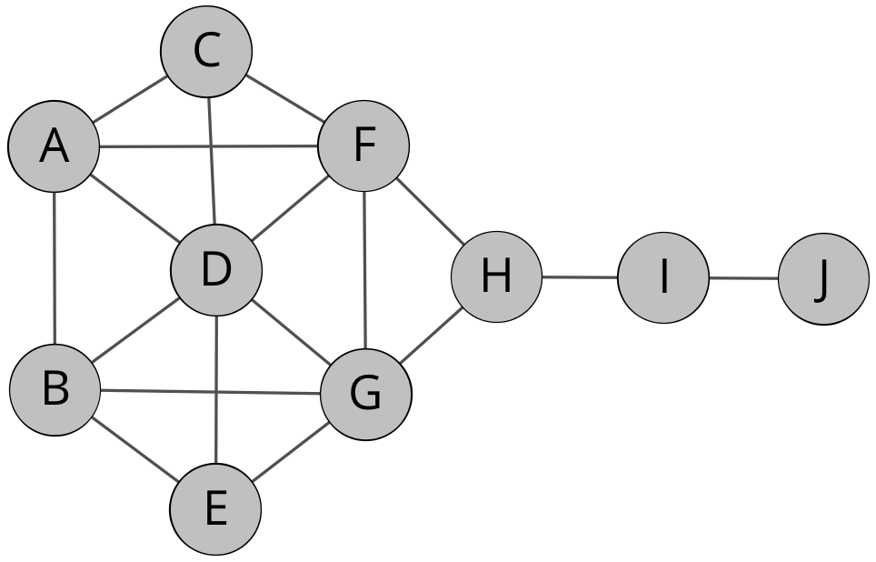

# Netzwerkanalyse mit neo4j

(Dieser Abschnitt befindet sich in Bearbeitung)

## Grundlagen zur Netzwerkanalyse

### Vorbemerkungen

Bei der Netzwerkanalyse handelt es sich um einen relationalen Forschungsansatz, bei dem Methoden aus der Graphen- und Netzwerktheorie sowie der Statistik zur Anwendung kommen.[^9ea3] Es werden Beziehungen (**Kanten**) von Entitäten (**Knoten**) in einem Netzwerk (**Graph**) untersucht. Weitere wichtige Begriffe sind die **Dyade** als kleinste mögliche Analyseeinheit eines Netzwerkes. Sie umfasst alle möglichen Beziehungen zwischen zwei Knoten. Eine **Triade** bezieht alle möglichen Beziehungen zwischen drei Knoten mit ein. Bei einer **Clique** sind mindestens drei Knoten vollständig miteinander verbunden. Als **Geodätischer Abstand** (in neo4j *shortest path*) wird die kürzeste Verbindung zwischen zwei Knoten bezeichnet.

### Überblick zu den Netzwerkmaßen

Grundlegende Maße in der Netzwerkanalyse sind

* **Dichte** als Quotient zwischen tatsächlichen Anzahl der Kanten und der maximal möglichen Anzahl der Kanten.
* **Entfernungsmaße**, z.B. geodätische Abstände, Durchmesser des Netzwerks etc.
* **Reziprozität** als Quotient zwischen der Anzahl bidirektionaler und einseitigen Beziehen.
* **Clustering** beispielsweise als Anzahl und Art von Triaden.

Eine wichtige Rolle spielen auch die Zentralitätsmaße (Beispiele):

* Bei der **Degree Centrality** werden pro Knoten die Anzahl der Verbindungen zu anderen Knoten betrachtet.
* Bei der **Betweenes Centrality** wird die Anzahl der über einen Knoten laufenden möglichen Verbindungen zwischen zwei anderen Knoten erhoben.
* Die **Closeness Centrality** erhebt die Nähe zu allen anderen Knoten.
* Die **Eigenvektor Centrality** misst die Verbindung zu "einflussreichen" Knoten.

### Beispiel: Zentralitätsmaße

Die folgende Abbildung zeigt einen kleinen Beispielgraphen, an dem einige Zentralitätsmaße erklärt werden sollen.[^d019]

* Bei der Berechnung der **Dichte** wird der Quotient zwischen der tatsächlichen Anzahl der Kanten und der maximal möglichen Anzahl der Kanten berechnet.
Die Formel hierfür lautet
$$Dichte des Netzwerks = 2m/(n*(n-1))$$
wobei m die Anzahl der vorhandenen Kanten ist und n die Anzahl der Knoten.
Für unser Beispiel ergibt sich damit:
$$2*18/(10*(10-1)) = 0,4$$
womit die Dichte des Netzwerks 0,4 beträgt.

* Die höchste **Degreenes Centrality** hat mit 6 Kanten der Knoten D, was mehr als bei allen anderen ist. Den ersten Platz bei der **Betweenes Centrality** teilen sich die Knoten D, F, G I und H.
* Die höchste **Closeness** besteht zwischen den Knoten F und G.
* Der größte **Eigenvektor** besteht zwischen den Knoten D, F und G.
* Die Knoten F und G sind **strukturell äquivalent**.

Mit diesen Vorbemerkungen als Hintergrund werden in den folgenden Abschnitten Netzwerkanalyse-Algorithmen auf eine aufbereitete Graphdatenbank der Regesten Kaiser Heinrichs IV. angewendet und deren Ergebnisse kritisch reflektiert.

## Die Register der Regesta Imperii

Grundlage der hier verwendeten Netzwerkdaten sind die Nennungen von Personeneinträgen im Register in den Regesten. Da die hier vorgestellten Netzwerkanalyse-Algorithmen nur mit unimodalen Netzwerken arbeiten können, also Netzwerken, die nur Knoten eines Typs enthalten, muss die Regestendaten entsprechend erweitert werden. Dabei wird davon ausgegangen, dass zwei Personen, die gemeinsam in einem Regest genannt sind, etwas miteinander zu tun haben. Diese Verbindung wird durch eine `APPEARS_WITH`-Kante dargestellt, da die gemeinsame Rolle im Regest nicht näher qualifiziert werden kann.

## Vorbereitung der Datenbank

Für diesen Abschnitt werden als Datenbeispiel die Regesten Heinrichs IV. in einer Graphdatenbank verwendet. Die Erstellung der Graphdatenbank wird im Kapitel [Regestenmodellierung im Graphen](20_Regestenmodellierung-im-Graphen.md) beschrieben. Auf dieser Datengrundlage werden dann noch zusätzliche Kantentypen erstellt. Mit dem folgenden cypher-Query werden zwischen Personeneinträgen des Registers, die gemeinsam in einem Regest genannt sind, `APPEARS_WITH`-Kanten erstellt.

~~~cypher
MATCH (n1:IndexPerson)-[r1:PERSON_IN]->(:Regesta)<-[r2:PERSON_IN]-(n2:IndexPerson)
WHERE id(n1) <> id(n2)
WITH n1, count(r1) AS c, n2
CREATE (n1)-[k:APPEARS_WITH]->(n2)
SET k.count = c;
~~~

## Explorative Datenanalyse oder was ist in der Datenbank darin

Zeigt alle Knoten und ihre Häufigkeiten

~~~cypher
CALL db.labels()
YIELD label
CALL apoc.cypher.run("MATCH (:`"+label+"`)
RETURN count(*) as count", null)
YIELD value
RETURN label, value.count as count
ORDER BY label;
~~~

Zeigt alle Verknüpfungen und ihre Häufigkeiten in der Datenbank

~~~cyper
CALL db.relationshipTypes()
YIELD relationshipType
CALL apoc.cypher.run("MATCH ()-[:" + `relationshipType` + "]->()
RETURN count(*) as count", null)
YIELD value
RETURN relationshipType, value.count AS count
ORDER BY relationshipType;
~~~

## Zentralitätsalgorithmen in der historischen Netzwerkanalyse

### PageRank

Was macht der PageRank-Algorithmus ?

~~~cyper
CALL algo.pageRank.stream("IndexPerson", "APPEARS_WITH",
{iterations:20})
YIELD nodeId, score
MATCH (node) WHERE id(node) = nodeId
RETURN node.name1 AS Person,
apoc.math.round(score,3)
ORDER BY score DESC;
~~~

### Degree Centrality

~~~cyper
MATCH (u:IndexPerson)
RETURN u.name1 AS name,
size((u)-[:APPEARS_WITH]->()) AS follows,
size((u)<-[:APPEARS_WITH]-()) AS followers
ORDER by followers DESC;
~~~

### Betweenes Centrality

~~~cyper
// betweenness centrality
CALL algo.betweenness.stream("IndexPerson",
"APPEARS_WITH", {direction: "OUTGOING", iterations: 10}) YIELD nodeId, centrality
MATCH (p:IndexPerson) WHERE id(p) = nodeId
RETURN p.name1 AS Name, centrality
ORDER by centrality DESC;
~~~

### Closeness Centrality

~~~cyper
// betweenness centrality
CALL algo.closeness.stream("IndexPerson", "APPEARS_WITH")
YIELD nodeId, centrality
MATCH (n:IndexPerson) WHERE id(n) = nodeId
RETURN n.name1 AS node, apoc.math.round(centrality,2)
ORDER BY centrality DESC
LIMIT 30;
~~~

## Community Detection Algorithmen

### Strongly Connected Components

~~~cyper
CALL algo.scc.stream("IndexPerson","APPEARS_WITH")
YIELD nodeId, partition
MATCH (u:IndexPerson) WHERE id(u) = nodeId
RETURN u.name1 AS name, partition
ORDER BY partition DESC;
~~~

### Weakly Connected Components

~~~cyper
CALL algo.unionFind.stream("IndexPerson","APPEARS_WITH")
YIELD nodeId, setId
MATCH (u:IndexPerson) WHERE id(u) = nodeId
RETURN u.name1 AS name, setId;
~~~

### Label Propagation

~~~cypher
CALL algo.labelPropagation.stream("IndexPerson",
"APPEARS_WITH", {direction: "OUTGOING", iterations: 10})
YIELD nodeId, label
MATCH (p:IndexPerson) WHERE id(p) = nodeId
RETURN p.name1 AS Name, label ORDER BY label DESC;
~~~

### Louvain Modularity

~~~cyper
CALL algo.louvain.stream("IndexPerson",
"APPEARS_WITH", {})
YIELD nodeId, community
MATCH (user:IndexPerson) WHERE id(user) = nodeId
RETURN user.name1 AS user, community
ORDER BY community;
~~~

### Triangle count and Clustering Coefficient

~~~cyper
CALL algo.triangle.stream("IndexPerson","APPEARS_WITH")
YIELD nodeA,nodeB,nodeC
MATCH (a:IndexPerson) WHERE id(a) = nodeA
MATCH (b:IndexPerson) WHERE id(b) = nodeB
MATCH (c:IndexPerson) WHERE id(c) = nodeC
RETURN a.name1 AS nodeA, b.name1 AS nodeB, c.name1 AS node;
~~~

direkt aus dem Beispiel übernommen

~~~cyper
CALL algo.triangleCount.stream('IndexPerson', 'APPEARS_WITH')
YIELD nodeId, triangles, coefficient
MATCH (p:IndexPerson) WHERE id(p) = nodeId
RETURN p.name1 AS name, triangles, coefficient
ORDER BY coefficient DESC;
~~~

nach der Anzahl der Dreiecksbeziehungen sortiert

~~~cyper
CALL algo.triangleCount.stream('IndexPerson', 'APPEARS_WITH')
YIELD nodeId, triangles, coefficient
MATCH (p:IndexPerson) WHERE id(p) = nodeId
RETURN p.name1 AS name, triangles, coefficient
ORDER BY triangles DESC;
~~~

~~~cypher

~~~

~~~cypher
CALL algo.labelPropagation.stream("IndexPerson", "APPEARS_WITH", {direction: "OUTGOING", iterations: 10}) YIELD nodeId, label
MATCH (p:IndexPerson) WHERE id(p) = nodeId
RETURN p.name1 AS Name, label ORDER BY label DESC;
~~~

~~~cypher
CALL algo.triangle.stream("IndexPerson","APPEARS_WITH")
YIELD nodeA,nodeB,nodeC
MATCH (a:IndexPerson) WHERE id(a) = nodeA
MATCH (b:IndexPerson) WHERE id(b) = nodeB
MATCH (c:IndexPerson) WHERE id(c) = nodeC
RETURN a.shortName AS nodeA, b.shortName AS nodeB, c.shortName AS node;
~~~

[^9ea3]: Die Informationen und Abbildungen in diesem Abschnitt stammen aus dem Kurs [Historisch-archäologische Netzwerkanalyse](https://digitale-methodik.adwmainz.net/mod5/5c/slides/networkAnalysis/2018/#/step-1) von Aline Deicke und Marjam Trautmann, der im Rahmen der [International Summer School](https://iss.adwmainz.net) in Mainz stattfand (abgerufen am 07.02.2019).

[^d019]: Vgl. zu diesm Abschnitt [D. Krackhardt, Assessing the Political Landscape: Structure, Cognition, and Power in Organizations. Administrative Science Quarterly 35, 2, 1990, S. 342-369](https://www.jstor.org/stable/2393394?origin=crossref&seq=1#metadata_info_tab_contents) (abgerufen am 07.02.2019).
