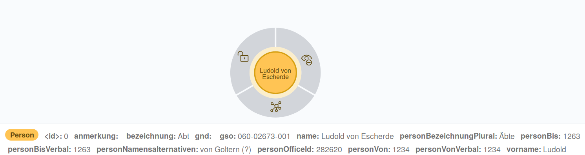
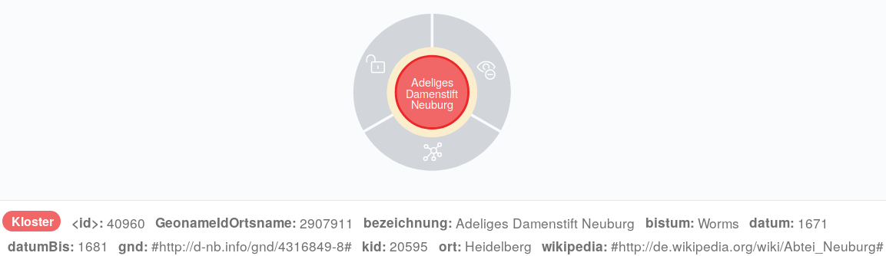

# JSON Import mit den Daten der Germania Sacra

(Dieser Abschnitt befindet sich in Bearbeitung)

## Das Projekt Germania Sacra

Das Projekt Germania Sacra erschließt die Quellen der Kirche des alten Reiches.[^eeaa] Dabei werden die Kirche und ihre Institutionen von den Anfängen im 3./4. Jahrhundert bis zu deren Auflösung am Beginn des 19. Jahrhunderts dar. Im Rahmen des Projekts werden die überlieferten Quellen nach einheitlichen Kriterien aufgearbeitet und so strukturierte Daten für Kirchengeschichte im alten Reich bereitgestellt. So bildet das Projekt die Grundlage für weiterführende Forschungen.

Neben den Bänden bietet das Projekt auch ein [digitales Personenregister](https://adw-goe.de/forschung/forschungsprojekte-akademienprogramm/germania-sacra/digitales-personenregister/) mit Angaben u.a. zu Personen, Bischöfen, Klöstern und Stiften. Die Daten werden über die [Schnittstellen des Projekts](https://adw-goe.de/forschung/forschungsprojekte-akademienprogramm/germania-sacra/schnittstellen-und-linked-data/) als JSON-Daten bereitgestellt.[^c866]

## Germania Sacra JSON

### Personen

Die Daten des Projekts umfassen z.B. Angaben zu Namen, Namensalternativen, Daten zu den Personen und der institutionelle Anbindung. Der folgende Ausschnitt aus einer JSON-Datei umfasst beispielhaft zwei Personeneinträge.

```json
{
	"persons": [{
		"person_vorname": "Ludold",
		"person_name": "Ludold von Escherde",
		"person_namensalternativen": "von Goltern (?)",
		"person_gso": "060-02673-001",
		"person_gnd": "",
		"person_bezeichnung": "Abt",
		"person_bezeichnung_plural": "\u00c4bte",
		"person_anmerkung": "",
		"person_von_verbal": "1234",
		"person_von": 1234,
		"person_bis_verbal": "1263",
		"person_bis": 1263,
		"person_office_id": "282620"
	}, {
		"person_vorname": "Hermann",
		"person_name": "Hermann",
		"person_namensalternativen": "",
		"person_gso": "033-02024-001",
		"person_gnd": "",
		"person_bezeichnung": "Abt",
		"person_bezeichnung_plural": "\u00c4bte",
		"person_anmerkung": "",
		"person_von_verbal": "1262",
		"person_von": 1262,
		"person_bis_verbal": "1265",
		"person_bis": 1265,
		"person_office_id": "311579"
	}
```

Die folgende Abbildung zeigt beispielhaft den ersten Personeneintrag des obigen json-Beispiels von Ludold von Escherde als importierten Personenknoten im Graphen.



Unter dem Personenknoten werden die aus dem json importierten Properties aufgelistet.


### Klöster

Die folgende Abbildung zeigt die ersten drei Einträge der JSON-Datei mit den Angaben zu den Klöstern.  

```json
{"kloster":
[
 {
   "bezeichnung": "Adeliges Damenstift Neuburg",
   "ort": "Heidelberg",
   "bistum": "Worms",
   "klosterid": 20595,
   "Wikipedia": "#http://de.wikipedia.org/wiki/Abtei_Neuburg#",
   "GND": "#http://d-nb.info/gnd/4316849-8#",
   "GeonameID_Ortsname": 2907911,
   "Datum_von": 1671,
   "Datum_bis": 1681
 },
 {
   "bezeichnung": "Adeliges weltliches Chorfrauenstift St. Fridolin, Säckingen",
   "ort": "Bad Säckingen",
   "bistum": "Konstanz",
   "klosterid": 20381,
   "Wikipedia": "#http://de.wikipedia.org/wiki/Damenstift_S%C3%A4ckingen#",
   "GND": "#http://d-nb.info/gnd/4343770-9#",
   "GeonameID_Ortsname": 2953363,
   "Datum_von": 501,
   "Datum_bis": 1806
 },
 {
   "bezeichnung": "Adliges Damenstift Frauenalb, zuvor Benediktinerinnenkloster",
   "ort": "Marxzell",
   "bistum": "Speyer",
   "klosterid": 20195,
   "Wikipedia": "",
   "GND": "#http://d-nb.info/gnd/4446800-3#",
   "GeonameID_Ortsname": null,
   "Datum_von": 1180,
   "Datum_bis": 1803
 },
```

Im folgenden die cypher-queries für den Import der json-Dateien. Die json-Dateien selbst werden über Seafile mit einem Download-Link bereitgestellt.

Die folgende Abbildung zeigt beispielhaft den ersten Klostereintrag des obigen json-Beispiels zum Adeligen Damenstift Neuburg als importierten Klosterknoten im Graphen.



Im folgenden die cypher-queries für den Import der json-Dateien. Die json-Dateien selbst werden über Seafile mit einem Download-Link bereitgestellt.

Im ersten Abschnitt des Codebeispiels werden Indexe z.B. für die Property gnd von Personenknoten und die Property Bistum von Klosterknoten erstellt. Anschließend werden Constraints für die IDs von Kloster- und Personenknoten eingerichtet, mit denen sichergestellt wird, das die IDs der Kloster- und Personenknosten jeweils nur einmal vorkommen können.

```cypher
CREATE INDEX ON :Person(gnd);
CREATE INDEX ON :Person(bezeichnung);
CREATE INDEX ON :Kloster(Bistum);
create constraint on (p:Person) assert p.id is unique;
create constraint on (k:Kloster) assert k.id is unique;
```
Der nächste Befehl importiert aus der Personen-json-Datei die Personen in die Graphdatenbank. Die Zusatzinformationen zu den einzelnen Personeneinträgen werden jeweils als Properties des Personenknoten in der Graphdatenbank angelegt.

```cypher
// Personenknoten erstellen
call apoc.load.json("https://seafile.rlp.net/f/456adda2cffc475ab755/?dl=1")
yield value as all
unwind all.persons as p
CREATE (p1:Person {personBezeichnungPlural:p.person_bezeichnung_plural,
	gso:p.person_gso, personOfficeId:p.person_office_id, name:p.person_name,
	gnd:p.person_gnd, anmerkung:p.person_anmerkung,
	personVonVerbal:p.person_von_verbal, bezeichnung:p.person_bezeichnung,
	personVon:p.person_von, personBisVerbal:p.person_bis_verbal,
	personBis:p.person_bis, personNamensalternativen:p.person_namensalternativen,
	vorname:p.person_vorname})
RETURN count(p1);
```

In diesem Query werden analog zu den Personen die Klöster mit den zugehörigen Informationen in die Graphdatenbank importiert.

```cypher
// Klosterknoten erstellen
call apoc.load.json("https://seafile.rlp.net/f/91c3600003d54cc9ac83/?dl=1") yield value as all
unwind all.kloster as k
CREATE (kl:Kloster {ort:k.ort,
GeonameIdOrtsname:k.GeonameID_Ortsname,
datum:k.Datum_von, bezeichnung:k.bezeichnung, bistum:k.bistum,
wikipedia:k.Wikipedia, datumBis:k.Datum_bis, kid:k.klosterid, gnd:k.GND})
RETURN count(kl);
```

Die Zugehörigkeit eines Klosters zu einem Bistum ist in der Eigenschaft Bistum bei den jeweiligen Klosterknoten gespeichert. Aus dieser Information werden in diesem Query die Bistumsknoten erstellt und die Klosterknoten den jeweiligen Bistumsknoten zugeordnet.

```cypher
// Bistumsknoten erstellen
MATCH (k:Kloster)
MERGE (b:Bistum {name:k.bistum})
MERGE (b)<-[bi:BISTUM]-(k)
RETURN count(bi);
```

Analog zu den Bistumern werden in diesem Query die Professionen erstellt und den einzelnen Personenknoten zugeordnet.

```cypher
//Professionsknoten erstellen
MATCH (p:Person)
MERGE (pro:Profession {name:p.bezeichnung})
MERGE (pro)<-[pr:PROFESSION]-(p)
RETURN count(pr);
```


(Dieser Abschnitt befindet sich in Bearbeitung)

[^eeaa]&#x3A; Zu diesem Abschnitt vgl. <http://www.germania-sacra.de/> (zuletzt abgerufen am 07.03.2019).

[^c866]: Der in diesem Kapitel verwendete json-Dump wurde freundlicherweise direkt vom Projekt Germania Sacra zur Verfügung gestellt und die Verwendung in dieser Veröffentlichung sowie die weitere Verwendung genehmigt.
