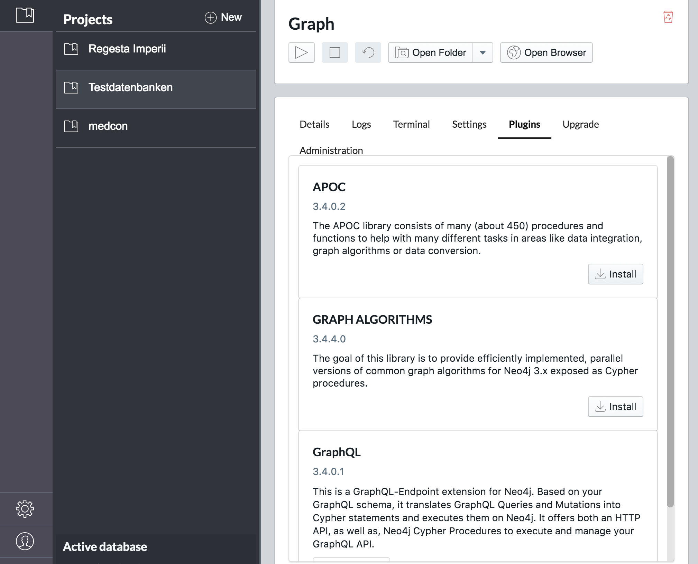

# Inhalt
{:.no_toc}

* Will be replaced with the ToC, excluding the "Contents" header
{:toc}

# Anhang

In diesem Kapitel werden Tipps und Tricks rund um typische Herausforderungen bei der Verwendung von Graphdatenbanken in den digitalen Geisteswissenschaften vorgestellt. Die Hinweise stammen oft von meinem Kollegen Stefan Armbruster von neo4j, dem an dieser Stelle nochmal herzlich für seine Unterstützung gedankt sei.

## Cypher-Dokumentation

Die Dokumentation von Cypher findet sich auf den Seiten von neo4j:
[https://neo4j.com/docs/developer-manual/current/](https://neo4j.com/docs/developer-manual/current/)

## Datenbank löschen

Vorab hier der Befehl, mit dem eine neo4j-Datenbank geleert werden kann. 

### Kleine Datenbanken

~~~cypher
MATCH (n) DETACH DELETE n;
~~~

### Große Datenbanken

Bei großen Datenbanken funktioniert der o.a. Befehl meist nicht. Daher kann dieser Befehl genutzt werden, für den aber die APOC-Bibliothek installiert sein muss.

~~~cypher
CALL apoc.periodic.iterate('MATCH (n) RETURN n', 'DETACH DELETE n', {batchSize:1000});
CALL apoc.schema.assert({},{},true) YIELD label, key
RETURN *;
~~~

## Explorative Datenanalyse oder "Was ist in der Datenbank?"

### Welche und jeweils wieviele Knoten enthält die Datenbank

Mit den in diesem Abschnitt vorgestellten Queries lassen sich Graphen explorativ erfassen. Mit dem folgenden Query findet man alle im Graph vorkommenden Typen von Knoten und die jeweiligen Häufigkeiten.

~~~cypher
CALL db.labels()
YIELD label
CALL apoc.cypher.run("MATCH (:`"+label+"`)
RETURN count(*) as count", null)
YIELD value
RETURN label, value.count as count
ORDER BY label;
~~~

### Welche Verknüpfungen gibt es in der Datenbank und wie häufig sind sie

Der nächste Query führt die gleiche Untersuchung für die in der Graphdatenbank vorhanden Kantentypen durch.

~~~cyper
CALL db.relationshipTypes()
YIELD relationshipType
CALL apoc.cypher.run("MATCH ()-[:" + `relationshipType` + "]->()
RETURN count(*) as count", null)
YIELD value
RETURN relationshipType, value.count AS count
ORDER BY relationshipType;
~~~

Mit diesen Queries lässt sich bei unbekannten Graphdatenbanken ein erster Überblick zur statistischen Verteilung von Knoten- und Kantentypen erstellen.

Mit dem folgenden Query werden alle Typen von Knoten und deren jeweilige Häufigkeit aufgelistet.

~~~cypher
CALL db.labels()
YIELD label
CALL apoc.cypher.run("MATCH (:`"+label+"`)
RETURN count(*) as count", null)
YIELD value
RETURN label, value.count as count
ORDER BY label
~~~

~~~cyper
CALL db.relationshipTypes()
YIELD relationshipType
CALL apoc.cypher.run("MATCH ()-[:`" + relationshipType + "`]->()
RETURN count(*) as count", null)
YIELD value
RETURN relationshipType, value.count AS count
ORDER BY relationshipType
~~~

### Welche Knoten haben keine Kanten

~~~cyper
MATCH (n)
WHERE size((n)--())=0
RETURN DISTINCT labels(n);
~~~

## Weitere Labels für einen Knoten

Gegeben sind Knoten vom Typ IndexEntry, die in der Property type noch näher spezifiziert sind (z.B. Ort, Person, Sache etc.).
Mit dem folgenden Query wird der Wert der Property type als zusätzliches Label angelegt.

~~~cypher
MATCH (e:IndexEntry)
WHERE e.type IS NOT NULL
WITH e, e.type AS label
CALL apoc.create.addLabels(id(e), [label]) YIELD node
RETURN node;
~~~

Die Namen der Labels können auch selbst bestimmt werden.

~~~cypher
MATCH (e:IndexEntry)
WHERE e.type = 'person'
WITH e
CALL apoc.create.addLabels(id(e), ['IndexPerson']) YIELD node
RETURN node;

MATCH (e:IndexEntry)
WHERE e.type = 'ereignis'
WITH eCALL apoc.create.addLabels(id(e), ['IndexEvent']) YIELD node
RETURN node;

MATCH (e:IndexEntry)
WHERE e.type = 'sache'
WITH e
CALL apoc.create.addLabels(id(e), ['IndexThing']) YIELD node
RETURN node;

MATCH (e:IndexEntry)
WHERE e.type = 'ort'
WITH e
CALL apoc.create.addLabels(id(e), ['IndexPlace']) YIELD node
RETURN node;
~~~

## CSV-Feld enthält mehrere Werte

Beim Import von Daten im CSV-Format in die Graphdatenbank kann es vorkommen, dass in einem CSV-Feld mehrere Werte zusammen stehen. In diesem Abschnitt wird erklärt, wie man diese Werte auseinandernehmen, einzeln im Rahmen des Imports nutzen kann.

In der Regel ist es von Vorteil, zunächst das CSV-Feld als eine Property zu importieren und in einem zweiten Schritt auseinanderzunehmen.

Angenommen wir haben Personen importiert, die in der Property `abschluss` eine kommaseparierte Liste von verschiedenen beruflichen Abschlüssen haben, wie z.B. Lehre, BA-Abschluss, MA-Abschluss, Promotion.

In der Property `abschluss` steht zum Beispiel:

`lic. theol., mag. art., dr. theol., bacc. art., bacc. bibl. theol.`

Für die Aufteilung der Einzelwerte kann die `split`-Funktion verwendet werden, die einen String jeweils an einem anzugebenden Schlüsselzeichen (hier das Komma) auftrennt. Der Befehl hierzu sieht wie folgt aus:

~~~cypher
MATCH (p:Person)
FOREACH ( j in split(p.abschluss, ",") |
MERGE (t:Titel {name:trim(j)})
MERGE (t)<-[:ABSCHLUSS]-(p)
);
~~~

Der Query trennt die Liste von Abschlüssen jeweils beim Komma, erstellt mit dem `MERGE`-Befehl einen Knoten für den Abschluss (falls noch nicht vorhanden) und verlinkt diesen Knoten dann mit dem Personenknoten.
Zu beachten ist, dass die im CSV-Feld vorhandenen Begriffe konsistent benannt sein müssen.

## Reguläre Ausdrücke

### Reguläre Ausdrücke mit cypher

Im folgenden Beispiel werden die Properties startDate and endDate auf Korrektheit überprüft.

~~~cypher
match (r:Regesta)
where not r.startDate =~ "[0-9]{4}-[0-1]{1}[0-9]{1}-[0-3]{1}[0-9]{1}" or not r.endDate =~ "[0-9]{4}-[0-1]{1}[0-9]{1}-[0-3]{1}[0-9]{1}"
return r.identifier, r.startDate, r.endDate
~~~

Damit können Tippfehler in den Datumsangaben gefunden werden (z.B. 0903-21-11).

### Reguläre Ausdrücke mit apoc

Mit dem Befehl `apoc.text.regexGroups` ist es möglich, reguläre Ausrücke zum Auffinden und Ändern von Property-Werten zu nutzen.

Beispiel: Überlieferung des Regest [RI III,2,3 n. 3](http://www.regesta-imperii.de/id/1051-02-02_1_0_3_2_3_3_3):

~~~
Herim. Aug. 1051 (<link http://opac.regesta-imperii.de/lang_de/
kurztitelsuche_r.php?kurztitel=pertz,_hermann_von_reichenau>SS 5, 129</link>);
vgl. Wibert, V. Leonis IX. II, 7 (<link
http://opac.regesta-imperii.de/lang_de/kurztitelsuche_r.php?
kurztitel=watterich,_pontificum_romanorum_vitae>Watterich 1, 159</link>).
~~~

Mit dem folgenden Query werden in den Überlieferungsteilen der Regesten Kaiser Heinrichs IV. die Verlinkungen der Litereratur herausgesucht und für jeden Link per MERGE ein Knoten erzeugt. Anschließend werden die neu erstellen Knoten mit den jeweiligen Regesten über eine `REFERENCES`-Kante verbunden.

~~~cypher
MATCH (reg:Regesta)
WHERE reg.archivalHistory CONTAINS "link"
UNWIND apoc.text.regexGroups(reg.archivalHistory, "<link (\\S+)>(\\S+)</link>") as link
MERGE (ref:Reference {url:link[1]}) ON CREATE SET ref.title=link[2]
MERGE (reg)-[:REFERENCES]->(ref);
~~~

## Iso-Zeit- und Datumsangaben in neo4j-Datumsformat umrechnen

Wenn in neo4j Datumsangaben iso-konform im Format JJJJ-MM-TT (also Jahr-Monat-Tag) abgespeichert sind, behandelt Neo4j diese Angaben aber immer noch als String. Um Datumsberechnungen durchführen zu können, müssen die Strings in neo4j-interne Datumswerte umgerechnet werden. Der Cypher-Query am Beispiel der Regesta Imperii hierzu sieht wie folgt aus:

~~~cypher
// Date in neo4j-Datumsformat umwandeln
MATCH (n:Regesta)
SET n.isoStartDate = date(n.startDate);
MATCH (n:Regesta)
SET n.isoEndDate = date(n.endDate);
MATCH (d:Date)
SET d.isoStartDate = date(d.startDate);
MATCH (d:Date)
SET d.isoEndDate = date(d.endDate);
~~~

Zunächst werden mit dem `MATCH`-Befehl alle Regestenknoten aufgerufen. Anschließend wird für jeden Regestenknoten aus der String-Property `startDate` die Datumsproperty `isoStartDate` berechnet und im Regestenknoten abgespeichert. Mit Hilfe der Property können dann Datumsangaben und Zeiträume abgefragt werden (Beispiel hierzu unten in der Auswertung).

## Geokoordinaten in neo4j

In den Properties von Knoten können auch Geokoorinaten gespeichert und analysiert werden. Angenommen im Knoten (n) enthält die Property n.latitude die Angaben zum Breitengrad und die Property n.longitude die Angaben zum Längengrad. Dann kann mit dem folgenden Query die Property n.nLatLong erstellt werden, mit der dann Entfernungsberechnungen durchgeführt werden können:

~~~cypher
// Property zur Entfernungsberechnung erstellen
MATCH (o:Ort)
SET o.nLatLong = point({latitude: tofloat(line.Latitude), longitude: tofloat(line.Longitude)});
RETURN *;
~~~

Beispiele zur Auswertung an Hand der Regesta Imperii finden Sie in dieser <a href="https://digitale-methodik.adwmainz.net/mod5/5c/slides/graphentechnologien/RI.html">Präsentation</a> auf dieser <a href="https://digitale-methodik.adwmainz.net/mod5/5c/slides/graphentechnologien/RI.html#/step-10">Folie</a>.

Hier noch eine cypher-Beispiel zur Abfrage der Ausstellungsorte in den Regesten Kaiser Heinrichs IV. (Band [RI III,2,3](http://www.regesta-imperii.de/unternehmen/publikationen.html#c200)) mit der Datumseinschränkung 1.1.1085 bis 1.1.1090. Die Ausgabe ist für die direkte Übernahme in den [Dariah-Geobrowser](https://geobrowser.de.dariah.eu/edit/index.html) formatiert. Über r.identifier lässt sich der Regestenband und über isoStartDate und isoEndDate der Zeitraum anpassen.

~~~cypher
MATCH (p)-[:PLACE_OF_ISSUE]-(r:Regesta)
WHERE p.latLong IS NOT NULL
AND r.identifier =~ 'RI III,2,3 .*'
AND r.isoStartDate > date('1085-01-01')
AND r.isoEndDate < date('1090-01-01')
RETURN p.normalizedGerman AS Name, p.normalizedGerman AS Address,
r.identifier AS Description, p.longitude AS Longitude, p.latitude AS Latitude, r.isoStartDate AS Timestamp
~~~

## Vorkommende Wörter in einer Textproperty zählen

Werden Texte in der Property source eines Knotens l gespeichert, kann man sich mit folgendem Query die Häufigkeit der einzelnen Wörter anzeigen lassen.

~~~cypher
match (l:Letter)
return apoc.coll.frequencies(
  apoc.coll.flatten(
    collect(
      split(
        apoc.text.regreplace(l.source, "[^a-zA-Z0-9ÄÖÜäöüß ]",""
      ),
    " ")
  )
);
~~~

In der folgenden Fassung wird die Liste noch nach Häufigkeit sortiert.

~~~cypher
match (l:Letter)
with apoc.coll.frequencies(
  apoc.coll.flatten(collect(
    split(
      apoc.text.regreplace(l.source, "[^a-zA-Z0-9ÄÖÜäöüß ]","")
      , " ")
    )
  )
) as freq
unwind freq as x
return x.item, x.count order by x.count desc
~~~

## `MERGE` schlägt fehl da eine Property NULL ist

Der `MERGE`-Befehl entspricht in der Syntax dem `CREATE`-Befehl, überprüft aber bei jedem Aufruf, ob der zu erstellende Knoten bereits in der Datenbank existiert. Bei dieser Überprüfung werden alle Propertys des Knoten verglichen. Falls also ein vorhandener Knoten eine Property nicht enthält, wird ein weiterer Knoten erstellt. Umgekehrt endet der `MERGE`-Befehl mit einer Fehlermeldung, wenn eine der zu prüfenden Propertys NULL ist.

Gerade beim Import von CSV-Daten leistet der `MERGE`-Befehl in der Regel sehr gute Dienste, da man mit ihm bereits beim Import einer Tabelle weitere Knotentypen anlegen und verlinken kann. Oft kommt es aber vor, dass man sich nicht sicher ist, ob eine entsprechende Property in allen Fällen existiert. Hier bietet es sich an, vor dem `MERGE`-Befehl mit einer `WHERE`-Clause die Existenz der Property zu überprüfen.

Im folgenden Beispiel importierten wir Personen aus einer CSV-Liste, bei denen pro Person jeweils eine ID, ein Name und manchmal ein Herkunftsort angegeben ist. Im ersten Schritt werden im `CREATE`-Statement die Personen erstellt und auch der Herkunftsort als Property angelegt, der aber auch NULL sein kann.

~~~cypher
LOAD CSV WITH HEADERS FROM "file:///import.csv" AS line
CREATE (p:Person {pid:line.ID_Person, name:line.Name, herkunft:line.Herkunft});
~~~

Im zweiten Schritt wird nun der `LOAD CSV`-Befehl nochmals ausgeführt und über die `WHERE`-Clause nur jene Fälle weiter bearbeitet, in denen die Property Herkunft nicht NULL ist. Nach der `WHERE`-Clause wird über den `MATCH`-Befehl zunächst der passende Personenknoten aufgerufen, anschließend per `MERGE`-Befehl der Ortsknoten erstellt (falls noch nicht vorhanden) und schließlich mit `MERGE` beide verknüpft.

~~~cypher
LOAD CSV WITH HEADERS FROM "file:///import.csv" AS line
WHERE line.Herkunft IS NOT NULL
MATCH (p:Person {pid:line.ID_Person})
MERGE (o:Ort {ortsname:line.Herkunft})
MERGE (p)-[:HERKUNFT]->(o);
~~~

## Der `WITH`-Befehl

Da Cypher eine deklarative und keine imperative Sprache ist, gibt es bei der Formulierung der Querys Einschränkungen.[^03a5] Hier hilft oft der `WITH`-Befehl weiter, mit dem sich die o.a. beiden Befehle auch in einem Query vereinen lassen:

~~~cypher
LOAD CSV WITH HEADERS FROM "file:///import.csv" AS line
CREATE (p:Person {pid:line.ID_Person, name:line.Name, herkunft:line.Herkunft})
WITH line, p
WHERE line.Herkunft IS NOT NULL
MERGE (o:Ort {ortsname:line.Herkunft})
MERGE (p)-[:HERKUNFT]->(o);
~~~

Der `LOAD CSV`-Befehl lädt die CSV-Datei und gibt sie zeilenweise an den `CREATE`-Befehl weiter. Dieser erstellt den Personenknoten. Der folgende `WITH`-Befehl stellt quasi alles wieder auf Anfang und gibt an die nach ihm kommenden Befehle nur die Variablen line und p weiter.

## Export eines Subgraphen mit apoc.export.cypher.query

Hier wird beschrieben, wie man einen Teil einer Graphdatenbank, einen sogenannten Sub-Graphen, exportieren und in eine neue Graphdatenbank importieren kann. Weitere Infos zum Befehl apoc.export.cypher.query finden Sie auf der [Quelle](https://neo4j.com/developer/kb/export-sub-graph-to-cypher-and-import/) dieser Seite.

### Export des Subgraphen

~~~cypher
// Export von Knoten und Kanten des cypher-Statements inkl. der Indexe als cypher-Statements in die genannte Datei
CALL apoc.export.cypher.query(
'MATCH (p1:Person)-[r:KNOWS]->(p2:Person) RETURN p1, r, p2',
'/tmp/export.cypher',{format:'cypher-shell'});
~~~

Zu beachten ist, dass beim RETURN-Befehl explizit p1, p2 und r erwähnt werden.
Dies ergibt die Datei export.cypher im Verzeichnis /tmp. Der Inhalt dieser Datei kann als Text in die Befehlszeile des neo4j-Browsers einer leeren Graphdatenbank kopiert und ausgeführt werden. Damit wird dann aus Subgraph erstellt.

### Import des Subgraphen in eine neue Datenbank über die cypher-Shell  

Alternativ kann die exportierte Datei direkt über die cypher-Shell importiert werden:

~~~cypher
cat /tmp/export.cypher | ./bin/cypher-shell -u neo4j -p password
~~~

## Knoten hat bestimmte Kante nicht

Am Beispiel der [Regesta-Imperii-Graphdatenbank](http://jlu-buster.mni.thm.de:10210/browser/) der Regesten Kaiser Friedrichs III. werden mit dem folgenden Cypher-Query alle Regestenknoten ausgegeben, die keine `PLACE_OF_ISSUE`-Kante zu einem `Place`-Knoten haben:

~~~cypher
MATCH (reg:Regesta)
WHERE NOT
(reg)-[:PLACE_OF_ISSUE]->(:Place)
RETURN reg;
~~~

## Shortest Path hat bestimmte Kanten nicht

Am Beispiel der [Fraktalität und Dynamik Graphdatenbank](http://jlu-buster.mni.thm.de:12160/browser/) werden mit dem folgenden Cypher-Query die Kantentypen 'BEGRABEN_IN' und 'VERSTORBEN_IN' aus dem shortestPath p ausgeschlossen:

~~~cypher
MATCH (n1:Person {pid: '3699' }),(n2:Person {pid: '3785' }), p = shortestPath((n1)-[*]-(n2))
WHERE NONE (r IN relationships(p) WHERE type(r)= 'BEGRABEN_IN')
AND NONE (r IN relationships(p) WHERE type(r)= 'VERSTORBEN_IN')
RETURN p
~~~

## Häufigkeit von Wortketten

Am Beispiel des [DTA-Imports](http://jlu-buster.mni.thm.de:10220/browser/) von [Berg Ostasien](http://www.deutschestextarchiv.de/book/show/berg_ostasien01_1864) wird mit dem folgenden Query die Häufigkeit von Wortketten im Text ausgegeben:

~~~cypher
MATCH p=(n1:Token)-[:NEXT_TOKEN]->(n2:Token)-[:NEXT_TOKEN]->(n3:Token)
WITH n1.text as text1, n2.text as text2, n3.text as text3, count(*) as count
WHERE count > 1 // evtl höherer Wert hier
RETURN text1, text2, text3, count ORDER BY count DESC LIMIT 10
~~~

## Liste von Briefknoten nach Datum verketten

Gegeben sei eine Menge von Briefknoten, die das Absendedatum in der Property sendDate abgespeichert haben. Der folgende Query verkettet die Briefe in der Reihenfolge des Absendedatums mit NEXT_LETTER-Kanten.

~~~cypher
MATCH (n:Brief)
WITH n ORDER BY n.sendDate
WITH collect(n) as briefe
CALL apoc.nodes.link(briefe, "NEXT_LETTER")
RETURN count(*)
~~~

Soll es sich nur um virtuelle Kanten handeln, können diese beispielhaft für diese [GraphDB](http://jlu-buster.mni.thm.de:12360/browser/) so erstellt werden:

~~~cypher
MATCH (s:Person {gnd:'http://d-nb.info/gnd/118607626'})<-[:SENDER|:RECEIVER]-(b:Letter)-[:RECEIVER]->(e:Person)
WITH b, s, e ORDER BY b.sendDate ASC
WITH collect(distinct b) as briefe, collect(s) as p1, collect(e) as p2
UNWIND range(0,size(briefe)-2) AS i
RETURN briefe, collect( apoc.create.vRelationship(briefe[i], "NEXT_BRIEF", {}, briefe[i+1])), p1, p2;
~~~

## Alle Indexe in einer Datenbank löschen

Mit dem folgenden Befehl lassen sich alle Indexe einer Datenbank auf einmal löschen.

~~~cypher
CALL apoc.schema.assert({},{},true) YIELD label, key
RETURN *;
~~~

## Die Apoc-Bibliothek

Die Funktionalitäten sind bei neo4j in verschiedene Bereiche aufgeteilt. Die Datenbank selbst bringt Grundfunktionalitäten mit. Um Industriestandards zu genügen haben diese Funktionen umfangreiche Tests und Prüfungen durchlaufen. Weiteregehende Funktionen sind in die sogenannte [*Apoc-Bibliothek*](https://guides.neo4j.com/apoc) ausgelagert, die zusätzlich installiert werden muss. Diese sogenannten *user defined procedures* sind benutzerdefinierte Implementierungen bestimmter Funktionen, die in Cypher selbst nicht so leicht ausgedrückt werden können. Diese Prozeduren sind in Java implementiert und können einfach in ihre neo4j-Instanz implementiert und dann direkt von Cypher aus aufgerufen werden.[^5cb9]

Die Apoc-Bibliothek besteht aus vielen Prozeduren, die bei verschiedenen Aufgaben in Bereichen wie Datenintegration, Graphenalgorithmen oder Datenkonvertierung helfen.

### Installation in neo4j

Die Apoc-Bibliothek lässt sich unter [http://github.com/neo4j-contrib/neo4j-apoc-procedures/releases/%7Bapoc-release%7D](http://github.com/neo4j-contrib/neo4j-apoc-procedures/releases/) herunterladen und muss in den plugin-Ordner der neo4j-Datenbank kopiert werden.

### Installation unter neo4j-Desktop

In [*neo4j-Desktop*](https://neo4j.com/download/) kann die Apoc-Bibliothek jeweils pro Datenbank im Management-Bereich über den Reiter plugins per Mausklick installiert werden.

### Liste aller Funktionen

Nach dem Neustart der Datenbank stehen die zusätzlichen Funktionen zur Verfügung. Mit folgendem Befehl kann überprüft werden, ob die Apoc-Bibliotheken installiert sind:

CALL dbms.functions()

Wenn eine Liste mit Funktionen ausgegeben wird, war die Installation erfolgreich. Falls nicht, sollte die Datenbank nochmals neu gestartet werden.

### Dokumentation aller Funktionen

In der [Dokumentation](https://neo4j-contrib.github.io/neo4j-apoc-procedures/) der Apoc-Bibliothek sind die einzelnen Funktionen genauer beschrieben.

## apoc.xml.import

Mit dem Befehl apoc.xml.import ist es möglich, einen XML-Text-Dateien 1:1 in die Graphdatenbank einzuspielen. Die [Dokumentation](https://neo4j-contrib.github.io/neo4j-apoc-procedures/#_import_xml_directly) findet sich [hier](https://neo4j-contrib.github.io/neo4j-apoc-procedures/#_import_xml_directly).

Beispielbefehl:
call
apoc.xml.import("URL",{relType:'NEXT_WORD', label:'XmlWord', filterLeadingWhitespace:true})
yield node
return node;

|Kantentyp|Beschreibung|
|------------------------|------------------------------------------------|
|:IS_CHILD_OF|Verweis auf eingeschachteltes XML-Element|
|:FIRST_CHILD_OF|Verweis auf das erste untergeordnete Element|
|:NEXT_SIBLING|Verweis auf das nächste XML-Element auf der gleichen Ebene|
|:NEXT|Erzeugt eine lineare Kette durch das gesamte XML-Dokument und gibt so die Serialität des XMLs wieder|
|:NEXT_WORD|Verbindet Wortknoten zu einer Kette von Wortknoten. Wird nur erzeugt, wenn createNextWordRelationships:true gesetzt wird|

## (apoc.load.json)

(Dieser Abschnitt befindet sich gerade in Bearbeitung)

Beispiel: Laden der json-Daten der [Germania Sacra](https://adw-goe.de/forschung/forschungsprojekte-akademienprogramm/germania-sacra/klosterdatenbank/linked-data/).

~~~cypher
CALL apoc.schema.assert({},{},true) YIELD label, key
RETURN *;
MATCH (n) DETACH DELETE n;

CREATE INDEX ON :Person(GSid);
CREATE INDEX ON :Person(Orden);
CREATE INDEX ON :Kloster(bistum);
CREATE INDEX ON :Amt(bezeichnung);
CREATE INDEX ON :PersonAmt(bezeichnung);
CREATE INDEX ON :Institution(institutionId);
CREATE INDEX ON :Orden(bezeichnung);
CREATE CONSTRAINT ON (p:Person) assert p.id is unique;
CREATE CONSTRAINT ON (k:Kloster) assert k.id is unique;

// Germania Sacra Personendaten importieren
UNWIND range(1,755) as page
CALL apoc.load.json("http://personendatenbank.germania-sacra.de/api/v1.0/person?format=json&id=%2A&limit=100&page=" + page) YIELD value
UNWIND value.records AS r
CREATE (p:Person {GSid: r.person.id,
      vorname: r.person.vorname,
      vornamenvarianten: r.person.vornamenvarianten,
      namenspraefix: r.person.namenspraefix,
      familienname: r.person.familienname,
      familiennamenvarianten: r.person.familiennamenvarianten,
      namenszusatz: r.person.namenszusatz,
      herkunftsname: r.person.herkunftsname,
      titel: r.person.titel,
      orden: r.person.orden,
      geburtsdatum: r.person.geburtsdatum,
      sterbedatum: r.person.sterbedatum,
      belegdaten: r.person.belegdaten,
      taetigkeit: r.person.taetigkeit,
      gndnummer: r.person.gndnummer,
      cerlid: r.person.cerlid,
      viaf: r.person.viaf,
      verwandtschaften: r.person.verwandtschaften,
      anmerkungen: r.person.anmerkungen,
      gsId:r.item.gsn.nummer})
WITH r, p
UNWIND r.aemter AS i
CREATE (a:PersonAmt {bezeichnung:i.bezeichnung,
        art: i.weltlich,
        institution: i.institution,
        ort: i.ort,
        dioezese: i.dioezese,
        gebiet: i.gebiet,
        klosterid: i.klosterid,
        weihegrad: i.weihegrad,
        von: i.von,
        bis: i.bis,
        latitude: i.latitude,
        longitude: i.longitude,
        anmerkung: i.anmerkung})
CREATE (p)-[:HAT_AMT]->(a)
RETURN *;

// GND-und VIAF-Nummern auf NULL setzen, wenn nicht vorhanden
MATCH (n:Person)
WHERE n.gndnummer = ""
SET n.gndnummer = NULL;
MATCH (n:Person)
WHERE n.viaf = ""
SET n.viaf = NULL;

~~~
## (neosemantics)

(Dieser Abschnitt befindet sich gerade in Bearbeitung)

Beispiel: Laden eines [Json-Beispiels](https://corpusvitrearum.de/id/about.html) des Projekts [CVMA](https://corpusvitrearum.de/).

~~~cypher
CALL apoc.schema.assert({},{},true) YIELD label, key
RETURN *;
MATCH (n) DETACH DELETE n;

CREATE INDEX ON :Resource(uri);
UNWIND range(1,14) as page
CALL
apoc.load.json("https://corpusvitrearum.de/id/about.json?tx_vocabulary_about[limit]=500&tx_vocabulary_about[page]="
+ page) YIELD value
UNWIND value.`http://www.w3.org/ns/hydra/core#member` AS item
CALL semantics.importRDF(item.`@id`, "JSON-LD") YIELD triplesLoaded
RETURN triplesLoaded;
~~~

[^5cb9]: Vgl. https://guides.neo4j.com/apoc (zuletzt aufgerufen am 11.04.2018).

[^03a5]: Hierzu vgl. https://de.wikipedia.org/wiki/Deklarative_Programmierung zuletzt abgerufen am 12.6.2018.

[^81c5]: Zu diesem Abschnitt vgl. [https://neo4j-contrib.github.io/neo4j-apoc-procedures/#_import_xml_directly](https://neo4j-contrib.github.io/neo4j-apoc-procedures/#_import_xml_directly). Die Tabelle ist direkt übernommen und übersetzt worden. Die dort genannte Beispieldatei ist momentan nicht mehr erreichbar. Stattdessen kann folgende URL verwendet werden: https://seafile.rlp.net/f/55e80fc426fb451e9294/?dl=1
